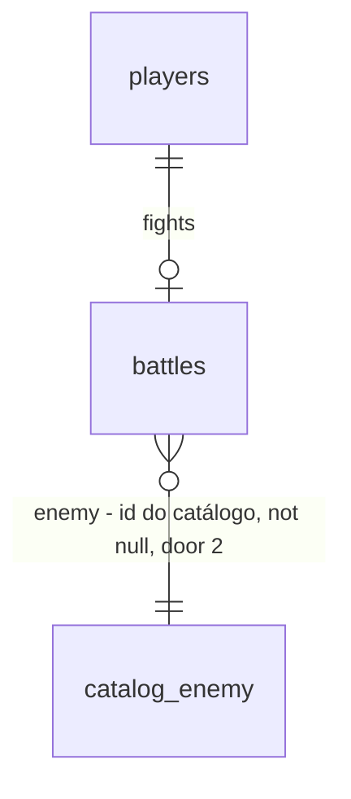

# Assets apply

Sources:

- conversa 2026-09-26 - "vamos aplicar todos os assets": todo asset da biblioteca de `assets` que ficou sem uso entra no jogo; mobs viram **inimigos novos no catálogo** (combate de verdade); tileset **monta os cenários** (sem mapa jogável)
- `.specs/features/assets/plan.md` + `checks.md` door 1 - **binding para o inventário**: a lista literal de assets; cada um que não tem consumidor hoje é uma obrigação desta feature
- `api/catalog/combat.json`, `api/internal/battle/*`, `api/migrations/00004_battle_inventory.sql` - o modelo de combate atual (um inimigo por região, `battles` sem id de inimigo)
- `.specs/STATE.md` - AD-002 (servidor autoritativo), AD-003 (catálogo é dado do Go), AD-004 (mutação com `FOR UPDATE`), AD-005 (erro), AD-011 (todo sorteio vem de `Deps.Rand`)

## Problem

A feature `assets` desenhou 101 assets, mas só 33 aparecem no jogo. Sobram:
- 65 PNGs sem consumidor: 15 props, 7 estruturas, 3 mobs, 5 extras, 3 fx, 17 peças de tileset, 9 ícones genéricos, 7 ícones de botão, 2 peças de UI e a medalha rubi;
- 2 ícones cujo match era falso-positivo (`ic-gear`, `ic-server`).

Quem joga vê a folha de assets prometer slimes, monstro, fogueira, casa do servidor e cachoeira que nunca aparecem. Os cenários são pintados só com ops soltas, e o tileset desenhado para eles não é usado. Cada região tem um único inimigo, sempre o mesmo, então repetir o Bug Fight na VILA é sempre o NULL SLIME.

A evidência é a contagem de consumidores (`grep` em `web/src` e nos specs de fundo). Não há números de uso.

Quando isto for entregue:
- todo asset da biblioteca tem pelo menos um consumidor (tela, CSS ou spec de fundo);
- VILA, FLORESTA e CAVERNA sorteiam entre dois inimigos;
- os cenários são montados com o tileset, os props, as estruturas e os extras.

## Out of scope

| Excluded | Why |
| --- | --- |
| Mapa de tiles jogável, andar pelo mapa | decisão do usuário: tiles montam cenários |
| Itens novos de drop | os mobs novos reusam drops existentes; item novo pede ícone, entrada na forja e balanceamento |
| Recompensa por inimigo (xp/coins diferentes) | `Combat.Victory` é global hoje; mudar é balanceamento, não arte |
| Tela de ranking / configurações | não existem; `btn-rank` e `btn-settings` vão para lugares que existem (tabela de integração) |
| Redesenhar assets | só aplicar; ajuste de arte só quando um fundo precisa de uma peça no tamanho dele |
| Animar mobs com frames | seguem com as transformações CSS dos inimigos |

## Assumptions

| Assumption | Chosen default | Rationale | Confirmed? |
| --- | --- | --- | --- |
| Mobs no catálogo | 3 inimigos novos: `slime` em `vila`, `slime_verde` em `floresta`, `monstro` em `caverna`, cada região passa a ter 2 | decisão do usuário (inimigos de verdade); uma região por mob, nas três de nível mais baixo onde cabem slimes e um bug | y |
| Stats dos mobs | `slime` "SLIME DE CACHE" nv 2, hp 45, sp 40, fraqueza "cache invalidado", drop `null_shard`, glyph `(o.o)`; `slime_verde` "SLIME DE LOG" nv 4, hp 55, sp 45, fraqueza "log rotacionado", drop `log_essence`, glyph `(-.-)`; `monstro` "BUG DE PRODUÇÃO" nv 9, hp 100, sp 65, fraqueza "hotfix", drop `wild_trace`, glyph `{>_<}` | um pouco mais fracos que o inimigo atual da região, com o mesmo drop (forja inalterada) | y |
| Sorteio do inimigo | `Start` sorteia uniforme com `Rand.IntN(n)` entre os inimigos da região; só sorteia quando `n > 1`, então regiões de um inimigo não consomem sorteio; batalha ativa na mesma região retoma o mesmo inimigo | AD-011; manter a ordem de sorteio das regiões com um inimigo não quebra os testes roteirizados | y |
| Id dos inimigos atuais | `id` = a região (`vila`, `floresta`, ...), para `enemy-<id>.png` e as batalhas salvas continuarem válidas | nenhum asset renomeado; backfill trivial | y |
| Arte dos mobs no combate | `web/art/sprite/enemy-<id>.json` = `use` do `mob-<nome>.json` (`enemy-slime` → `mob-slime`, `enemy-slime_verde` → `mob-slime-verde`, `enemy-monstro` → `mob-monstro`), 32x32, escala ×4 como os inimigos de 32 | `GameArt` `enemy` já endereça por id; o mob continua sendo a fonte | y |
| Painel de madeira | `ui-panel-wood` nos cabeçalhos das cenas: `.deploy-head`, `.battle-head`, `.skills-head`, `.shop-head`, `.office-head`, `.avatar-bag-head` (classe `.panel-wood`) | as placas de madeira da folha são títulos | y |
| Trilho de barra | `ui-bar` no `.bar` (HUD, deploy, Bug Fight) | a barra da folha tem trilho próprio | y |
| Ícones de botão | `btn-deploy` em INICIAR DEPLOY; `btn-start` em VIAJAR ATÉ AQUI; `btn-shop` nos botões COMPRAR / COMPRAR E EQUIPAR / COMPRAR E USAR da LOJA; `btn-build` em FORJAR / FORJAR E EQUIPAR; `btn-play` em NOVO ENCONTRO; `btn-rank` antes de `LEVEL n` no HUD; `btn-settings` na aba VISUAL do AVATAR; todos `alt=""` 16px, o texto fica | o lugar mais próximo do rótulo da folha em cada tela que existe | y |
| Ícones genéricos | `ic-code` / `ic-server` / `ic-cloud` antes do nome das árvores FRONTEND / BACKEND / INFRA; `ic-gear` no slot CONFIGURAÇÃO do AVATAR; `ic-laptop` no título do painel de deploy; `ic-file` no cabeçalho do log do Bug Fight; `ic-wrench` no título RACK do SERVER; `ic-trophy` no selo RESOLVIDO; `ic-crown` no chip de tag `CHEFE` e `ENDGAME` do MUNDO | um lugar por ícone, onde o sentido casa | y |
| Raridade | chip de raridade da LOJA e do AVATAR ganha medalha: COMUM `bronze`, INCOMUM `prata`, RARO `ouro`, LENDÁRIO `rubi`; PADRÃO sem medalha | aplica `medal-rubi`; as mesmas medalhas do escritório, outra tabela | y |
| Props, estruturas e extras | entram por `use` nos fundos: `world` (casa do servidor na VILA, tenda no MERCADO, antena na TORRE, placas, fogueira, banco, lâmpada, bandeira); `office` (laptop, macbook, monitor, planta, caneca, livros, caixas); `server` (racks, torre, roteador, modem, terminal, `build-rack`); `battle-vila` (fogueira, banco, lâmpada, placa); `battle-mercado` (caixas, caixa aberta, tenda); `battle-caverna` (gema no pedestal); `battle-floresta` (bloco de grama); `battle-torre` (`build-placa-code`) | fundo é onde objeto parado vive; nada novo no DOM | y |
| Tileset | fundos montados com tiles por `use`: `world` (grama, grama-topo, terra, areia no caminho, água e água funda no lago, cachoeira, árvores e arbustos); `battle-*` (chão de grama-topo/terra/pedra/tijolo por região); `server` (pedra); tiles animados pelo frame 0 (`clip`); e no DOM a zona PAREDE do escritório com `tile-parede-madeira` e o PISO com `tile-tabua` repetidos ×2 | decisão do usuário (montar cenários) | y |
| Efeitos | `dust` no pé do herói no beat `lunge`; `sparkle` sobre o nó WHEN uma skill é desbloqueada com `200`; `fire` em laço sobre a fogueira do MUNDO | cada um no gatilho que existe | y |
| Consumidor | um asset está aplicado quando um arquivo de `web/src` o referencia, ou um spec de `web/art/background/**` o usa (direto ou via outro spec) | o fundo renderizado é o PNG que a tela mostra | y |
| Branch | `feat/assets-apply` a partir de `feat/assets` | a biblioteca vive lá | y |

**Open questions:** none - all resolved or logged above.

## Criteria

### S1: mobs como inimigos do catálogo (P1)

**Acceptance Criteria**

1. The api SHALL servir em `GET /api/catalog` cada inimigo com um `id` único; os seis atuais com `id` = a região e os três da tabela de assumptions com os stats de lá
2. WHEN o dev inicia um encontro numa região com mais de um inimigo THEN the api SHALL escolher o inimigo `i` com `Rand.IntN(n)` na ordem do catálogo e responder `battle.enemy` = o `id` dele e `enemyHp` = o `hp` dele
3. WHILE a região tem um inimigo só the api SHALL iniciar o encontro sem consumir um sorteio de `Rand`
4. WHILE existe batalha `active` na região atual, WHEN o dev inicia de novo THEN the api SHALL retomar a mesma batalha com o mesmo `battle.enemy`
5. The api SHALL usar o inimigo salvo na batalha (não o primeiro da região) para contra-ataque, fraqueza e drop em cada turno
6. WHEN a migration roda sobre batalhas existentes THEN the api SHALL gravar `enemy` = `region` em cada linha
7. The web SHALL mostrar no Bug Fight o nome, a fraqueza e o sprite `/art/sprite/enemy-<battle.enemy>.png` do inimigo da batalha; `enemy-slime`, `enemy-slime_verde`, `enemy-monstro` existem com spec e PNG 32x32

**Independent test:** entrar no Bug Fight na VILA várias vezes (NOVO ENCONTRO) e ver NULL SLIME ou SLIME DE CACHE.

### S2: todo ícone e peça de UI em uso (P1)

**Acceptance Criteria**

8. The web SHALL desenhar `.panel-wood` com `border-image-source: url(/art/ui/ui-panel-wood.png)`, e os seis cabeçalhos de cena da tabela de assumptions SHALL ter a classe `panel-wood`
9. The web SHALL desenhar o trilho `.bar` com `border-image-source: url(/art/ui/ui-bar.png)`
10. The web SHALL mostrar cada ícone de botão da tabela de assumptions (`btn-deploy`, `btn-start`, `btn-shop`, `btn-build`, `btn-play`, `btn-rank`, `btn-settings`) `alt=""` 16px antes do texto do seu botão, com o nome acessível do botão inalterado
11. The web SHALL mostrar cada ícone genérico da tabela de assumptions (`ic-code`, `ic-server`, `ic-cloud`, `ic-gear`, `ic-laptop`, `ic-file`, `ic-wrench`, `ic-trophy`, `ic-crown`) `alt=""` 16px antes do texto do seu lugar
12. WHEN a LOJA ou o AVATAR mostram uma raridade THEN the web SHALL mostrar antes dela `/art/icon/medal-<m>.png` `alt=""` 16px com `<m>` = `bronze`, `prata`, `ouro`, `rubi` para COMUM, INCOMUM, RARO, LENDÁRIO, e nenhuma medalha para PADRÃO

**Independent test:** percorrer as telas e achar cada ícone no lugar da tabela.

### S3: cenários montados com tiles, props e estruturas (P2)

**Acceptance Criteria**

13. The web SHALL ter, para cada prop, estrutura (exceto `build-flag`), extra (exceto `extra-bau`, `extra-bau-aberto`) e peça do tileset, ao menos um spec em `web/art/background/**` que o usa, direto ou por outro spec usado
14. WHEN o OFFICE é mostrado THEN the web SHALL pintar a zona PAREDE com `url(/art/tile/tile-parede-madeira.png)` e a zona PISO com `url(/art/tile/tile-tabua.png)` repetidos a 64px (×2)
15. The web SHALL continuar reproduzindo cada fundo com `make art-check` saindo `0`

**Independent test:** abrir MUNDO, OFFICE, SERVER e as batalhas de cada região; ver a casa do servidor, a cachoeira e os tiles.

### S4: os três efeitos restantes (P2)

**Acceptance Criteria**

16. WHILE o beat do Bug Fight é `lunge` the web SHALL mostrar `[data-fx="dust"]` com `url(/art/fx/dust.png)` no herói
17. WHEN desbloquear uma skill responde `200` THEN the web SHALL mostrar `[data-fx="sparkle"]` com `url(/art/fx/sparkle.png)` no nó desbloqueado; IF responde erro THEN nenhum
18. The MUNDO SHALL mostrar um `span.fx-fire` em laço com `url(/art/fx/fire.png)` sobre a fogueira do mapa, e com `prefers-reduced-motion: reduce` sem animação

**Independent test:** atacar no Bug Fight, desbloquear uma skill, olhar a fogueira no mapa.

### S5: nada sobra na biblioteca (P1)

**Acceptance Criteria**

19. The web SHALL ter, para cada asset da lista literal da door 1 de `assets`, ao menos um consumidor (arquivo de `web/src` que referencia o nome, ou spec de fundo que o usa)

**Independent test:** o teste de consumidores lista zero órfãos.

## Traceability

| ID | Slice | Criteria | Status |
| --- | --- | --- | --- |
| APL-01 | S1 | 1, 2, 3, 4, 5, 6 | Verified |
| APL-02 | S1 | 7 | Verified |
| APL-03 | S2 | 8, 9, 10, 11, 12 | Verified |
| APL-04 | S3 | 13, 14, 15 | Verified |
| APL-05 | S4 | 16, 17, 18 | Verified |
| APL-06 | S5 | 19 | Verified |

## Observable

| Surface | Decision | Landing |
| --- | --- | --- |
| screens BUG FIGHT, MUNDO, OFFICE, SERVER, DEPLOY, SKILLS, LOJA, AVATAR, HUD | empty / loading / error states | existing - inalterados; AC 17 cobre o erro do desbloqueio |
| screens (idem) | unauthorised | existing - `GameShell` manda para `/login` |
| screens (idem) | density and ordering | ícones ×1 antes do texto; ordem do catálogo |
| screens (idem) | destructive action confirms | n/a - nenhuma ação nova |
| screens (idem) | movimento | AC 18; `dust`/`sparkle` seguem a regra de `.fx-once` (somem com movimento reduzido) |
| API `GET /api/catalog` | response shape | AC 1 - campo novo `id` em `enemies[]` (aditivo) |
| API `POST /api/me/battle` | response shape | AC 2 - campo novo `enemy` em `battle` (aditivo) |
| API `GET /api/me/battle`, `POST .../commands`, `POST .../items` | response shape | AC 5 - `battle.enemy` em toda resposta com batalha |
| API (idem) | error shape and codes | existing - AD-005, códigos inalterados |
| API (idem) | versioning | n/a - campos aditivos, único consumidor é o próprio web |
| collection `web/art` | naming | door 1 de `assets` + `enemy-<id>` para os mobs (door 2) |
| collection | the exception that does not fit | `extra-bau`, `extra-bau-aberto`, `build-flag` já têm consumidor no DOM e não entram nos fundos |

## Flow

Reusa o `Rand` injetado (AD-011), a mutação com `FOR UPDATE` já existente no início da batalha, o `GameArt` (kinds `enemy`, `btn`, `ic`, `medal`), o `FxOnce`/`LoadingFx` e o renderer com `use` + `clip`. Nenhuma rota nova.

1. `api/catalog/combat.json` (exists) - ganha `id` por inimigo e três inimigos -> `internal/catalog` (exists; `Enemy` passa a buscar por id, e ganha a lista por região) -> `GET /api/catalog`
2. `POST /api/me/battle` -> `battle.Handlers.Start` (exists) - escolhe o inimigo (door 1), persiste `battles.enemy` (door 2)
3. turnos -> `battle.Handlers.turn` (exists) - lê `battles.enemy` e busca por id
4. web `BattleScene` (exists) - `enemyOf` por `battle.enemy`; `GameArt kind="enemy" id={battle.enemy}`
5. telas (exist) -> `GameArt` - ícones de botão, genéricos e medalhas; `globals.css` (exists) - `.panel-wood`, `.bar`, tiles do escritório
6. specs `web/art/background/*.json` (exist) - ganham `use` dos props, estruturas, extras e tiles -> `render.py` (exists) -> PNGs re-renderizados

## Relations

One-way constraints: `battles.enemy` not null, backfill = `region` (door 2). O inimigo do catálogo não é tabela; a referência é validada no Go (`catalog.Enemy(id)`).

## Surface

| Route | In | Out | Status |
| --- | --- | --- | --- |
| `GET /api/catalog` | - | `enemies[].id` (novo) + campos atuais | `200` |
| `POST /api/me/battle` | - | `battle.enemy` (novo) · `player` | `200`; os de erro atuais inalterados (AD-005) |
| `GET /api/me/battle` | - | `battle.enemy` (novo) | `200`; os de erro atuais inalterados (AD-005) |
| `POST /api/me/battle/commands` | `command` | `battle.enemy` (novo) · `player` · `events` | `200`; os de erro atuais inalterados (AD-005) |

## Landing

| One-way door | Literal shape | Alternative rejected |
| --- | --- | --- |
| 1. mais de um inimigo por região, escolhido no início | `combat.json` `enemies[]` com `"id"`; `Start` filtra por `region` na ordem do catálogo e, se `n > 1`, `i := d.Rand.IntN(n)`; a batalha guarda o id | escolher no cliente: viola AD-002; escolher por nível do dev: regra de balanceamento que ninguém pediu |
| 2. batalha guarda o inimigo | migration `00010_battle_enemy.sql`: `ALTER TABLE battles ADD COLUMN enemy TEXT`; `UPDATE battles SET enemy = region`; `ALTER COLUMN enemy SET NOT NULL`; JSON `battle.enemy` | re-sortear a cada turno ou derivar da região: o inimigo trocaria no meio da luta |
| 3. id dos inimigos atuais = região | `{"id": "vila", "region": "vila", ...}` | ids novos (`null_slime`): renomeia 6 specs, 6 PNGs e toda asserção de arte, e o backfill precisaria de um mapa região→id |

- Nothing else in this change is hard to reverse

## Impact

| Front | What changes |
| --- | --- |
| domain | new term: `Enemy.ID` - chave do inimigo no catálogo, lives in `api/internal/catalog` |
| domain | existing term: `Catalog.Enemy(region)` era "o inimigo da região"; vira busca por id, e a região passa a ter uma lista - `battle.Handlers.Start`, `turn`, `rules_test.go:24` chamam hoje |
| domain | existing term: `enemyOf(battle)` no web achava por `region`; agora por `battle.enemy` - `BattleScene.tsx:52, 64` |
| tests | `catalog_test.go:217-231` (6 inimigos em ordem) passa a 9; `battle_test.go` fixtures `battleJSON` ganham `Enemy`; web `ENEMIES`/`ALL_ENEMIES` ganham `id`; `art.test.tsx` enemy por `id` |
| stored data | backfill na migration: `enemy = region` em toda linha de `battles` |
| decisions | AD-017 novo em `.specs/STATE.md`: vários inimigos por região, sorteio no início via `Rand` (estende AD-011) |
