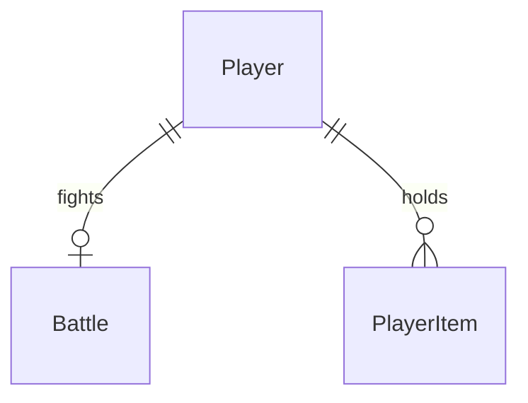

# Bug fight

Sources:

- `docs/DevServer RPG.html` - cena 05 BUG FIGHT: `battleThemes` (inimigo por região), `cmdDefs` (comandos base e de skill), regras `use`, `counter` e `usePotion`, `itemDefs` (drops e poções)
- conversa 2026-09-23 - inventário mínimo nasce nesta feature; derrota volta à Vila com HP cheio; D3 (combate autoritativo no servidor) e D4 (combate na região onde o jogador está)
- `.specs/STATE.md` - AD-001 a AD-010; foundation doors 5, 7, 8, 12; deploy-pipelines door 6 (`GainXP`); skills doors 2 e 4 (bônus de SP e dano somados do catálogo, `player.skills`)

## Problem

O jogador sobe de nível e desbloqueia skills que prometem "+SP em combate" e "+% de dano", mas não
existe combate: a aba BUG FIGHT diz "EM BREVE", os bônus não servem para nada e as regiões acima da
Vila não oferecem nada além de um nome. O protótipo não traz números - não há evidência além dele.

Quando isto for entregue, o dev enfrenta o inimigo da região onde está, escolhe comandos por turno
(os básicos e os das skills desbloqueadas), gasta SP, usa poções, ganha XP, coins e gems ao vencer,
pode receber o item da região no inventário e, se cair, volta à Vila com HP cheio.

## Out of scope

| Excluded | Why |
| --- | --- |
| Comprar, descartar e ver o inventário numa tela própria | shop-inventory-avatar; aqui só existe o que o combate usa |
| Bônus de skin e equipamento no combate | entram com shop-inventory-avatar |
| Chefe com andares da Torre e raid de 4 devs nos Picos da Nuvem | fora do MVP |
| Bônus de SP por turno do escritório | escritório fora do MVP (AD-008) |
| Sprites próprios por inimigo e animações de golpe | arte ainda não existe; a cena usa um cartão com o glifo do inimigo |
| Uso das poções fora do combate | protótipo só as usa no Bug Fight |

## Assumptions

| Assumption | Chosen default | Rationale | Confirmed? |
| --- | --- | --- | --- |
| Inimigos | vila NULL SLIME HP 60 SP 50 Lv3 fraqueza "null-check" drop `null_shard` · floresta LOG WISP 70 55 Lv5 "referência circular" `log_essence` · mercado PACOTE MALICIOSO 85 60 Lv7 "versão não travada" `corrupt_dep` · caverna EXCEÇÃO SELVAGEM 110 70 Lv10 "catch ausente" `wild_trace` · torre RACE CONDITION 160 85 Lv15 "mutex ausente" `race_core` · nuvem MEMORY LEAK ANCESTRAL 220 100 Lv22 "garbage collector" `memory_crystal` | valores do protótipo (`battleThemes`) | y |
| Comandos base | FIX dano 14–20 custo 10 · TEST expõe fraqueza custo 8 · REFACTOR cura 18 custo 14 · PLAIN escudo e +3 SP custo 0 · ROLLBACK foge custo 0 | protótipo (`cmdDefs`) | y |
| Comandos de skill | f1 dano 12–14 custo 12 · f2 16–20 custo 16 · f3 20–25 custo 20 · b1 13–17 custo 12 · b2 cura 24 custo 16 · b3 22–28 custo 20 · i1 dano 8–10 e expõe fraqueza custo 10 · i2 escudo custo 14 · i3 28–34 custo 24; disponível só com a skill desbloqueada | protótipo (`cmdDefs`) | y |
| Dano | valor sorteado no intervalo; com fraqueza exposta, ×1.8 arredondado e a fraqueza é consumida; depois, ×(1 + bônus de dano/100) arredondado | ordem do protótipo (`use`) | y |
| Turno do inimigo | depois de cada ação que não vence: contra-ataque de 7 a 14; com escudo, metade arredondada; o escudo vale só para esse golpe; depois, SP +5 até o máximo | protótipo (`counter`) | y |
| SP do combate | começa no máximo = SP do inimigo + bônus de SP das skills; fixo durante o combate | protótipo; recalcular no meio do combate não tem pedido | y |
| Vitória | +90 XP, +40 coins, +1 gem via `GainXP`; 65% de chance do item da região; 30% de chance de 1 poção de cache | protótipo (`counter`) | y |
| Depois da vitória | o inimigo fica `RESOLVIDO` até o jogador pedir um novo encontro, que nasce com HP cheio | protótipo | y |
| Derrota | combate termina sem recompensa, HP = HP máximo, região = `vila` | decisão do usuário | y |
| Poções | POÇÃO DE CACHE restaura 30 SP · POÇÃO DE MEMÓRIA restaura 40 HP; usar uma gasta o turno (o inimigo contra-ataca) | protótipo (`usePotion`) | y |
| Inventário inicial | todo jogador tem 2 POÇÕES DE CACHE; jogadores já existentes recebem as 2 na migration | protótipo começa com `sp_potion: 2` | y |
| Onde se luta | na região atual do jogador; viajar para outra região e voltar ao combate troca de inimigo | D4 do levantamento | y |

**Open questions:** none - all resolved or logged above.

## Criteria

### S1: Começar um encontro (P1)

**Acceptance Criteria**

1. WHEN `POST /api/me/battle` é chamado sem combate ativo THEN a api SHALL criar o combate contra o inimigo da região atual do jogador, com HP do inimigo cheio e SP = SP máximo, e responder `200` com `battle` e `player`
2. WHEN `POST /api/me/battle` é chamado com combate ativo na mesma região e inimigo vivo THEN a api SHALL devolver o mesmo combate sem alterá-lo
3. WHEN `POST /api/me/battle` é chamado com combate de outra região ou com o inimigo já vencido THEN a api SHALL substituir pelo combate novo da região atual
4. The system SHALL calcular o SP máximo do combate como SP do inimigo + soma dos bônus `sp` das skills desbloqueadas
5. WHEN `GET /api/me/battle` é chamado THEN a api SHALL responder `200` com o combate atual, ou `404` com `error.code` = `battle_not_found` se não houver

**Independent test:** jogador na floresta com `f2` desbloqueada começa um encontro com LOG WISP HP 70/70 e SP 63/63.

### S2: Jogar um turno (P1)

**Acceptance Criteria**

6. WHEN `POST /api/me/battle/commands` recebe um comando de dano THEN a api SHALL tirar do inimigo o dano sorteado no intervalo do comando, ajustado pela fraqueza e pelo bônus de dano, e descontar o custo de SP
7. WHEN o comando expõe a fraqueza THEN o próximo comando de dano SHALL causar ×1.8 arredondado e consumir a fraqueza
8. WHEN o comando cura THEN a api SHALL somar a cura ao HP do jogador, sem passar do HP máximo
9. WHEN o comando é de escudo THEN o contra-ataque desse turno SHALL causar metade do dano arredondado
10. WHEN o comando é PLAIN THEN a api SHALL somar 3 ao SP antes do contra-ataque, sem passar do máximo
11. WHEN a ação do jogador não derruba o inimigo THEN a api SHALL aplicar o contra-ataque de 7 a 14 ao HP do jogador e, depois, somar 5 ao SP sem passar do máximo
12. WHEN um turno termina THEN a api SHALL responder `200` com `battle`, `player` e `events` descrevendo, em ordem, o que aconteceu
13. IF o SP é menor que o custo do comando THEN a api SHALL responder `409` com `error.code` = `not_enough_sp` e não jogar o turno
14. IF o comando é de uma skill não desbloqueada THEN a api SHALL responder `409` com `error.code` = `command_locked`
15. IF o comando não existe no catálogo THEN a api SHALL responder `422` com `error.code` = `unknown_command`
16. IF não há combate ativo THEN comandos e itens SHALL responder `404` com `error.code` = `battle_not_found`
17. IF o inimigo já foi vencido THEN comandos e itens SHALL responder `409` com `error.code` = `battle_over`
18. WHEN o comando é ROLLBACK THEN a api SHALL encerrar o combate sem recompensa e sem contra-ataque
19. The system SHALL sortear todo número do combate no servidor; o cliente envia só o id do comando ou do item
20. The system SHALL aplicar no máximo 1 turno por requisição, inclusive com requisições simultâneas

**Independent test:** com o sorteio fixado, TEST seguido de FIX 20 causa 36 de dano; o NULL SLIME contra-ataca 14, ou 7 com PLAIN.

### S3: Vencer, perder e usar itens (P1)

**Acceptance Criteria**

21. WHEN o HP do inimigo chega a 0 THEN a api SHALL marcar o combate como vencido, não aplicar contra-ataque e creditar 90 XP (via `GainXP`), 40 coins e 1 gem
22. WHEN o combate é vencido e o sorteio de drop fica abaixo de 65 em 100 THEN a api SHALL somar 1 do item da região ao inventário
23. WHEN o combate é vencido e o sorteio de poção fica abaixo de 30 em 100 THEN a api SHALL somar 1 POÇÃO DE CACHE ao inventário
24. WHEN o contra-ataque leva o HP do jogador a 0 ou menos THEN a api SHALL encerrar o combate sem recompensa, deixar HP = HP máximo e região = `vila`
25. WHEN `POST /api/me/battle/items` recebe `sp_potion` ou `hp_potion` com quantidade ≥ 1 THEN a api SHALL tirar 1 do inventário, restaurar 30 SP ou 40 HP sem passar do máximo e aplicar o contra-ataque do turno
26. IF o jogador não tem o item THEN a api SHALL responder `409` com `error.code` = `no_item` e não jogar o turno
27. IF o item não existe ou não é usável em combate THEN a api SHALL responder `422` com `error.code` = `unknown_item`
28. The system SHALL incluir em todo `player` o `inventory` com id e quantidade de cada item que ele tem, sem itens com quantidade 0
29. The system SHALL dar 2 POÇÕES DE CACHE a todo jogador novo e a cada jogador existente na migration

**Independent test:** vencer o NULL SLIME com drop sorteado e ver +90 XP, +1 FRAGMENTO NULL; perder na floresta e aparecer na Vila com HP cheio.

### S4: A cena de combate (P1)

**Acceptance Criteria**

30. WHEN o jogador abre `/bug-fight` THEN o web SHALL começar ou retomar o encontro e exibir nome, nível, HP e fraqueza do inimigo e o nome da região
31. The web SHALL exibir os comandos base e os das skills desbloqueadas, cada um com rótulo, descrição e custo (`<n> SP` ou `grátis`), desabilitando os que o SP atual não paga
32. The web SHALL exibir HP e SP do jogador no combate e os botões POÇÃO DE CACHE e POÇÃO DE MEMÓRIA com a quantidade, desabilitados quando a quantidade é 0
33. WHEN um turno responde THEN o web SHALL escrever os `events` no log de combate, em pt-BR, e manter as últimas 6 linhas
34. WHEN o turno responde THEN o web SHALL repassar o `player` ao HUD
35. WHILE o inimigo está vencido o web SHALL exibir `RESOLVIDO` e o botão `NOVO ENCONTRO`, que começa outro encontro
36. WHEN o jogador é derrotado ou usa ROLLBACK THEN o web SHALL exibir o fim do encontro e o botão `NOVO ENCONTRO`
37. WHILE um turno está em andamento o web SHALL desabilitar comandos e poções
38. IF a api responde erro THEN o web SHALL exibir a mensagem da api no log sem mudar o estado do combate
39. WHILE o encontro está carregando o web SHALL exibir `CARREGANDO...`; IF o carregamento falha THEN SHALL exibir `SERVIDOR FORA DO AR` com `TENTAR DE NOVO`
40. The web SHALL ler inimigos, comandos, itens e textos de fraqueza apenas do catálogo

**Independent test:** abrir BUG FIGHT na Vila, jogar FIX até vencer e ver `RESOLVIDO`, o log com o drop e o HUD com +90 XP.

## Traceability

| ID | Slice | Criteria | Status |
| --- | --- | --- | --- |
| FIGHT-01 | S1 | 1, 2, 3, 4, 5 | Pending |
| FIGHT-02 | S2 | 6, 7, 8, 9, 10, 11, 12, 13, 14, 15, 16, 17, 18, 19, 20 | Pending |
| FIGHT-03 | S3 | 21, 22, 23, 24, 25, 26, 27, 28, 29 | Pending |
| FIGHT-04 | S4 | 30, 31, 32, 33, 34, 35, 36, 37, 38, 39, 40 | Pending |

## Observable

| Surface | Decision | Landing |
| --- | --- | --- |
| screen `bug-fight` | empty state | AC 36 |
| screen `bug-fight` | loading state | AC 39 |
| screen `bug-fight` | error state | AC 38 |
| screen `bug-fight` | unauthorised state | existing - `GameShell` mostra login em `401` (foundation AC 1) |
| screen `bug-fight` | ordering | AC 31 |
| screen `bug-fight` | destructive action confirms | n/a - ROLLBACK só encerra o encontro, sem perda; o protótipo não confirma |
| API `GET /api/me/battle` | response shape | AC 5 |
| API `GET /api/me/battle` | error shape and codes | AC 5 |
| API `POST /api/me/battle` | response shape | AC 1 |
| API `POST /api/me/battle/commands` | response shape | AC 12 |
| API `POST /api/me/battle/commands` | error shape and codes | AC 13 |
| API `POST /api/me/battle/items` | response shape | AC 25 |
| API `POST /api/me/battle/items` | error shape and codes | AC 26 |
| API `/api/me/battle*` | who may call it | existing - `RequireSession` da foundation |
| API `/api/me/battle*` | versioning | n/a - único consumidor é o `web/` publicado junto |
| API `/api/me/battle*` | rate limit behaviour | n/a - cada requisição é um turno serializado pela trava do jogador (AC 20); clicar rápido é só jogar mais rápido |
| API `GET /api/me` and every `player` | response shape | AC 28 |
| API `GET /api/catalog` | response shape | AC 40 |

## Flow

Reusa `player.WithLocked` (um turno = uma transação com a trava do jogador), `player.GainXP` para a
recompensa, o relógio e o padrão de injeção de dependências de `app.Deps` para o sorteio, e os
bônus de skill somados do catálogo (skills door 2).

1. web `/bug-fight` -> `POST /api/me/battle` (new) - `player.WithLocked` (exists) cria ou retoma `Battle` (door 1) na região do jogador com inimigo do catálogo (door 4)
2. `POST /api/me/battle/commands` -> `RequireSession` (exists) -> `player.WithLocked` (exists) - `battle.Turn` (new, no door - placement) resolve ação, fraqueza, escudo, vitória ou contra-ataque com o sorteio injetado (door 3); grava `Battle` e `PlayerItem` (door 2)
3. vitória -> `player.GainXP` (exists) e drops no inventário (door 2); derrota -> HP cheio e região `vila`, apaga `Battle`
4. out: `{"battle", "player", "events"}` (door 5); web escreve o log e chama `setPlayer` (exists)

## Relations

One-way constraints: no máximo 1 `Battle` por jogador (door 1); no máximo 1 `PlayerItem` por
jogador e item, com quantidade ≥ 0 (door 2); inimigo e item são ids do catálogo (foundation door 5).
No columns and no types here.

## Surface

| Route | In | Out | Status |
| --- | --- | --- | --- |
| `GET /api/me/battle` | cookie `ds_session` | `battle` · `{error}` | `200`, `401`, `404`, `500` |
| `POST /api/me/battle` | - | `battle`, `player` | `200`, `401`, `404`, `500` |
| `POST /api/me/battle/commands` | `command` | `battle`, `player`, `events` · `{error}` | `200`, `401`, `404`, `409`, `422`, `500` |
| `POST /api/me/battle/items` | `item` | `battle`, `player`, `events` · `{error}` | `200`, `401`, `404`, `409`, `422`, `500` |
| `POST /api/players` (changed: grava itens iniciais na mesma transação) | `devName`, `class` | `player` com `inventory` · `{error}` | `201`, `401`, `409`, `422`, `500` |
| `GET /api/me` (changed; same for every route returning `player`) | cookie `ds_session` | `player` gains `inventory` | `200`, `401`, `404`, `500` |
| `GET /api/catalog` (changed) | `If-None-Match` | adds `enemies`, `commands`, `items`, `combat` | `200`, `304` |

## Landing

| One-way door | Literal shape | Alternative rejected |
| --- | --- | --- |
| 1. entidade `Battle` | no máximo 1 linha por jogador (chave = jogador), com região, HP do inimigo, SP e SP máximo, fraqueza, escudo e estado `active` OR `won`; apagada na derrota e no ROLLBACK | combate só no cliente - viola AD-002, o cliente escolheria o dano |
| 2. entidade `PlayerItem` | 1 linha por jogador e item com `quantity` e `CHECK (quantity >= 0)`; `player.inventory` lista só quantidade > 0, na ordem do catálogo | JSON de inventário em `players` - sem `CHECK` por item e sem trava por linha para a loja depois |
| 3. sorteio injetado | `app.Deps.Rand` com `Intn(n int) int` (padrão `math/rand/v2`); testes usam uma sequência fixa; cada turno sorteia na ordem: dano, contra-ataque, drop, poção | `rand` global - testes não fixam o resultado e não provam as regras |
| 4. forma do catálogo | `api/catalog/combat.json` com `enemies` (por região: `name`, `level`, `hp`, `sp`, `weakness`, `drop`, `glyph`), `commands` (`id`, `label`, `hint`, `cost`, `damage` `[min,max]`, `heal`, `exposesWeakness`, `shield`, `spGain`, `flee`, `skill`), `items` (`id`, `name`, `glyph`, `rarity`, `description`, `restore`) e `rules` (`counter` `[7,14]`, `spRegen` 5, `weaknessMultiplier` 1.8, `victory` `{xp 90, coins 40, gems 1}`, `dropChance` 65, `potionChance` 30, `potion` `sp_potion`); servido como `enemies`, `commands`, `items`, `combat` | números no front - viola AD-003 |
| 5. eventos do turno | `events` é uma lista de `{type, ...}` com `type` em `damage` (`command`, `amount`, `weakness`), `heal` (`amount`), `weakness`, `shield`, `sp` (`amount`), `item` (`item`, `stat`, `amount`), `counter` (`amount`, `blocked`), `victory`, `reward` (`xp`, `coins`, `gems`, `levelsGained`), `drop` (`item`), `defeat`, `fled`; o web traduz para texto | texto pronto vindo da api - o web não conseguiria destacar valores nem mudar a redação sem mexer na api |
| 6. códigos de erro novos | `battle_not_found` `404`, `battle_over` `409`, `not_enough_sp` `409`, `command_locked` `409`, `no_item` `409`, `unknown_command` `422`, `unknown_item` `422` | um `409 battle_invalid` genérico - o web não diz ao jogador o que falta |
| 7. rotas | `GET` e `POST /api/me/battle`, `POST /api/me/battle/commands` `{command}`, `POST /api/me/battle/items` `{item}` | `/api/battles/{id}` - só existe 1 combate por jogador |
| 1a. escudo não é gravado (acrescentado na verificação) | o escudo vale só para o contra-ataque do turno em que é usado (AC 9), então não existe coluna nem campo de estado para ele; a door 1 citava "escudo" entre os campos gravados | uma coluna `shield` - guardaria um valor que nenhum turno seguinte lê |
| 3a. nome do método (acrescentado na verificação) | o método é `IntN(n int) int`, a grafia de `math/rand/v2`; a door 3 escrevia `Intn` | adaptar `rand/v2` a `Intn` - um wrapper só para mudar a caixa |
| 4a. itens iniciais no catálogo (acrescentado na verificação) | `rules.startingItems` = `[{item: sp_potion, quantity: 2}]` em `combat.json`, servido em `combat` | quantidade fixa no código de criação - número de balanceamento fora do catálogo (AD-003) |

- Nothing else in this change is hard to reverse

## Impact

| Front | What changes |
| --- | --- |
| domain | new term: `Battle` - o encontro atual de um jogador com o inimigo da região; vive em `api/internal/battle` |
| domain | new term: `PlayerItem` / inventário - itens e quantidades do jogador; vive em `api/internal/player` (a loja vai reusar) |
| domain | existing term: `Player` ganha `inventory` em toda resposta |
| domain | existing term: `Catalog` ganha `enemies`, `commands`, `items`, `combat`; `version` muda |
| code | `app.Deps` ganha `Rand`; `apptest` passa um sorteio fixável |
| screen | `/bug-fight` deixa de ser `EM BREVE`: o conjunto do check C28 da foundation cai para `/loja`, `/avatar`; a placa BUG da tela-título já aponta para `/bug-fight` |
| code | `player.Get`/`WithLocked` carregam o inventário; `POST /api/players` grava jogador e itens iniciais numa transação; `player.AddItem` é o único caminho para mudar quantidade; o handler de criação recebe o catálogo pelo `app.Deps` (itens iniciais) |
| stored data | migration cria `battles` e `player_items` e insere 2 `sp_potion` para cada jogador existente |
