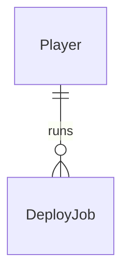

# Deploy pipelines

Sources:

- `docs/DevServer RPG.html` - cena 04 PIPELINE DE DEPLOY: 5 tipos, 5 níveis com tempo real, nível mínimo e recompensa, estágios LINT/BUILD/TEST/SHIP, coleta manual, regra de level-up (`gain`)
- conversa 2026-09-23 - acelerador adiado para shop-inventory-avatar; level-up do protótipo; sem cancelamento; coleta manual
- `.specs/STATE.md` - AD-001 a AD-008; `.specs/features/foundation/plan.md` - doors 5, 7, 8 e 12 que esta feature copia

## Problem

O jogador entra no jogo, cria o dev e não tem nada para fazer: o HUD mostra XP, coins e gems que
nunca mudam, e a aba DEPLOY diz "EM BREVE". Sem um loop que renda progresso, não existe motivo para
voltar amanhã. O protótipo não traz números de retenção - não há evidência além do próprio
protótipo, que trata o deploy como o loop principal.

Quando isto for entregue, o dev escolhe um tipo e um nível de deploy, sai do jogo, volta depois do
tempo real e coleta XP, coins e gems; ao acumular XP ele sobe de nível, ganha skill point e HP.

## Out of scope

| Excluded | Why |
| --- | --- |
| Acelerador de deploy (`-15min`) | depende de inventário; entra com shop-inventory-avatar (decisão do usuário) |
| Redução de tempo e bônus de XP do escritório | escritório fora do MVP (AD-008) |
| Cancelar um deploy em andamento | decisão do usuário: sem cancelamento |
| Coleta automática | decisão do usuário: coleta manual |
| Notificação quando o deploy termina | sem pedido; exige push/e-mail |
| Histórico persistido do log do terminal | o painel de log é da sessão; o que persiste são os jobs |

## Assumptions

| Assumption | Chosen default | Rationale | Confirmed? |
| --- | --- | --- | --- |
| Tabela de níveis | NV.1 15 min, nível mínimo 1, +80 XP +40 coins +0 gems · NV.2 30 min, 3, +150 +70 +1 · NV.3 60 min, 6, +260 +110 +2 · NV.4 180 min, 10, +420 +180 +4 · NV.5 360 min, 15, +700 +300 +8 | valores do protótipo (`deployLevelData`) | y |
| Tipos | `backend`, `frontend`, `mobile`, `database`, `microservices`, todos com a mesma tabela de níveis | protótipo não diferencia recompensa por tipo | y |
| Level-up | enquanto XP ≥ XP máximo: XP -= XP máximo, nível +1, XP máximo +250, skill points +1, HP máximo +20, HP = HP máximo | regra `gain` do protótipo; aprovado pelo usuário | y |
| Recompensa congelada no início | XP, coins, gems e duração do job são gravados quando o deploy começa | um ajuste de catálogo no meio do job não muda o que foi prometido | y |
| Estágio exibido | LINT < 25% do tempo decorrido ≤ BUILD < 50% ≤ TEST < 75% ≤ SHIP; terminado = `PRONTO PARA COLETAR` | regra do protótipo | y |
| Relógio | o servidor decide início, fim e "pronto"; o web mostra contagem usando a diferença entre `serverTime` e o relógio local | AD-002; relógio do navegador pode estar errado | y |
| Log do terminal | linhas geradas no web a cada início e coleta da sessão, últimas 8 | cosmético, como no protótipo | y |

**Open questions:** none - all resolved or logged above.

## Criteria

### S1: Iniciar um deploy (P1)

**Acceptance Criteria**

1. WHEN `POST /api/me/deploys` recebe `type` e `level` válidos, com o nível do jogador ≥ nível mínimo e sem job ativo desse tipo THEN a api SHALL criar o job com início = agora e fim = agora + duração do nível, e responder `201` com `player`, `deploy` e `serverTime`
2. IF já existe job ativo do mesmo `type` para o jogador THEN a api SHALL responder `409` com `error.code` = `deploy_running` e não criar outro job
3. IF o nível do jogador é menor que o nível mínimo do `level` pedido THEN a api SHALL responder `422` com `error.code` = `level_too_low`
4. IF `type` não é um dos 5 tipos THEN a api SHALL responder `422` com `error.code` = `unknown_deploy_type`
5. IF `level` não é um inteiro de 1 a 5 THEN a api SHALL responder `422` com `error.code` = `unknown_deploy_level`
6. The system SHALL permitir no máximo 1 job ativo por jogador e tipo, inclusive com requisições simultâneas
7. The system SHALL permitir jobs ativos de tipos diferentes ao mesmo tempo, até 5

**Independent test:** iniciar `backend` NV.1 e `frontend` NV.1, tentar `backend` de novo e receber `deploy_running`.

### S2: Acompanhar os pipelines (P1)

**Acceptance Criteria**

8. WHEN `GET /api/me/deploys` é chamado THEN a api SHALL responder `200` com `serverTime` e a lista de jobs ativos do jogador, cada um com `type`, `level`, `startedAt`, `endsAt` e `ready`
9. WHILE `serverTime` < `endsAt` de um job a api SHALL devolver `ready` = `false`, e `true` a partir de `endsAt`
10. WHEN o jogador abre `/deploy` THEN o web SHALL exibir os 5 tipos na ordem do catálogo, cada um com `ocioso`, `<tempo> restante` ou `pronto p/ coletar`
11. WHILE um tipo selecionado está ocioso o web SHALL exibir os 5 níveis com tempo e recompensa, e `NÍVEL <n>` desabilitado nos níveis cujo mínimo passa do nível do jogador
12. WHILE um tipo selecionado está rodando o web SHALL exibir a barra de progresso, o estágio (`LINT`, `BUILD`, `TEST`, `SHIP`) pelo tempo decorrido e o tempo restante em `mm:ss`, ou `h:mm:ss` a partir de 1 hora
13. WHILE um deploy está rodando o web SHALL atualizar o tempo restante a cada segundo sem chamar a api
14. WHILE `GET /api/me/deploys` não respondeu o web SHALL exibir `CARREGANDO...` no painel de deploy
15. IF `GET /api/me/deploys` falha THEN o web SHALL exibir `SERVIDOR FORA DO AR` com `TENTAR DE NOVO` no painel de deploy
16. The web SHALL ler tipos, níveis, tempos e recompensas apenas do catálogo, nunca de constantes no front

**Independent test:** iniciar `database` NV.1 e ver a contagem descer de `15:00`; recarregar e ver o mesmo tempo restante.

### S3: Coletar e subir de nível (P1)

**Acceptance Criteria**

17. WHEN `POST /api/me/deploys/{type}/claim` é chamado com um job pronto desse tipo THEN a api SHALL marcar o job como coletado, somar ao jogador o XP, coins e gems gravados no início e responder `200` com `player` e `reward`
18. IF o job do `type` ainda não chegou a `endsAt` THEN a api SHALL responder `409` com `error.code` = `deploy_not_ready` e não alterar o jogador
19. IF não há job ativo do `type` THEN a api SHALL responder `404` com `error.code` = `deploy_not_found`
20. WHEN a coleta leva o XP a um valor ≥ XP máximo THEN a api SHALL aplicar o level-up repetidamente até XP < XP máximo, somando 1 nível, 250 de XP máximo, 1 skill point e 20 de HP máximo por nível e deixando HP = HP máximo
21. The system SHALL creditar cada job no máximo 1 vez, inclusive com coletas simultâneas do mesmo job
22. WHEN um job é coletado THEN o tipo SHALL voltar a ocioso e aceitar um novo deploy
23. WHEN a coleta responde THEN o web SHALL atualizar o HUD com o `player` recebido e mostrar no log `> release de <TIPO> nível <n> publicada.`
24. WHILE o job selecionado não está pronto o web SHALL manter `COLETAR RECOMPENSA` desabilitado
25. WHEN um job é coletado THEN a api SHALL registrar um log `deploy.collected` com o tipo, o nível e o XP, coins e gems creditados

**Independent test:** com o relógio do teste avançado 15 minutos, coletar `backend` NV.1 e ver +80 XP e +40 coins no HUD; clicar duas vezes e receber `deploy_not_found` na segunda.

## Traceability

| ID | Slice | Criteria | Status |
| --- | --- | --- | --- |
| DEPLOY-01 | S1 | 1, 2, 3, 4, 5, 6, 7 | Verified |
| DEPLOY-02 | S2 | 8, 9, 10, 11, 12, 13, 14, 15, 16 | Verified |
| DEPLOY-03 | S3 | 17, 18, 19, 20, 21, 22, 23, 24, 25 | Verified |

## Observable

| Surface | Decision | Landing |
| --- | --- | --- |
| screen `deploy` | empty state | AC 10 |
| screen `deploy` | loading state | AC 14 |
| screen `deploy` | error state | AC 15 |
| screen `deploy` | unauthorised state | existing - `GameShell` mostra login em `401` (foundation AC 1) |
| screen `deploy` | ordering | AC 10 |
| screen `deploy` | destructive action confirms | n/a - não há ação destrutiva; iniciar não pode ser desfeito, mas também não custa nada |
| screen `deploy` | error on start or claim | AC 2 |
| API `GET /api/me/deploys` | response shape | AC 8 |
| API `GET /api/me/deploys` | error shape and codes | existing - envelope da foundation (door 7), `401`/`404` pelo middleware e `player_not_found` |
| API `POST /api/me/deploys` | response shape | AC 1 |
| API `POST /api/me/deploys` | error shape and codes | AC 2 |
| API `POST /api/me/deploys/{type}/claim` | response shape | AC 17 |
| API `POST /api/me/deploys/{type}/claim` | error shape and codes | AC 18 |
| API `GET /api/catalog` | response shape | AC 16 |
| API `/api/me/deploys*` | who may call it | existing - `RequireSession` da foundation |
| API `/api/me/deploys*` | versioning | n/a - mesmo motivo da foundation: único consumidor é o `web/` publicado junto |
| API `/api/me/deploys*` | rate limit behaviour | n/a - início e coleta são limitados pela regra de 1 job por tipo e pelo tempo real |

## Flow

Reusa o padrão de mutação da foundation (`player.WithLocked`, door 8), o envelope de erro (door 7)
e o catálogo embutido (door 5) em vez de criar outros; o level-up vira uma função única do
`player` que as próximas features (combate) chamam também.

1. web `/deploy` -> `GET /api/catalog` (exists) e `GET /api/me/deploys` (new, door 7) - desenha pipelines com o offset de `serverTime`
2. `POST /api/me/deploys` -> `RequireSession` (exists) -> `player.WithLocked` (exists) - valida tipo, nível e nível mínimo no catálogo (door 4), grava `DeployJob` (door 1) com recompensa congelada (door 2) e fim pelo relógio injetado (door 3)
3. `POST /api/me/deploys/{type}/claim` -> `player.WithLocked` (exists) - busca o job ativo, compara `endsAt` com o relógio (door 3), marca coletado (door 8), aplica `player.GainXP` (door 6), loga `deploy.collected`
4. out: `{"player", ...}`; web atualiza o HUD com `setPlayer` (exists, foundation AC 26)

## Relations

One-way constraints: no máximo 1 `DeployJob` ativo (não coletado) por jogador e tipo (door 1);
recompensa e fim gravados no job, imutáveis depois do início (door 2); job coletado permanece
guardado (door 8). No columns and no types here.

## Surface

| Route | In | Out | Status |
| --- | --- | --- | --- |
| `GET /api/me/deploys` | cookie `ds_session` | `serverTime`, `deploys` · `{error}` | `200`, `401`, `404`, `500` |
| `POST /api/me/deploys` | `type`, `level` | `player`, `deploy`, `serverTime` · `{error}` | `201`, `401`, `404`, `409`, `422`, `500` |
| `POST /api/me/deploys/{type}/claim` | - | `player`, `reward` · `{error}` | `200`, `401`, `404`, `409`, `422`, `500` |
| `GET /api/catalog` (changed) | `If-None-Match` | `version`, `regions`, `deployTypes`, `deployLevels` | `200`, `304` |

## Landing

| One-way door | Literal shape | Alternative rejected |
| --- | --- | --- |
| 1. entidade `DeployJob` | uma linha por deploy iniciado, ligada ao jogador; índice único parcial em (jogador, tipo) onde `collected_at` é nulo | 5 grupos de colunas por tipo em `players` - não guarda histórico e cada tipo novo vira migration |
| 2. recompensa congelada | XP, coins, gems e `ends_at` gravados no job no início; a coleta credita o gravado, não o catálogo | recalcular no catálogo na coleta - um ajuste de balanceamento muda o prêmio de jobs já rodando |
| 3. relógio injetado | `app.Deps.Now func() time.Time` (padrão `time.Now`), usado para início, fim e `ready`; respostas trazem `serverTime` em RFC 3339 UTC | `now()` do Postgres - testes não conseguem avançar o tempo; relógio do cliente - trapaça trivial |
| 4. forma do catálogo | `api/catalog/deploys.json` com `types` (`id`, `name`, `glyph`) e `levels` (`level`, `minLevel`, `minutes`, `xp`, `coins`, `gems`), servidos como `deployTypes` e `deployLevels` | números no front - viola AD-003 |
| 5. códigos de erro novos | `deploy_running` `409`, `deploy_not_ready` `409`, `deploy_not_found` `404`, `unknown_deploy_type` `422`, `unknown_deploy_level` `422`; `level_too_low` reutilizado | um `409 deploy_conflict` genérico - o web não distingue "já rodando" de "ainda não pronto" |
| 6. level-up único | `player.GainXP(p, xp)` é a única regra de level-up; deploy e futuras recompensas chamam ela | cada feature somar XP por conta própria - duas regras de level-up divergem |
| 7. rotas | `/api/me/deploys` e `/api/me/deploys/{type}/claim`; `{type}` é o id do catálogo | `/api/deploys/{id}` por id do job - o web teria que guardar ids; só existe 1 ativo por tipo |
| 8. histórico guardado | job coletado recebe `collected_at` e continua na tabela; contagem de deploys do ranking sai daí | apagar na coleta - o ranking perderia a coluna DEPLOYS |

- Nothing else in this change is hard to reverse

## Impact

| Front | What changes |
| --- | --- |
| domain | new term: `DeployJob` - um deploy iniciado por um jogador, ativo até ser coletado; vive em `api/internal/deploy` |
| domain | new term: level-up (`player.GainXP`) - regra única de progressão por XP; vive em `api/internal/player` |
| domain | existing term: `Catalog` passa a ter `deployTypes` e `deployLevels`; `version` muda, então clientes com `ETag` antigo recebem `200` |
| screen | a cena `/deploy` deixa de ser `EM BREVE`: o check C28 da foundation passa a cobrir só `/bug-fight`, `/skills`, `/loja`, `/avatar` - o teste muda no commit que entrega a cena |
| screen | e2e `shell.spec.ts` (foundation C27) deixa de esperar `EM BREVE` após clicar DEPLOY e passa a esperar `PIPELINES DE DEPLOY` |
| code | `player.WithLocked` passa a entregar a transação a `fn` (`fn(tx, p)`); `world.Travel` atualizado - próximas mutações que gravam outras linhas usam a mesma transação |
| stored data | nothing to migrate - tabela nova, vazia |
