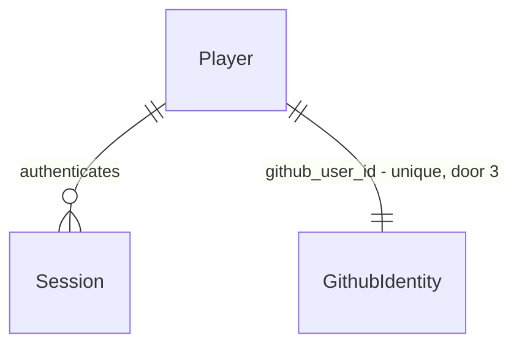
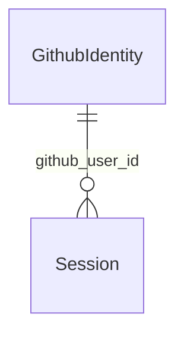

# Foundation

Sources:

- `docs/DevServer RPG.html` - protótipo navegável: cenas, HUD, regiões e seus níveis mínimos, paleta e tipografia
- conversa 2026-09-23 - levantamento de requisitos aprovado: MVP fatias 1–5, OAuth GitHub, decisões D3–D12 com a recomendação
- `.specs/STATE.md` - AD-001 a AD-008

## Problem

O DevServer RPG só existe como protótipo de uma página: todo o estado vive na memória do navegador,
some ao recarregar, não há jogador identificado e o ranking é inventado. Ninguém consegue jogar de
verdade, voltar no dia seguinte ou ser comparado a outro dev. O protótipo não traz números de uso -
não há evidência além do próprio protótipo.

Quando isto for entregue, um dev entra com a conta GitHub, cria seu personagem, vê o HUD com o
estado persistido no servidor, navega pelas cenas por clique e viaja entre regiões do mapa conforme
o nível. É o chão onde deploy, skills, combate e loja vão apoiar.

## Out of scope

| Excluded | Why |
| --- | --- |
| Deploy, skills, Bug Fight, loja, inventário, avatar | cada um é feature própria do MVP (AD-008); aqui aparecem só como abas "EM BREVE" |
| Escritório, ranking real, sala de servidores | fora do MVP (AD-008) |
| Navegação por teclado (setas, teclas 1–7) | recurso de apresentação do protótipo, não do jogo |
| "Prompt de arte" e scanlines configuráveis | ferramenta de design do protótipo |
| Login por email/senha | usuário escolheu só GitHub (AD-006) |
| Renomear dev depois de criado | sem pedido; nome único vira identidade pública no ranking |
| Layout mobile/responsivo | desktop-first 1200px (AD-007) |
| Excluir conta | registrado como pergunta aberta abaixo |

## Assumptions

| Assumption | Chosen default | Rationale | Confirmed? |
| --- | --- | --- | --- |
| Economia inicial | nível 1, XP 0/500, HP 100/100, 100 coins, 20 gems, 1 skill point, região `vila`, skin `default` | D10 aprovado no levantamento; 500 gems do protótipo é valor de demo | y |
| Classe do dev | escolhida no onboarding entre `FRONTEND`, `BACKEND`, `DEVOPS`, `FULLSTACK`; só cosmética | D9 aprovado no levantamento; valores vêm do ranking do protótipo | y |
| Formato do nome do dev | `^[A-Z0-9_]{3,16}$`, gravado em maiúsculas, único sem distinção de caixa | protótipo exibe o nome em maiúsculas na fonte pixel; 16 cabe no HUD | y |
| Nome sugerido no onboarding | login do GitHub em maiúsculas, caracteres fora de `[A-Z0-9_]` viram `_`, cortado em 16 | menos atrito no primeiro acesso | y |
| Duração da sessão | 30 dias, sem renovação deslizante | jogo casual volta dias depois; simples de provar | y |
| Catálogo exige login? | não - `GET /api/catalog` é público | só dados de jogo, sem dado de jogador | y |
| Estado de abas não entregues | aba visível com cena "EM BREVE" | mostra o formato final do jogo desde a foundation | y |
| Regeneração de HP fora de combate | nenhuma nesta feature | pertence ao bug-fight, onde HP é gasto | y |

**Open questions:**

| # | Kind | Question | Until answered |
| --- | --- | --- | --- |
| 1 | blocks go-live | Exclusão de conta e dados (LGPD): obrigatória antes de abrir ao público? | não abrir cadastro para usuários reais fora do time |
| 2 | open | Domínio e hospedagem de produção (define `redirect_uri` do app OAuth GitHub) | desenvolvimento usa `http://localhost:3000`; deploy fica fora desta feature |

## Criteria

### S1: Entrar com GitHub (P1)

**Acceptance Criteria**

1. WHEN um visitante sem sessão abre qualquer rota do jogo THEN o web SHALL exibir a tela de login com o botão `ENTRAR COM GITHUB`
2. WHEN o visitante clica em `ENTRAR COM GITHUB` THEN a api SHALL responder `302` para o authorize do GitHub com um parâmetro `state` aleatório e gravar o mesmo valor no cookie `ds_oauth_state` com validade de 600 segundos
3. WHEN o GitHub chama o callback com `state` igual ao cookie e um `code` válido THEN a api SHALL criar uma sessão, gravar o cookie `ds_session` com `HttpOnly`, `SameSite=Lax`, `Path=/`, `Max-Age=2592000` e responder `302` para `/`
4. IF o callback chega com `state` ausente ou diferente do cookie `ds_oauth_state` THEN a api SHALL responder `302` para `/login?error=state` e não criar sessão
5. IF a troca do `code` ou a leitura do usuário no GitHub falha THEN a api SHALL responder `302` para `/login?error=github` e não criar sessão
6. WHEN a tela de login abre com `error=github` ou `error=state` THEN o web SHALL exibir `NÃO FOI POSSÍVEL ENTRAR · TENTE DE NOVO` acima do botão `ENTRAR COM GITHUB`
7. WHEN o jogador aciona `SAIR` THEN a api SHALL apagar a sessão, expirar o cookie `ds_session` e responder `204`, e o web SHALL voltar à tela de login
8. IF uma rota protegida da api recebe requisição sem sessão válida THEN a api SHALL responder `401` com `error.code` = `unauthenticated`
9. IF a sessão foi criada há mais de 2592000 segundos THEN a api SHALL tratá-la como inválida e responder `401` com `error.code` = `unauthenticated`

**Independent test:** com um app OAuth GitHub de desenvolvimento, entrar, recarregar a página e continuar logado; clicar `SAIR` e cair na tela de login.

### S2: Criar o dev no primeiro acesso (P1)

**Acceptance Criteria**

10. WHEN um usuário GitHub autenticado sem jogador abre o jogo THEN o web SHALL exibir a tela de onboarding com o nome sugerido derivado do login GitHub e as 4 classes `FRONTEND`, `BACKEND`, `DEVOPS`, `FULLSTACK`
11. WHEN `POST /api/players` recebe `devName` válido e `class` válida THEN a api SHALL criar o jogador com nível 1, XP 0, XP máximo 500, HP 100, HP máximo 100, 100 coins, 20 gems, 1 skill point, região `vila`, skin `default` e responder `201` com `{"player": {...}}`
12. IF `devName`, depois de convertido para maiúsculas, não casa com `^[A-Z0-9_]{3,16}$` THEN a api SHALL responder `422` com `error.code` = `invalid_dev_name` e não criar jogador
13. IF `devName` já pertence a outro jogador, sem distinção de caixa THEN a api SHALL responder `409` com `error.code` = `dev_name_taken`
14. IF `class` não é uma das 4 classes THEN a api SHALL responder `422` com `error.code` = `invalid_class`
15. IF o usuário GitHub autenticado já tem jogador THEN `POST /api/players` SHALL responder `409` com `error.code` = `player_exists` e não alterar o jogador existente
16. WHEN a api responde `409 dev_name_taken` THEN o web SHALL manter o onboarding aberto e exibir `NOME JÁ EM USO` sob o campo de nome
17. The system SHALL manter no máximo 1 jogador por id de usuário GitHub

**Independent test:** entrar com uma conta nova, criar `DEV_01` classe `BACKEND` e ver o HUD com 100 coins e 20 gems; tentar outro usuário com `dev_01` e receber `NOME JÁ EM USO`.

### S3: HUD e navegação por cenas (P1)

**Acceptance Criteria**

18. WHEN um jogador autenticado abre o jogo THEN o web SHALL exibir o HUD com `LEVEL`, XP `atual/máximo`, HP `atual/máximo`, `COINS`, `GEMS` e `SKILL PTS` lidos de `GET /api/me`
19. WHILE `GET /api/me` não respondeu o web SHALL exibir `CARREGANDO...` no lugar dos valores do HUD
20. IF `GET /api/me` falha com `5xx` ou erro de rede THEN o web SHALL exibir `SERVIDOR FORA DO AR` com o botão `TENTAR DE NOVO`, que repete a requisição
21. IF `GET /api/me` responde `404` com `error.code` = `player_not_found` THEN o web SHALL abrir a tela de onboarding
22. The web SHALL exibir as abas na ordem `TÍTULO`, `MUNDO`, `DEPLOY`, `BUG FIGHT`, `SKILLS`, `LOJA`, `AVATAR`, cada uma ligada às rotas `/`, `/mundo`, `/deploy`, `/bug-fight`, `/skills`, `/loja`, `/avatar`
23. WHEN o jogador clica numa aba THEN o web SHALL trocar a cena e a URL sem recarregar o documento, mantendo o HUD visível
24. WHEN o jogador abre uma aba cuja feature ainda não foi entregue THEN o web SHALL exibir a cena `EM BREVE` com o nome da cena
25. WHEN o jogador clica numa placa da tela-título (`MUNDO`, `DEPLOY`, `SKILLS`, `BUG`) THEN o web SHALL navegar para a rota da cena correspondente
26. WHEN qualquer mutação responde `{"player": {...}}` THEN o web SHALL atualizar o HUD com esses valores sem nova chamada a `GET /api/me`

**Independent test:** logado, recarregar em `/mundo` e ver o HUD; clicar todas as abas e ver `EM BREVE` em `DEPLOY`; derrubar a api e ver `SERVIDOR FORA DO AR`.

### S4: Catálogo servido pela api (P1)

**Acceptance Criteria**

27. WHEN `GET /api/catalog` é chamado THEN a api SHALL responder `200` com `version` e a lista `regions` de 6 regiões `vila`, `floresta`, `mercado`, `caverna`, `torre`, `nuvem` com nível mínimo 1, 1, 2, 5, 8, 12
28. WHEN `GET /api/catalog` recebe `If-None-Match` igual ao `ETag` corrente THEN a api SHALL responder `304` sem corpo
29. The web SHALL ler níveis mínimos, nomes e descrições das regiões apenas do catálogo, nunca de constantes no front

**Independent test:** `curl -i /api/catalog` e repetir com o `ETag` retornado em `If-None-Match`.

### S5: Mapa do mundo e viagem (P1)

**Acceptance Criteria**

30. WHEN o jogador abre `/mundo` THEN o web SHALL exibir as 6 regiões e, para cada região com nível mínimo maior que o nível do jogador, o botão `REQUER NÍVEL <n>` desabilitado no lugar de `VIAJAR ATÉ AQUI`
31. WHEN `POST /api/me/travel` recebe `region` cujo nível mínimo é menor ou igual ao nível do jogador THEN a api SHALL gravar a região atual do jogador e responder `200` com `{"player": {...}}`
32. IF o nível do jogador é menor que o nível mínimo da `region` THEN a api SHALL responder `422` com `error.code` = `level_too_low` e manter a região atual
33. IF `region` não existe no catálogo THEN a api SHALL responder `422` com `error.code` = `unknown_region`
34. WHILE o jogador está numa região o web SHALL exibir `região atual: <NOME>` no mapa e destacar o nó dessa região

**Independent test:** jogador nível 1 viaja para `floresta` com sucesso e recebe `level_too_low` para `caverna`.

### S6: Contrato comum da api (P1)

**Acceptance Criteria**

35. The api SHALL responder todo `4xx` e `5xx` com corpo `{"error":{"code":"<snake_case>","message":"<texto pt-BR>"}}`
36. WHEN duas mutações do mesmo jogador chegam ao mesmo tempo THEN a api SHALL aplicá-las uma após a outra, de modo que o estado final seja o de alguma ordem sequencial das duas
37. The system SHALL rejeitar na gravação qualquer valor de `coins` ou `gems` menor que 0
38. IF um erro inesperado ocorre no handler THEN a api SHALL responder `500` com `error.code` = `internal` e registrar um log com o id da requisição

**Independent test:** disparar 20 `POST /api/me/travel` concorrentes alternando `vila`/`floresta` e ver a região final ser uma das duas, sem erro `500`.

## Traceability

| ID | Slice | Criteria | Status |
| --- | --- | --- | --- |
| AUTH-01 | S1 | 1, 2, 3, 4, 5, 6, 7, 8, 9 | Pending |
| PLAYER-01 | S2 | 10, 11, 12, 13, 14, 15, 16, 17 | Pending |
| SHELL-01 | S3 | 18, 19, 20, 21, 22, 23, 24, 25, 26 | Pending |
| CATALOG-01 | S4 | 27, 28, 29 | Pending |
| WORLD-01 | S5 | 30, 31, 32, 33, 34 | Pending |
| API-01 | S6 | 35, 36, 37, 38 | Pending |

## Observable

| Surface | Decision | Landing |
| --- | --- | --- |
| screen `login` | empty state | AC 1 |
| screen `login` | loading state | n/a - o clique é um redirect de navegação, não uma requisição assíncrona |
| screen `login` | error state | AC 6 |
| screen `login` | unauthorised state | n/a - é a própria tela de quem não tem sessão |
| screen `onboarding` | empty state | AC 10 |
| screen `onboarding` | error state | AC 16 |
| screen `onboarding` | unauthorised state | AC 1 |
| screen `onboarding` | loading state | n/a - envio único; botão desabilitado durante o envio é placement de UI |
| screen `hud + abas` | loading state | AC 19 |
| screen `hud + abas` | error state | AC 20 |
| screen `hud + abas` | unauthorised state | AC 1 |
| screen `hud + abas` | empty state | AC 21 |
| screen `hud + abas` | ordering | AC 22 |
| screen `hud + abas` | destructive action confirms | n/a - `SAIR` é reversível entrando de novo |
| screen `em breve` | empty state | AC 24 |
| screen `mundo` | empty state | n/a - o catálogo sempre tem as 6 regiões |
| screen `mundo` | error state | AC 20 |
| screen `mundo` | unauthorised state | AC 1 |
| screen `mundo` | ordering | AC 27 |
| API `GET /api/auth/github/login` | response shape | AC 2 |
| API `GET /api/auth/github/callback` | response shape | AC 3 |
| API `GET /api/auth/github/callback` | error shape and codes | AC 4 |
| API `GET /api/auth/github/callback` | error on our own failure | AC 38 |
| API `POST /api/auth/logout` | response shape | AC 7 |
| API `GET /api/me` | error shape and codes | AC 8 |
| API `GET /api/onboarding` | response shape | AC 10 |
| API `GET /api/onboarding` | who may call it | AC 8 |
| API `POST /api/players` | response shape | AC 11 |
| API `POST /api/players` | error shape and codes | AC 12 |
| API `GET /api/catalog` | response shape | AC 27 |
| API `GET /api/catalog` | who may call it | AC 27 |
| API `POST /api/me/travel` | response shape | AC 31 |
| API `POST /api/me/travel` | error shape and codes | AC 32 |
| API `/api/*` | who may call it | AC 8 |
| API `/api/*` | error shape and codes | AC 35 |
| API `/api/*` | versioning | n/a - único consumidor é o `web/` do mesmo repo, publicado junto via proxy same-origin |
| API `/api/*` | rate limit behaviour | n/a - nenhuma rota da foundation gera recurso; throttle de comandos entra no bug-fight |

## Flow

Greenfield: nada existe além do protótipo. A foundation cria os dois processos e o padrão que as
próximas features copiam - uma mutação é uma transação com lock na linha do jogador que devolve o
jogador inteiro (door 8), e o front nunca guarda regra de jogo, só lê o catálogo (door 5).

1. navegador -> `web/` Next.js (door 1) - renderiza cena; chamadas `/api/*` passam pelo rewrite same-origin (door 6)
2. `api/` Go HTTP (door 1) - middleware lê `ds_session` e resolve `Session` -> `Player` (door 2); rotas públicas: login, callback, catálogo
3. `api/` auth GitHub (door 9) - troca `code`, lê id e login do usuário GitHub, persiste `Session`
4. handler de mutação - transação, `SELECT ... FOR UPDATE` em `Player` (door 8), valida contra o catálogo embutido (door 5), grava
5. out: `{"player": {...}}` ou envelope de erro (door 7); `web/` atualiza o HUD com o `player` recebido

## Relations

One-way constraints: `github_user_id` único (door 3); `dev_name` único sem distinção de caixa
(door 4); `coins` e `gems` nunca negativos (door 10); região do jogador é um id do catálogo, não
chave estrangeira (door 5). No columns and no types here.

Acrescentado no build: a `Session` nasce antes do `Player` (onboarding), então ela se liga ao
`GithubIdentity` (`github_user_id`) e o `Player` é resolvido por ele.

## Surface

| Route | In | Out | Status |
| --- | --- | --- | --- |
| `GET /api/auth/github/login` | - | redirect para GitHub · cookie `ds_oauth_state` | `302` |
| `GET /api/auth/github/callback` | `code`, `state` | redirect `/` ou `/login?error=` · cookie `ds_session` | `302` |
| `GET /api/auth/github/callback` (acrescentado na verificação) | `code`, `state` | `{error}` quando a sessão não pode ser gravada | `500` |
| `POST /api/auth/logout` | cookie `ds_session` | - | `204`, `401` |
| `GET /api/me` | cookie `ds_session` | `player` · `{error}` | `200`, `401`, `404`, `500` |
| `GET /api/onboarding` | cookie `ds_session` | `suggestedDevName`, `classes` | `200`, `401` |
| `POST /api/players` | `devName`, `class` | `player` · `{error}` | `201`, `401`, `409`, `422`, `500` |
| `GET /api/catalog` | `If-None-Match` | `version`, `regions` | `200`, `304` |
| `POST /api/me/travel` | `region` | `player` · `{error}` | `200`, `401`, `404`, `422`, `500` |

## Landing

| One-way door | Literal shape | Alternative rejected |
| --- | --- | --- |
| 1. layout do repo | `web/` (Next.js App Router, TypeScript) e `api/` (módulo Go `devserver/api`) na raiz; `docker-compose.yml` com Postgres 16 para dev | dois repositórios - toda feature vira dois PRs e o contrato diverge entre versões |
| 2. sessão | token aleatório de 32 bytes no cookie `ds_session`; banco guarda só o SHA-256 do token; validade 30 dias | JWT sem estado - `SAIR` não consegue revogar e a sessão vazada vale até expirar |
| 3. identidade do jogador | jogador ligado ao id numérico do usuário GitHub, único | login GitHub como chave - usuário GitHub pode renomear o login e perder o personagem |
| 4. nome do dev | gravado em maiúsculas, `^[A-Z0-9_]{3,16}$`, índice único sobre o valor em maiúsculas | texto livre - acentos e emoji fora do charset da fonte pixel e nomes quase iguais no ranking |
| 5. catálogo | JSON em `api/catalog/*.json` embutido via `embed`; `version` = hash do conteúdo, usado como `ETag`; estado do jogador guarda só ids do catálogo | tabelas de catálogo no Postgres - cada ajuste de balanceamento vira migration e exige tela de admin que o MVP não tem |
| 6. origem única | `web/next.config` com `rewrites` de `/api/:path*` para o Go; o navegador só fala com a origem do Next | CORS entre origens - cookie de sessão vira cross-site e depende de `SameSite=None` |
| 7. envelope de erro | `{"error":{"code":"<snake_case>","message":"<pt-BR>"}}`; códigos desta feature: `unauthenticated`, `player_not_found`, `player_exists`, `invalid_dev_name`, `dev_name_taken`, `invalid_class`, `level_too_low`, `unknown_region`, `internal` | status HTTP sem corpo - o web não distingue `dev_name_taken` de `player_exists`, ambos `409` |
| 8. padrão de mutação | uma transação por requisição; `SELECT ... FROM players WHERE id = $1 FOR UPDATE` antes de ler regras; resposta sempre `{"player": {...}}` | versão otimista com `409` em conflito - duplo clique no jogo mostraria erro ao jogador em vez de serializar |
| 9. dependências | Go: `go-chi/chi/v5`, `jackc/pgx/v5`, `pressly/goose/v3`, `golang.org/x/oauth2` (endpoint `github`); web: `next`, `react`, `typescript`; fontes Press Start 2P e VT323 via `next/font/google` | ORM (`gorm`) - esconde o `FOR UPDATE` que a door 8 exige e gera SQL implícito |
| 10. moedas não negativas | `CHECK (coins >= 0)` e `CHECK (gems >= 0)` na tabela de jogadores | só validação no Go - um handler futuro que esqueça a checagem grava saldo negativo |

| 11. stack de testes | api: `go test` contra Postgres real do `docker-compose.yml` (banco `devserver_test`), GitHub falso via `httptest.Server` e binário `api/cmd/fakegithub` para e2e; web: `vitest` + `@testing-library/react` + `jsdom` para telas, `@playwright/test` para e2e | banco mockado - não prova `FOR UPDATE` (door 8) nem `CHECK` (door 10) |
| 12. códigos genéricos de erro | `not_found` (`404`, rota inexistente), `method_not_allowed` (`405`), `invalid_body` (`422`, JSON malformado ou campo com tipo errado), no mesmo envelope da door 7 | resposta texto padrão do roteador - quebra o AC 35 para qualquer URL errada |

- Nothing else in this change is hard to reverse

## Impact

| Front | What changes |
| --- | --- |
| domain | new term: `Player` - o personagem de um usuário GitHub, com nível, XP, HP, coins, gems, skill points, classe, skin e região; vive em `api/` |
| domain | new term: `DevName` - nome público único do jogador em maiúsculas; vive em `api/` |
| domain | new term: `Catalog` - dados de balanceamento versionados embutidos na api; única fonte de números de jogo |
| domain | new term: `Region` - um dos 6 lugares do mapa com nível mínimo; vive no `Catalog` |
| domain | new term: `Session` - login ativo de 30 dias ligado a um `Player` |
| stored data | nothing to migrate - banco novo, primeira migration cria as tabelas |
