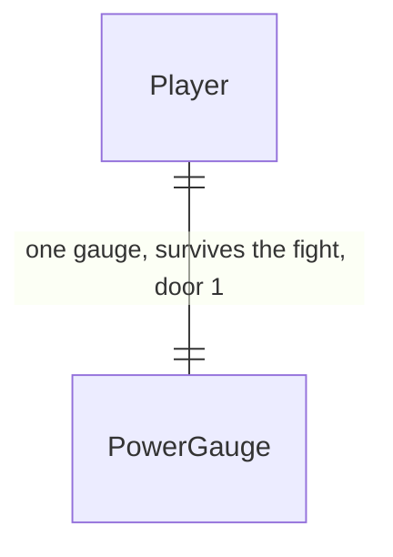

# Limit break

Sources:

- conversa 2026-09-26 — uma skill única, habilitada quando uma barra de poder enche (exemplo: 10 acertos ou 5 críticos), com dano alto e uma animação própria, no estilo dos RPGs antigos
- `api/catalog/combat.json`, `api/internal/battle/rules.go` — o dano passa por `Hit`; o crítico que o jogo já mostra é o golpe que consome a fraqueza exposta (`×1.8`), não um segundo sorteio
- `.specs/STATE.md` — AD-002, AD-003, AD-004, AD-005, AD-011, AD-012
- `.claude/skills/pixel-assets/references/style-guide.md` (seção fx) — a faixa de efeito é 128×32, quatro quadros de 32×32

> Revisão 2026-09-26 (`.specs/features/skill-loadout/plan.md`): o especial passa a ser **um por classe**. `ship` / `SHIP IT` fica sendo o da classe BACKEND; FRONTEND ganha `hot_reload` (`HOT RELOAD`, 40 dano, cura 60, +50 SP), DEVOPS `zero_downtime` (`ZERO DOWNTIME`, escudo, cura 60, 50 dano) e FULLSTACK `monolito` (`MONOLITO`, 60 dano, cura 30). Cada comando `limit` leva `class`; o de outra classe responde `409 command_locked`. Os quatro usam a faixa `ship`. A regra da barra (door 2) não muda. A decisão entra no STATE.md como AD-020 (AD-018 já é a trilha por classe).

## Problem

No Bug Fight todo golpe é da mesma família: o jogador gasta SP, o inimigo devolve o turno, e o efeito na tela é um dos oito flashes de 400ms. Não existe um momento em que a luta acumula e então descarrega. Quem luta várias vezes seguidas paga com a mesma cadência do primeiro turno, e o comando mais forte do catálogo (`i3`, 28–34) continua sendo só mais um botão de SP.

Quando isto for entregue, cada golpe que acerta enche uma barra de poder que sobrevive à luta. Cheia, ela habilita um único comando, SHIP IT, que esvazia a barra, causa o maior dano do catálogo e toca uma animação própria, maior e mais longa que os flashes atuais.

## Out of scope

| Excluded | Why |
| --- | --- |
| Upar o especial | revisão 2026-09-26 (`skill-loadout`): o especial é fixo; só as skills da trilha sobem de nível |
| Um crítico sorteado à parte da fraqueza | o crítico do jogo já é o golpe na fraqueza exposta |
| Encher a barra ao tomar dano | o pedido é acertar |
| O inimigo perder o turno | não houve pedido de turno grátis; `EndTurn` continua sendo a única regra de turno |
| A barra no HUD fora do Bug Fight | o valor viaja no `player` para a próxima luta; a barra é da cena de combate |
| Faixa nova no rig do herói | o espetáculo é o efeito sobre o inimigo; o sprite do herói reusa a pose `interact` |
| Guardar carga acima do teto | o que passa de 100 se perde |

## Assumptions

| Assumption | Chosen default | Rationale | Confirmed? |
| --- | --- | --- | --- |
| O que conta como crítico | o golpe que consome fraqueza exposta, o mesmo caso em que o float já diz `CRÍTICO!` | um sorteio novo seria uma segunda regra de crítico e deslocaria a ordem de draws do AD-011 (dano, contra-ataque, drop, poção) | n |
| Quanto a barra sobe | +10 por golpe, +20 por crítico, teto 100 | os exemplos da conversa: 10 acertos ou 5 críticos | n |
| Onde a barra vive | no jogador; vitória, fuga, derrota e o próximo encontro não zeram | o NULL SLIME tem 60 HP e o FIX tira 14–20, então uma luta curta acaba em cerca de 4 golpes; 10 acertos não cabem nela | n |
| A skill | um comando `ship`, rótulo `SHIP IT`, dano base 80, custa a barra inteira e 0 SP, não exige nó da árvore | uma skill só, acima do `i3` (28–34). 80 sem modificador mata até o slime da vila (60) e não mata o PACOTE MALICIOSO (85). Com fraqueza e sem bônus: 144, mata a torre só se houver bônus. Com fraqueza e os 37% de dano das skills (`f3`+`b3`+`i3`): 197, e o MEMORY LEAK ANCESTRAL (220) continua de pé | n |
| Turno do inimigo | se o inimigo sobrevive, o contra-ataque de 7–14 acontece como em qualquer outro comando | não houve pedido de turno grátis | n |
| Animação | a faixa fx que o guia já define (4 quadros de 32×32), desenhada a 128px por 1,2s, com flash dourado no palco | uma faixa de 8 quadros em tela cheia seria um segundo contrato de frame, e o próximo efeito copiaria esse contrato | n |

**Open questions:** none - all resolved or logged above.

## Criteria

### S1: a barra enche e atravessa a luta (P1)

**Acceptance Criteria**

1. WHEN um comando do catálogo com intervalo de dano e sem `limit` (`fix`, `f1`, `f2`, `f3`, `b1`, `b3`, `i1`, `i3`) acerta sem consumir fraqueza THEN the api SHALL somar `combat.power.perHit` (10) a `player.power`, limitado a `combat.power.max` (100), e devolver esse valor em `player`
2. WHEN esse golpe consome fraqueza THEN the api SHALL somar `combat.power.perCrit` (20), com o mesmo teto
3. WHEN `player.power` é 90 e o golpe soma 10 THEN the api SHALL gravar 100
4. WHEN `player.power` é 90 e o golpe soma 20 THEN the api SHALL gravar 100
5. WHEN `player.power` já é 100 e o jogador acerta de novo THEN the api SHALL manter 100
6. WHEN o comando é `test`, `refactor`, `plain`, `rollback`, `b2` ou `i2` THEN the api SHALL deixar `player.power` como estava
7. WHEN o jogador usa uma poção ou o inimigo contra-ataca THEN the api SHALL deixar `player.power` como estava
8. WHEN a luta termina em vitória, fuga ou derrota THEN the api SHALL manter `player.power` no valor de depois do último acerto
9. IF o corpo de `POST /api/me/battle/commands` traz `power` ou `damage` THEN the api SHALL ignorar os dois e SHALL mudar `player.power` só pela regra do catálogo
10. WHEN um jogador é criado ou uma linha que já existe passa pela migration THEN `player.power` SHALL ser 0
11. The api SHALL incluir `power` em todo `player` serializado, inclusive em `GET /api/me`
12. The api SHALL servir em `GET /api/catalog` `combat.power` com `max` 100, `perHit` 10 e `perCrit` 20, e um comando `ship` com `label` `SHIP IT`, `cost` 0, `damage` [80, 80], `limit` true e sem `skill`, depois de `i3` e antes de `rollback`

**Independent test:** nove FIX levam a barra de 0 a 90; o décimo chega a 100; fugir e abrir outro encontro ainda mostra 100.

### S2: SHIP IT gasta a barra (P1)

**Acceptance Criteria**

13. WHILE `player.power` é 100, o SP do combate é 0 e o jogador não tem skills, WHEN `POST /api/me/battle/commands` recebe `command` = `ship` THEN the api SHALL gravar `player.power` = 0 e SHALL emitir um evento `damage` com `command` `ship` e `amount` 80
14. WHEN esse golpe não reduz o HP do inimigo a 0 e o draw do contra-ataque é 0 THEN the api SHALL incluir um evento `counter` com `amount` 7
15. WHEN esse golpe reduz o HP do inimigo a 0 THEN the api SHALL incluir `victory`, SHALL não incluir `counter`, e `player.power` SHALL ser 0
16. The dano de `ship` SHALL seguir `Hit`: fraqueza e bônus 0 → 144; bônus 10% e sem fraqueza → 88; fraqueza e bônus 37% → 197; em todos esses casos `player.power` SHALL ficar 0
17. IF `player.power` é 99 THEN the api SHALL responder `409` com `error.code` = `power_not_ready` e `error.message` = `a barra de poder ainda não encheu`, e SHALL não mudar `power`, HP, SP nem o HP do inimigo
18. IF `ship` é enviado de novo depois de ter sido gasto THEN the api SHALL responder `409` `power_not_ready`
19. WHEN dois `ship` do mesmo jogador chegam juntos com `power` 100 THEN the api SHALL aplicar um (evento `damage` com `amount` 80 e `power` 0) e SHALL responder `409` `power_not_ready` ao outro
20. IF a transação do turno falha antes do commit THEN the api SHALL responder `500` e `player.power` SHALL continuar o valor de antes do pedido

**Independent test:** com a barra em 100 e SP em 0, SHIP IT tira 80 de um inimigo com mais de 80 HP, zera a barra, e o inimigo ainda contra-ataca; o segundo clique responde `power_not_ready`.

### S3: a barra e o botão no Bug Fight (P1)

**Acceptance Criteria**

21. WHEN o painel do herói está na tela THEN the web SHALL mostrar `PODER <power>/<max>` e uma barra cuja largura preenchida é `<power>/<max>` da trilha, inclusive com `power` 0 e depois que o encontro terminou (`battle` null)
22. The web SHALL ler o teto, o preenchimento e se SHIP IT está habilitado de `catalog.combat.power` e `player.power`; com o catálogo de teste em `max` 40 e `power` 40 o botão SHALL estar habilitado, e com `power` 20 a barra SHALL estar pela metade e o botão desabilitado
23. WHILE `player.power` é menor que `catalog.combat.power.max` the web SHALL desabilitar o botão `SHIP IT`
24. WHEN `player.power` é igual ao teto, o SP é 0 e a luta está `active` THEN the web SHALL habilitar o botão com o `label` e o `hint` do catálogo, o custo escrito `PODER`, depois de `^ SCALING` e antes de `ROLLBACK`
25. WHILE os beats de um turno ainda estão tocando the web SHALL manter a barra no `power` de antes do pedido; WHEN o último beat termina the web SHALL mostrar o `power` da resposta
26. IF o pedido de `ship` responde `409` com a mensagem `a barra de poder ainda não encheu` THEN the web SHALL acrescentar essa mensagem ao log e SHALL manter a barra no valor anterior
27. WHILE a largura da viewport é menor que 1200px the web SHALL manter a barra dentro do painel do herói, e a página SHALL não ganhar rolagem horizontal

**Independent test:** barra em 0 mostra `PODER 0/100` e o botão desabilitado; em 100, com SP 0, o botão habilita e o clique só atualiza a barra quando a animação acaba.

### S4: a animação de SHIP IT (P1)

**Acceptance Criteria**

28. WHEN um evento `damage` tem `command` `ship` e o usuário não prefere movimento reduzido THEN the web SHALL tocar um beat com `data-fx` `ship` e `background-image` apontando para `/art/fx/ship.png`, classe `battle-fx-limit` com caixa de 128px, `background-size` `512px 128px`, `animation-duration` `1.2s` e `animation-timing-function` `steps(4)`, o ator do herói com classe `anim-special`, o palco com classe `is-limit`, e o float `-<amount> SHIP IT!`
29. The arquivo `/art/fx/ship.png` SHALL ter 128×32 pixels, quatro quadros de 32×32, cada um diferente dos outros, sem pixel na margem de 1px de cada quadro, pintado na rampa `code`, com exatamente um pixel `white` no segundo quadro e nenhum nos outros três
30. WHILE `prefers-reduced-motion: reduce` the web SHALL não renderizar o elemento de fx, SHALL acrescentar ao log `> SHIP IT: <amount> de dano` e SHALL mostrar o `power` da resposta sem esperar beat

**Independent test:** soltar SHIP IT mostra o flash de 128px por 1,2s e o float `SHIP IT!`; com movimento reduzido, o log recebe a linha de dano e a barra zera na hora.

## Traceability

| ID | Slice | Criteria | Status |
| --- | --- | --- | --- |
| LIMIT-01 | S1 | 1, 2, 3, 4, 5, 6, 7, 8, 9, 10, 11, 12 | Pending |
| LIMIT-02 | S2 | 13, 14, 15, 16, 17, 18, 19, 20 | Pending |
| LIMIT-03 | S3 | 21, 22, 23, 24, 25, 26, 27 | Pending |
| LIMIT-04 | S4 | 28, 29, 30 | Pending |

## Observable

| Surface | Decision | Landing |
| --- | --- | --- |
| screen `BUG FIGHT` | empty state | AC 21 |
| screen `BUG FIGHT` | loading state | n/a - a cena já mostra `CARREGANDO...` até `POST /api/me/battle` voltar; `power` não tem pedido próprio |
| screen `BUG FIGHT` | error state | AC 26 |
| screen `BUG FIGHT` | unauthorised state | existing - `GameShell` mostra o login no `401` |
| screen `BUG FIGHT` | ordering | AC 24 |
| screen `BUG FIGHT` | destructive action confirms | n/a - os comandos de combate não pedem confirmação; o botão habilitado é a ação, como o FIX |
| API `POST /api/me/battle/commands` | response shape | AC 1 |
| API `POST /api/me/battle/commands` | error shape and codes | AC 17 |
| API `POST /api/me/battle/commands` | who may call it | existing - `RequireSession` da foundation |
| API `POST /api/me/battle/commands` | versioning | n/a - o único consumidor é o `web/` publicado junto |
| API `POST /api/me/battle/commands` | rate limit behaviour | n/a - nenhuma rota do jogo tem limite; a barra e o lock da linha limitam o gasto |
| API `GET /api/catalog` | response shape | AC 12 |
| API `GET /api/catalog` | error shape and codes | n/a - a rota entrega o documento embutido e não usa o envelope de erro |
| API `GET /api/catalog` | who may call it | n/a - a rota é pública, fora de `RequireSession` |
| API `GET /api/catalog` | versioning | n/a - campo aditivo, único consumidor é o `web/` publicado junto |
| API `GET /api/catalog` | rate limit behaviour | n/a - leitura do catálogo embutido, sem limite |
| API `GET /api/me` | response shape | AC 11 |
| API `GET /api/me` | error shape and codes | existing - os códigos desta rota não mudam |
| API `GET /api/me` | who may call it | existing - `RequireSession` da foundation |
| API `GET /api/me` | versioning | n/a - campo aditivo, único consumidor é o `web/` publicado junto |
| API `GET /api/me` | rate limit behaviour | n/a - nenhuma rota do jogo tem limite |

## Flow

A carga e o gasto passam pelo turno que já existe: `ApplyCommand`, `Hit` e `EndTurn`. O dano de SHIP IT não ganha fórmula própria, e o crítico não ganha um segundo sorteio. O cliente continua mandando só o id do comando.

1. `POST /api/me/battle/commands` entra em `RequireSession` (exists) e em `battle.Command` (exists), que trava a linha em `player.WithLocked` (exists)
2. `battle.Command` (exists) recusa um comando `limit` quando `player.power` é menor que `combat.power.max` com `power_not_ready` (door 4); se aceita, zera `power` antes do dano (door 3)
3. `ApplyCommand` (exists) sorteia o dano e chama `Hit` (exists); um golpe com dano que não é `limit` soma `perHit` ou `perCrit` e corta no teto (door 2); `EndTurn` (exists) contra-ataca ou encerra a luta sem zerar `power`
4. out: a resposta traz `player.power` e `events`; `BattleScene` (exists) só aplica esse `power` na barra quando o último beat termina
5. `beatOf` (exists) mapeia o `damage` de `ship` para o beat longo (door 5), lendo a faixa `/art/fx/ship.png`

## Relations

One-way constraints: every player has the gauge, including rows that already exist, and it starts at 0 (door 1). It is never negative. The cap lives in the catalog, not in a stored ceiling.

## Surface

| Route | In | Out | Status |
| --- | --- | --- | --- |
| `POST /api/me/battle/commands` | `command` (`ship` or an existing id) | `battle` · `player` (gains `power`) · `events` · `{error}` | `200`, `401`, `404`, `409`, `422`, `500` |
| `GET /api/me` (changed; same for every route that returns `player`) | cookie `ds_session` | `player` gains `power` | `200`, `401`, `404`, `500` |
| `GET /api/catalog` (changed) | `If-None-Match` | `combat.power` · command `ship` | `200`, `304` |

## Landing

| One-way door | Literal shape | Alternative rejected |
| --- | --- | --- |
| 1. a barra mora no jogador | migration nova: `players.power integer NOT NULL DEFAULT 0 CHECK (power >= 0)`; JSON `player.power` | coluna em `battles` — a linha some na fuga e na derrota, e uma luta curta não chega a 10 acertos |
| 2. a tabela de carga é catálogo | `combat.json` `rules.power` = `{"max":100,"perHit":10,"perCrit":20}`, servido como `catalog.combat.power`; golpe com dano e sem `limit` soma `perCrit` quando `Hit` consome a fraqueza, senão `perHit`, e corta em `max` | um draw extra de crítico — mudaria a ordem dano, contra-ataque, drop, poção que os testes do combate já scriptam (AD-011) |
| 3. um comando `limit` | `ship`, rótulo `SHIP IT`, hint `o deploy que resolve · 80 dano`, `cost` 0, `damage` [80, 80], `limit` true, sem `skill`, depois de `i3` e antes de `rollback`; ao usar, `power` vai a 0 antes do dano e esse golpe não recarrega; o dano passa por `Hit` e o turno por `EndTurn` | um nó da árvore de skills — ficaria trancado até gastar um ponto, e o pedido é a barra que habilita |
| 4. código novo | `409` `power_not_ready`, mensagem `a barra de poder ainda não encheu` | reusar `not_enough_sp` — SP é outro recurso, e a mensagem mandaria recuperar SP |
| 5. a animação cabe no contrato de fx | `web/art/fx/ship.json` e `web/public/art/fx/ship.png`, 128×32, quatro quadros de 32×32, rampa `code`, um pixel `white` só no segundo quadro; na tela, classe `battle-fx-limit` a 128px por 1,2s `steps(4)`, ator `anim-special`, palco `is-limit` | uma faixa de 8 quadros em tela cheia — o renderer e o guia só definem a célula de 4 quadros, e um segundo contrato é o que o próximo efeito copiaria |

Door 2 é a regra que a próxima barra copiaria. Quando este plano for confirmado, ela entra em `.specs/STATE.md` como AD-020: existe uma barra de poder só, `players.power`, carregada pela tabela `combat.power` do catálogo e gasta por um comando com `limit: true`; uma fonte nova entra nessa regra e não ganha uma segunda barra nem um segundo crítico.

- Nothing else in this change is hard to reverse

## Impact

| Front | What changes |
| --- | --- |
| domain | new term: `power` — a única barra do jogador; nasce em 0, sobe com o golpe que acerta, esvazia no `ship`. Vive no `player` |
| domain | new term: `limit` — flag de comando; o comando gasta `power`, custa 0 SP e não exige skill desbloqueada |
| domain | existing term: `CRÍTICO` continua sendo o golpe que consome a fraqueza exposta. Quem ramifica hoje: `battle.Hit` e o float de `beatOf`. O dano desse golpe não muda; ele passa também a somar `perCrit` |
| stored data | todo jogador que já existe ganha a barra em 0; nenhuma linha de `battles` é reescrita |
| catalog | `GET /api/catalog` ganha `combat.power` e o comando `ship`; os fixtures do web copiam esses campos à mão |
