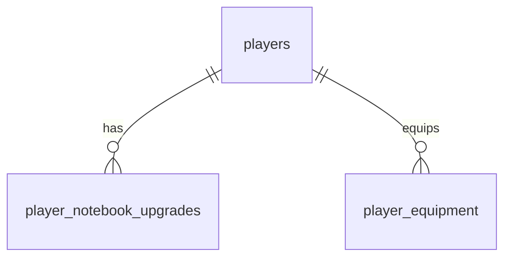

# Notebook do dev (arma)

Sources:

- conversa 2026-09-26 - "vamos implementar a tela de weapon; ideia é o dev conseguir gerenciar e upar seu notebook"
- respostas na mesma conversa: **um notebook único por dev** que evolui de BÁSICO a LENDÁRIO; o slot de gear `notebook` sai e MACBOOK PRO / MONITOR ULTRAWIDE vão para `acessorio`; o laptop do herói segue a raridade. V1 = nível e raridade com APRIMORAR em coins, os 4 upgrades e a arte das 4 raridades; gemas (encaixes) e skins de notebook depois
- `web/public/notebook_keyart.png` - **binding for the art and the arrangement**: "VARIAÇÕES DO NOTEBOOK" (4 raridades), "TELA DO NOTEBOOK (UI)" (sprite à esquerda, nome com raridade, nível, lista de stats, botão APRIMORAR), "TELA DE UPGRADE" (4 cartões com ícone, nome, descrição e custo em coins). Os rótulos de efeito da keyart (cooldown, velocidade de movimento, "% de vida") descrevem mecânicas que o jogo não tem; a copy é a deste plano
- `.specs/STATE.md` - AD-002, AD-003, AD-004, AD-005, AD-009, AD-012..014, AD-015, AD-019 (HP de passivo entra e sai do HP gravado), AD-022, AD-023
- `.specs/features/server-room/plan.md`, `.specs/features/skill-loadout/plan.md` - padrões de compra com coins em `player.WithLocked` e de nível 1..3 pago

## Problem

O dev não tem uma arma. O notebook hoje é só um dos 12 slots de equipamento: tem duas peças compradas
com gems e nenhuma progressão, e as coins do jogador não têm onde render bônus de combate além do
rack. A keyart apresenta o notebook como "a sua arma", que "evolui durante a jornada", e o jogo não
tem nada que corresponda a isso. Não há números de uso; a keyart e a decisão do usuário são a única
evidência.

Quando isto for entregue, todo dev tem um notebook, começando no BÁSICO Nv 1. Na tela NOTEBOOK ele
gasta coins em APRIMORAR (Nv 1 a 10; a raridade vira RARO no Nv 4, ÉPICO no 7 e LENDÁRIO no 10) e em
4 upgrades de 3 níveis cada. Tudo isso soma dano, HP, SP e regeneração de SP pela regra única de
bônus, e o laptop que o herói segura muda com a raridade.

## Out of scope

| Excluded | Why |
| --- | --- |
| Gemas / encaixes do notebook (ATAQUE, DEFESA, VIDA, CRÍTICO...) | decisão do usuário: V1 sem encaixes; o nome colide com a moeda `gems` e vai ser decidido na feature deles |
| Skins de notebook (PADRÃO, DEV, HACKER, QUÂNTICO) | decisão do usuário: depois |
| XP do notebook (barra `120 / 300 XP` da keyart) | AD-009: XP só por `player.GainXP`; uma segunda trilha de XP exigiria outro AD. O nível sobe só por APRIMORAR |
| Stats DEFESA, CRÍTICO por chance, VELOCIDADE, COOLDOWN, MANA | o combate não tem essas mecânicas; os efeitos usam os tipos que já existem (`dmg`, `hp`, `sp`, `spregen`) |
| Abas INVENTÁRIO / GEMAS / CONFIGURAÇÕES da janela da keyart | inventário já está em AVATAR; as outras dependem do que está fora |
| Estados animados (abrindo, danificado, carregando) e efeitos visuais do notebook em batalha | arte e combate fora da V1; o sprite é estático por raridade |
| Rebaixar nível, vender upgrade, devolver coins | sem pedido; subir é a única direção |
| Novos slots de gear para o notebook (colar, cinto...) | AD-023 já cuida dos slots do corpo |

## Assumptions

| Assumption | Chosen default | Rationale | Confirmed? |
| --- | --- | --- | --- |
| Modelo | um notebook por dev, nível gravado no jogador, sempre ativo (não é equipado) | decisão do usuário | y |
| Escopo V1 | nível + raridade + APRIMORAR + 4 upgrades + arte das 4 raridades | decisão do usuário | y |
| Slot `notebook` | sai de `shop.json` `slots`; MACBOOK PRO e MONITOR ULTRAWIDE passam a `slot: acessorio`; o equipamento gravado no slot `notebook` vai para `acessorio` quando ele está livre, e senão é desequipado (a peça continua do jogador) | decisão do usuário; nenhuma das duas peças tem bônus `hp`, então desequipar não mexe no HP | y |
| Laptop do herói | BÁSICO mostra o laptop escolhido no visual (básico, preto ou o gamer comprado); RARO, ÉPICO e LENDÁRIO trocam pelo laptop da raridade, por cima da escolha, como o gear faz hoje | decisão do usuário ("segue a raridade"); manter a escolha no BÁSICO não joga fora o `laptop_gamer` comprado com gems | n |
| Look do MACBOOK PRO | a peça perde o `look`, e a opção `laptop_macbook` (só de gear) sai do catálogo | no `acessorio` ela não pode mais trocar o laptop; o laptop agora vem do notebook | n |
| Níveis e custo do APRIMORAR | tabela "Catálogo proposto" abaixo; Nv 1 a 10, custo em coins, stats cumulativos por nível | a keyart mostra custo em coins; valores iniciais de balanceamento, ajustáveis só no catálogo | n |
| Raridade por nível | BÁSICO 1–3, RARO 4–6, ÉPICO 7–9, LENDÁRIO 10 (`rarities[].from`) | 4 raridades da keyart num teto de 10 | n |
| Upgrades | 4 upgrades, Nv 0 a 3 cada, custo por nível; o Nv k exige o notebook no Nv `levels[k-1].minLevel` (1, 4, 7) | a keyart mostra slots trancados; amarrar à raridade dá motivo para APRIMORAR | n |
| Efeito dos upgrades | CPU TURBO → `dmg`, BATERIA ESTENDIDA → `hp`, SSD NVME → `sp`, CONECTIVIDADE 5G → `spregen` | a keyart pede cooldown e velocidade, que não existem; o mais próximo que existe | n |
| HP | o bônus `hp` do nível e da BATERIA entra no HP máximo e no HP ao subir (`player.ChangeHP`) | AD-019 / gear: HP de bônus entra no HP gravado quando começa a contar | n |
| Navegação | rota `/notebook`; entra pelo cartão NOTEBOOK na ficha do AVATAR (onde ficava o slot `notebook`); a hotbar continua com 9 abas | a hotbar tem 9 slots com atalhos 1–9 e grade 3x3 no celular (game-menu door 3); uma 10ª aba quebra os dois | n |
| Confirmação antes de gastar | nenhuma, como comprar na LOJA e no SERVER | padrão existente | n |
| Nome do upgrade SSD | `SSD NVME` igual ao componente do rack, ids diferentes (`ssd_nvme` × `ssd`) | nome da keyart; catálogos separados | n |

**Open questions:** none - todos os `n` acima são defaults que mudam no catálogo ou na tela, exceto a remoção do slot `notebook` (porta 3), que é a decisão do usuário.

### Catálogo proposto (`api/catalog/notebook.json`)

Níveis (stats cumulativos do notebook naquele nível; custo = coins para chegar nele):

| Nv | Raridade | Custo | Poder (`dmg` %) | Vida (`hp`) |
| --- | --- | --- | --- | --- |
| 1 | BÁSICO | - | 0 | 0 |
| 2 | BÁSICO | 100 | 1 | 5 |
| 3 | BÁSICO | 150 | 2 | 10 |
| 4 | RARO | 250 | 3 | 15 |
| 5 | RARO | 350 | 4 | 20 |
| 6 | RARO | 450 | 5 | 25 |
| 7 | ÉPICO | 600 | 6 | 30 |
| 8 | ÉPICO | 750 | 7 | 35 |
| 9 | ÉPICO | 900 | 8 | 40 |
| 10 | LENDÁRIO | 1200 | 10 | 50 |

Upgrades (valor cumulativo no Nv 1 / 2 / 3; custo em coins por nível; notebook mínimo 1 / 4 / 7):

| id | Nome | Descrição | Bônus | Valor | Custo |
| --- | --- | --- | --- | --- | --- |
| `cpu_turbo` | CPU TURBO | Aumenta o dano no Bug Fight. | `dmg` | 2 / 4 / 6 | 300 / 500 / 800 |
| `bateria` | BATERIA ESTENDIDA | Aumenta o HP máximo. | `hp` | 10 / 20 / 30 | 250 / 400 / 650 |
| `ssd_nvme` | SSD NVME | Aumenta o SP máximo no Bug Fight. | `sp` | 5 / 10 / 15 | 300 / 450 / 700 |
| `rede_5g` | CONECTIVIDADE 5G | Recupera mais SP a cada turno. | `spregen` | 1 / 2 / 3 | 200 / 350 / 550 |

## Criteria

### S1: o notebook existe e sobe de nível (P1)

**Acceptance Criteria**

1. The api SHALL servir em `GET /api/catalog` a chave `notebook` com `rarities` (4, na ordem `basico`, `raro`, `epico`, `lendario`, cada uma com `id`, `name`, `from` = 1, 4, 7, 10 e, a partir de `raro`, `look` = `laptop_raro`, `laptop_epico`, `laptop_lendario`), `levels` (10 entradas com `cost`, `dmg` e `hp` da tabela, `cost` null no Nv 1) e `upgrades` (os 4 da tabela, cada um com `id`, `name`, `description`, `bonus` e 3 `levels` `{minLevel, cost, amount}`)
2. The api SHALL incluir em todo `player` a chave `notebook` = `{"level": n, "rarity": "<id>", "upgrades": {"cpu_turbo": k, "bateria": k, "ssd_nvme": k, "rede_5g": k}}`, com toda chave de upgrade do catálogo presente (0 quando nunca comprado)
3. WHEN um dev é criado THEN `notebook` SHALL ser `{"level": 1, "rarity": "basico", "upgrades": {... todos 0}}`; um jogador que já existia antes da migration SHALL ler o mesmo
4. The api SHALL derivar `rarity` como a última raridade cujo `from` <= `level`: Nv 3 → `basico`, Nv 4 → `raro`, Nv 6 → `raro`, Nv 7 → `epico`, Nv 10 → `lendario`
5. WHEN `POST /api/me/notebook/enhance` chega com o notebook no Nv n < 10 e `coins` >= `levels[n].cost` THEN a api SHALL gravar Nv n+1, tirar o custo das coins e somar `levels[n].hp − levels[n-1].hp` ao HP máximo e ao HP; `coins` igual ao custo SHALL pagar
6. IF o notebook está no Nv 10 THEN `enhance` SHALL responder `409 notebook_max_level` `o notebook já está no nível máximo` sem mudar nada, antes de olhar as coins
7. IF `coins` < `levels[n].cost` THEN `enhance` SHALL responder `409 not_enough_coins` sem mudar nada
8. The schema SHALL recusar um nível de notebook menor que 1
9. IF o nível gravado é maior que o número de `levels` do catálogo THEN a api SHALL tratar o notebook como no último nível (stats, raridade e `notebook_max_level`)
10. The api SHALL somar em `player.Bonus`, sempre, o `dmg` e o `hp` do nível do notebook (Nv 4 → `dmg` +3, `hp` +15), junto com as fontes de hoje
11. The web SHALL servir `/notebook` com o sprite da raridade (`/art/sprite/notebook-<rarity>.png`), `NOTEBOOK <NOME DA RARIDADE>`, `NÍVEL <n>/<max>` com a barra de nível, e as linhas `PODER +<dmg>%`, `VIDA +<hp>`, `SP +<sp>`, `REGEN SP +<spregen>` somando nível e upgrades do notebook
12. The web SHALL mostrar o botão `APRIMORAR · <custo>c`; WHEN clicado THEN SHALL chamar `enhance` e repassar o `player` da resposta ao `setPlayer`, com o botão desabilitado enquanto a chamada está pendente
13. WHILE o notebook está no último nível o web SHALL mostrar `NÍVEL MÁXIMO` no lugar do botão
14. WHILE `coins` < custo do próximo nível o botão SHALL estar desabilitado com `COINS INSUFICIENTES`
15. IF a chamada responde erro THEN o web SHALL exibir `error.message` na faixa de mensagem da cena; IF a rede falha THEN SHALL exibir `falha na conexão. tente de novo.`
16. The web SHALL mostrar na ficha do AVATAR um cartão `NOTEBOOK` com o sprite, a raridade e `NV <n>` que leva a `/notebook`
17. The web SHALL somar o notebook (nível e upgrades) em `totalBonus`, de modo que a ficha do AVATAR mostre `dano +<x>%` e `SP +<y>` iguais aos de `player.Bonus`

**Independent test:** novo dev abre `/notebook` pela ficha do AVATAR, vê BÁSICO Nv 1/10, aperta APRIMORAR três vezes e vê RARO Nv 4, `PODER +3%`, `VIDA +15`, HP máximo do HUD +15 e coins −500.

### S2: upgrades (P1)

**Acceptance Criteria**

18. WHEN `POST /api/me/notebook/upgrades/{id}` chega para um upgrade no Nv k < 3, com o notebook no Nv >= `levels[k].minLevel` e `coins` >= `levels[k].cost` THEN a api SHALL gravar o upgrade no Nv k+1 e tirar o custo das coins; para `bateria` SHALL somar `levels[k].amount − levels[k-1].amount` (Nv 0 = 0) ao HP máximo e ao HP
19. The api SHALL decidir `upgrades/{id}` nesta ordem: id fora do catálogo → `422 unknown_upgrade` `upgrade desconhecido` (antes de olhar o jogador); Nv 3 → `409 upgrade_max_level` `o upgrade já está no nível máximo`; notebook abaixo de `minLevel` → `409 notebook_level_too_low` `aprimore o notebook para liberar este nível`; `coins` < custo → `409 not_enough_coins`; cada recusa sem mudar nada
20. The schema SHALL recusar um nível de upgrade menor que 1 e dois registros do mesmo upgrade para o mesmo jogador
21. IF um upgrade gravado não está mais no catálogo THEN a api SHALL ignorá-lo (fora de `notebook.upgrades` e de `player.Bonus`); IF o nível gravado passa do número de `levels` THEN SHALL contar como o último
22. The api SHALL somar em `player.Bonus` o `amount` do nível de cada upgrade no seu tipo (`cpu_turbo` Nv 2 → `dmg` +4; `rede_5g` Nv 1 → `spregen` +1); Nv 0 soma nada
23. The web SHALL listar os 4 upgrades na ordem do catálogo, cada cartão com o ícone `/art/icon/nbup-<id>.png`, nome, descrição, `NV <k>/3`, o efeito atual e o próximo (`+2% → +4% DANO`) e o botão `UPGRADE · <custo>c`
24. WHILE o upgrade está no Nv 3 o cartão SHALL mostrar `NV MÁX.` no lugar do botão
25. WHILE o notebook está abaixo do `minLevel` do próximo nível o botão SHALL estar desabilitado com `REQUER NOTEBOOK NV <minLevel>`; WHILE só faltam coins SHALL estar desabilitado com `COINS INSUFICIENTES`
26. WHEN o botão é clicado THEN o web SHALL chamar a rota, repassar o `player` ao `setPlayer` e, em erro, exibir `error.message` como no AC 15, com os botões da cena desabilitados enquanto uma chamada está pendente

**Independent test:** dev no Nv 1 compra CPU TURBO Nv 1 (−300 coins, `PODER +2%`), vê o Nv 2 trancado com `REQUER NOTEBOOK NV 4`, aprimora até o Nv 4 e compra o Nv 2.

### S3: o slot de gear `notebook` sai (P2)

**Acceptance Criteria**

27. The api SHALL servir `gearSlots` sem `notebook`, na ordem `cabeca`, `oculos`, `brinco`, `colar`, `torso`, `cinto`, `pernas`, `pe`, `maos`, `acessorio`, `bebida`, e MACBOOK PRO e MONITOR ULTRAWIDE com `slot` = `acessorio`, sem `look`
28. The api SHALL servir `player.equipment` sem a chave `notebook`
29. WHEN a migration sobe num jogador com MACBOOK PRO no slot `notebook` e `acessorio` vazio THEN o MACBOOK PRO SHALL ficar equipado em `acessorio`, e HP e HP máximo SHALL não mudar
30. WHEN a migration sobe num jogador com MONITOR ULTRAWIDE no slot `notebook` e FONE COM CANCELAMENTO em `acessorio` THEN o FONE SHALL continuar em `acessorio`, o MONITOR SHALL ficar desequipado e continuar em `player.gear`
31. The api SHALL servir a parte `laptop` do avatar sem `gearSlot`, sem a opção `laptop_macbook`, e com as opções `laptop_raro`, `laptop_epico`, `laptop_lendario` marcadas `gearOnly` (não escolhíveis no editor; `PUT /api/me/appearance` com elas → `422 gear_only`)

**Independent test:** jogador com MACBOOK PRO equipado antes da migration abre AVATAR depois dela e vê o MACBOOK no ACESSÓRIO, sem linha NOTEBOOK entre os slots e com o cartão NOTEBOOK do AC 16.

### S4: o laptop do herói segue a raridade (P3)

**Acceptance Criteria**

32. WHILE `player.notebook.rarity` é `basico` o herói SHALL desenhar o laptop escolhido no visual (ou o padrão do corpo)
33. WHILE a raridade tem `look` (`raro`, `epico`, `lendario`) o herói SHALL desenhar o layer dessa opção por cima da escolha, nos dois corpos e em toda animação (`idle`, `walk`, `run`, `jump`, `interact`), e o editor SHALL marcar a parte NOTEBOOK como `definido pelo notebook`

**Independent test:** dev com `laptop_gamer` comprado vê o gamer no Nv 3; no Nv 4 o herói do HUD, do AVATAR e do Bug Fight passa a segurar o laptop azul RARO; o `laptop_gamer` continua em `player.looks`.

### S5: layout (P2)

**Acceptance Criteria**

34. WHILE a largura é menor que 1200px a cena `/notebook` SHALL empilhar o painel do notebook sobre os 4 cartões de upgrade numa coluna, sem rolagem horizontal, tanto no estado normal quanto com a faixa de erro visível (AD-015)

**Independent test:** Playwright a 390px de largura mede a cena e os cartões dentro da viewport.

## Traceability

| ID | Slice | Criteria | Status |
| --- | --- | --- | --- |
| NOTE-01 | S1 | 1–17 | Pending |
| NOTE-02 | S2 | 18–26 | Pending |
| NOTE-03 | S3 | 27–31 | Pending |
| NOTE-04 | S4 | 32–33 | Pending |
| NOTE-05 | S5 | 34 | Pending |

## Observable

| Surface | Decision | Landing |
| --- | --- | --- |
| screen `/notebook` | empty state | n/a - todo dev tem o notebook desde o Nv 1 (AC 3); upgrade nunca comprado aparece como `NV 0/3` (AC 23) |
| screen `/notebook` | loading state | existing - `GameShell` só monta a cena com `player` e `catalog` carregados |
| screen `/notebook` | error state | AC 15, AC 26 |
| screen `/notebook` | unauthorised state | existing - `GameShell` mostra o login em `401` e o onboarding em `404 player_not_found` |
| screen `/notebook` | density and ordering | AC 11 (ordem das linhas de stat), AC 23 (upgrades na ordem do catálogo), AC 34 (uma coluna no celular) |
| screen `/notebook` | destructive action confirms | n/a - gastar coins não pede confirmação, como a LOJA e o SERVER; nada é destruído |
| screen `/notebook` | pending / double click | AC 12, AC 26 |
| screen `/notebook` | max and locked states | AC 13, AC 14, AC 24, AC 25 |
| screen `/avatar` (ficha) | entry point and slot list | AC 16, AC 27 |
| API `POST /api/me/notebook/enhance` | response shape | AC 5 - `{"player": {...}}` (AD-004) |
| API `POST /api/me/notebook/enhance` | error shape and codes | AC 6, AC 7; `404 player_not_found` e `401` pelo padrão de `WithLocked` / `RequireSession` |
| API `POST /api/me/notebook/upgrades/{id}` | response shape | AC 18 - `{"player": {...}}` |
| API `POST /api/me/notebook/upgrades/{id}` | error shape and codes | AC 19 |
| API `POST /api/me/notebook/*` | who may call it | existing - grupo `RequireSession`; cada um só muda o próprio jogador |
| API `POST /api/me/notebook/*` | versioning | n/a - o único cliente é `web/` no mesmo repo e no mesmo deploy (AD-001) |
| API `POST /api/me/notebook/*` | rate limit | n/a - nenhuma rota do jogo tem limite; o custo em coins limita o efeito |
| API `GET /api/catalog` | response shape | AC 1, AC 27, AC 31 |
| document / copy | tone and next action | AC 11, AC 23, AC 25 - copy pt-BR em caixa alta como o resto do jogo; o texto trancado diz o que fazer (`REQUER NOTEBOOK NV 4`) |

## Flow

Reusa `player.WithLocked` e `player.Pay` para pagar, `player.ChangeHP` para o HP de bônus e
`player.Bonus` como a única soma de bônus (AD-012); o catálogo segue o caminho de `rack.json`. O
herói ganha uma fonte de look nova em `resolveLook` no lugar do gear, que sai da parte `laptop`.

1. `api/catalog/notebook.json` (door 5) -> `catalog` (exists) - carrega `Notebook` e responde em `GET /api/catalog` como `notebook`
2. in: `POST /api/me/notebook/enhance` ou `/upgrades/{id}` -> router `RequireSession` (exists) -> handlers `notebook` (new package, no door - placement como `rack`) - valida o id no catálogo e chama `player.WithLocked` (exists)
3. `player.WithLocked` (exists) - trava a linha, carrega `players.notebook_level` (door 1) e `player_notebook_upgrades` (door 2) em `Player.Notebook`, a regra decide, `player.Pay` (exists) cobra, `player.ChangeHP` (exists) aplica o delta de `hp`, grava e responde `{"player": ...}`
4. `player.Bonus` (exists, door 4) - soma nível e upgrades do notebook; `battle` (exists) e `deploy` (exists) leem sem mudar
5. migration `00015` (door 3) - move o equipamento do slot `notebook` e cria as portas 1 e 2
6. out: `web` `NotebookScene` (new, no door - placement como `ServerScene`) em `/notebook` renderiza `player.notebook` e chama as rotas; `setPlayer` (exists) atualiza o HUD
7. `web/src/lib/gear.ts` `totalBonus` (exists) soma o notebook; `web/src/lib/avatar.ts` `resolveLook` (exists, door 6) troca o laptop pela raridade; `AvatarScene` (exists) ganha o cartão NOTEBOOK
8. arte: skill `pixel-assets` (exists) traça de `notebook_keyart.png` os 4 sprites `sprite/notebook-<rarity>`, os 4 ícones `icon/nbup-<id>` e os layers do herói `laptop-<raro|epico|lendario>[-f]` com as 5 animações

## Relations

One-way constraints: `players` ganha o nível do notebook, not null com default 1 e check >= 1
(door 1); `player_notebook_upgrades` é única por (jogador, upgrade), com nível check >= 1 e cascade
na remoção do jogador (door 2); `player_equipment` deixa de ter linhas no slot `notebook` (door 3).
No columns and no types here.

## Surface

| Route | In | Out | Status |
| --- | --- | --- | --- |
| `POST /api/me/notebook/enhance` | nenhum corpo | `player` | `200`, `401`, `404`, `409`, `500` |
| `POST /api/me/notebook/upgrades/{id}` | `id` do upgrade no path, nenhum corpo | `player` | `200`, `401`, `404`, `409`, `422`, `500` |
| `GET /api/catalog` | - | `notebook` · `gearSlots` sem `notebook` · `avatar.parts.laptop` sem `gearSlot` | `200` |
| `GET /api/me` e toda resposta `{"player": ...}` | - | `player.notebook` · `player.equipment` sem `notebook` | `200`, `401`, `404` (inalterados) |

## Landing

| One-way door | Literal shape | Alternative rejected |
| --- | --- | --- |
| 1. nível do notebook no jogador | `players.notebook_level integer NOT NULL DEFAULT 1 CHECK (notebook_level >= 1)`; o teto fica no catálogo (AC 9) | tabela `player_notebook` 1:1 - um JOIN a mais para um inteiro que todo jogador tem; `CHECK (<= 10)` - trava o balanceamento no schema |
| 2. níveis dos upgrades | `CREATE TABLE player_notebook_upgrades (player_id bigint NOT NULL REFERENCES players(id) ON DELETE CASCADE, upgrade_id text NOT NULL, level integer NOT NULL CHECK (level >= 1), PRIMARY KEY (player_id, upgrade_id))`; Nv 0 = sem linha | 4 colunas em `players` - cada upgrade novo vira migration, contra AD-003 |
| 3. slot `notebook` removido | `UPDATE player_equipment SET slot = 'acessorio' WHERE slot = 'notebook' AND player_id NOT IN (SELECT player_id FROM player_equipment WHERE slot = 'acessorio'); DELETE FROM player_equipment WHERE slot = 'notebook';` - o Down não recria o que foi desequipado | manter o slot ao lado da arma - dois "notebook" no jogo com regras diferentes (decisão do usuário) |
| 4. notebook em `player.Bonus` | `sum += notebookBonus(cat, p.Notebook, bonusType)`: `levels[min(level, len)-1]` nos tipos `dmg`/`hp` mais `upgrades[i].levels[min(k, 3)-1].amount` no tipo `upgrades[i].bonus`; vira AD-024 em `STATE.md`, estendendo AD-012 | calcular o bônus no handler de batalha - segunda regra, contra AD-012 |
| 5. contrato do catálogo | `notebook: {rarities: [{id, name, from, look?}], levels: [{cost, dmg, hp}], upgrades: [{id, name, description, bonus, levels: [{minLevel, cost, amount}]}]}` e `player.notebook: {level, rarity, upgrades: {<id>: k}}` | `levels` com deltas por nível - a tela e o `Bonus` teriam de somar prefixos; totais cumulativos se leem direto |
| 6. fonte de look `notebook` | `resolveLook` recebe `notebookRarity`; a parte `laptop` usa `rarities[].look` quando existe, com `by: "notebook"` no `LookSource`; a parte deixa de ter `gearSlot` | continuar pelo gear (um item "notebook raro" no slot) - volta ao modelo que o usuário recusou |

- Nothing else in this change is hard to reverse

## Impact

| Front | What changes |
| --- | --- |
| domain | termo novo `notebook` (a arma): nível 1..10, raridade derivada, 4 upgrades; mora em `player` (estado) e num pacote `notebook` (regras) |
| domain | termo existente `notebook` (slot de gear, AD-022/AD-023) deixa de existir; quem ramifica nele hoje: `shop.json` `slots`, `avatar.json` parte `laptop` (`gearSlot`), `AvatarScene` (abreviação `note` e ícone na linha 156), `web/src/test/helpers.ts`, testes de catálogo que conferem `gearSlot` e a ordem dos slots, e specs e2e de AVATAR e LOJA. AD-024 atualiza AD-022/AD-023 |
| domain | `SSD NVME` passa a ser o nome de dois itens: componente do rack (`ssd`) e upgrade do notebook (`ssd_nvme`) |
| domain | `gearOnly` passa a significar "não escolhível no editor" também para os laptops de raridade; o `422 gear_only` fala "equipe-o no inventário", que não serve para eles - a mensagem fica, a tela não oferece essas opções |
| stored data | `players` ganha o nível com default 1 (todo jogador existente lê Nv 1, sem bônus, sem mexer no HP); `player_equipment` perde as linhas do slot `notebook` (porta 3); nada mais a migrar |
| art | `notebook_keyart.png` entra como keyart de referência na skill `pixel-assets`; ~44 specs novos (4 sprites, 4 ícones, 3 laptops × 2 corpos × (base + 5 animações)); a arte `laptop-macbook*` fica sem uso e sai com a opção |
