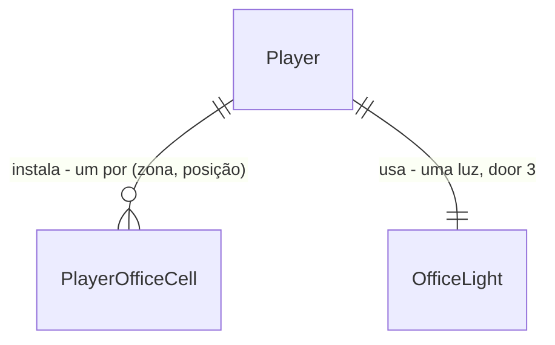

# Office keyart

Sources:

- `web/public/office_keyart.png` - **binding for the interface and the art**: "ESCRITÓRIO DO DEV", "PERSONALIZE SEU ESCRITÓRIO" (MÓVEIS, DECORAÇÕES, TECNOLOGIAS, MASCOTES, ILUMINAÇÃO), os quadros MÓVEIS PRINCIPAIS (12), DECORAÇÕES (12), TECNOLOGIAS / SERVIDORES (8), MASCOTES (8), TEMPLATES DE LAYOUT (BÁSICO, CONFORTO, PROFISSIONAL, GAMER) e o EXEMPLO DE ESCRITÓRIO MONTADO
- conversa 2026-09-27 - "implementar o nosso escritório seguindo o modelo da keyart, as funções que tem na keyart e os assets"
- `.specs/features/office/plan.md` - o escritório existente (zonas PAREDE 8 / PISO 24, instalar, guardar, conforto, níveis, bônus via `player.Bonus`), que esta feature estende sem mudar regra
- `.specs/STATE.md` - AD-002 a AD-005, AD-013 (bônus do escritório em `player.Bonus`)

## Problem

A cena OFFICE vende 12 móveis numa lista única filtrada por PAREDE e PISO. A keyart do escritório
mostra outra coisa: 40 peças separadas em MÓVEIS, DECORAÇÕES, TECNOLOGIAS e MASCOTES, quatro
TEMPLATES DE LAYOUT que montam uma sala pronta, e ILUMINAÇÃO como eixo de personalização. Nenhum
desses existe: 33 das peças da keyart não estão no catálogo nem têm arte, não há como montar uma
sala de uma vez e a sala tem uma só luz. A keyart é a única evidência; não há números de uso.

Quando isto for entregue, o dev abre OFFICE, navega o catálogo pelas quatro categorias da keyart
(cada peça com o ícone traçado da keyart), aplica um template de layout que compra e instala as
peças que faltam de uma vez, e troca a iluminação da sala entre as luzes que o conforto do
escritório já liberou.

## Out of scope

| Excluded | Why |
| --- | --- |
| Sala em perspectiva com móveis posicionados livremente (o EXEMPLO da keyart) | a sala continua a grade PAREDE/PISO do escritório existente; posição livre exige outra entidade |
| Miniaturas ilustradas dos templates | a keyart desenha cada template como uma sala; aqui o cartão mostra os ícones das peças |
| Personagem animado (IDLE, WALK, RUN, JUMP, ATTACK) e a paleta | já são assets do herói e do guia de estilo, não funções do escritório |
| Mascote que anda ou reage na sala | mascote é uma peça de piso como as outras |
| Redesenhar os 12 ícones de móvel existentes | já têm arte; esta feature desenha só as 33 peças novas |
| Guardar tudo / desfazer template | não está na keyart; guardar continua um espaço por vez |
| Mudar os 12 móveis existentes (preço, nome, bônus) ou os níveis | rebalanceamento é outra decisão (AD-003) |

## Assumptions

| Assumption | Chosen default | Rationale | Confirmed? |
| --- | --- | --- | --- |
| Categorias | `moveis` MÓVEIS · `decoracoes` DECORAÇÕES · `tecnologias` TECNOLOGIAS · `mascotes` MASCOTES, nessa ordem, no catálogo | quadros da keyart | n |
| Móveis existentes nas categorias | `mesa`, `cadeira_gamer`, `estante`, `planta`, `setup2`, `cafeteira` → MÓVEIS; `poster`, `tapete`, `neon`, `kanban`, `janela` → DECORAÇÕES; `rack` → TECNOLOGIAS; ids, preços e bônus iguais | mesa, cadeira, estante, planta, poster, tapete e rack aparecem na keyart; mudar id perderia móveis gravados | n |
| Ordem do catálogo | por categoria; dentro dela a ordem da keyart, depois as peças antigas que a keyart não mostra | a tela lista na ordem do catálogo | n |
| Peças novas (33) | a tabela "Peças novas" abaixo: id, nome, zona, preço, conforto, bônus | tecnologias dão tempo de deploy, móveis de descanso dão SP, decoração de estudo dá XP, mascotes em gems; rebalancear é só catálogo | n |
| MONITOR duplicado na keyart | MÓVEIS `monitor` = MONITOR; TECNOLOGIAS `monitor_ops` = MONITORAMENTO | dois ids com o mesmo nome confundem o detalhe e as mensagens | n |
| NUBE na keyart | `nuvem` = NUVEM | pt-BR (AD-015); "nube" é espanhol | n |
| Iluminação | `lights` no catálogo: `natural` NATURAL conforto 0 · `quente` LUZ QUENTE 30 · `noite` NOITE 70 · `neon` NEON 120; grátis; liberada quando o conforto do escritório ≥ o mínimo | a keyart lista ILUMINAÇÃO sem preço; os mínimos são os níveis HOME OFFICE, ESTÚDIO e LAB DEV, o que dá ao nível um efeito | n |
| Luz gravada acima do conforto (dev guardou móveis) | a luz continua; o conforto só é checado ao trocar | tirar a luz ao guardar um móvel seria um efeito escondido | n |
| Luz gravada que saiu do catálogo | lida como a primeira luz do catálogo (`natural`) | mesma regra de `ResolveAppearance`: catálogo encolher não quebra o jogador | n |
| Templates | `templates` no catálogo, cada um com `id`, `name`, `description` e `pieces` `{zone, position, furniture}`; a tabela "Templates" abaixo | quatro cartões da keyart | n |
| Aplicar template | tudo ou nada: espaço vazio recebe a peça e cobra o preço; espaço com a mesma peça é pulado sem cobrar; espaço com outra peça (ou peça fora do catálogo) responde `409 cell_occupied` sem mudar nada; o total em coins e o total em gems são cobrados juntos | aplicar duas vezes não cobra de novo; nunca sobrescrever um móvel do dev | n |
| Ordem das validações do template | `invalid_body` → `unknown_template` → `cell_occupied` → `not_enough_coins` → `not_enough_gems` | catálogo antes do lock, estado depois, como `office` | n |
| Ordem das validações da luz | `invalid_body` → `unknown_light` → `light_locked` | idem | n |
| Pré-checagem na tela para template e luz | nenhuma além de desabilitar a luz bloqueada; o servidor responde e a tela mostra `error.message` | o custo do template depende do que já está instalado; só o servidor sabe | n |
| Preço mostrado no cartão do template | soma dos preços de todas as peças, por moeda (`270C`, `380C + 60G`) | é o custo com a sala vazia; o servidor cobra só o que falta | n |

**Open questions:** none - all resolved or logged above.

### Peças novas

| id | nome | categoria | zona | preço | conforto | bônus |
| --- | --- | --- | --- | --- | --- | --- |
| `monitor` | MONITOR | moveis | piso | 30 gems | 6 | deploy 2 |
| `laptop` | LAPTOP | moveis | piso | 80 coins | 5 | xp 2 |
| `sofa` | SOFÁ | moveis | piso | 90 coins | 12 | spregen 1 |
| `puff` | PUFF | moveis | piso | 40 coins | 7 | - |
| `cama` | CAMA | moveis | piso | 120 coins | 14 | spregen 2 |
| `gaveteiro` | GAVETEIRO | moveis | piso | 35 coins | 4 | - |
| `prateleira` | PRATELEIRA | moveis | parede | 30 coins | 4 | xp 1 |
| `luminaria` | LUMINÁRIA | moveis | piso | 25 coins | 5 | - |
| `quadro` | QUADRO | decoracoes | parede | 20 coins | 3 | - |
| `relogio` | RELÓGIO | decoracoes | parede | 30 coins | 3 | deploy 1 |
| `trofeu` | TROFÉU | decoracoes | piso | 25 gems | 6 | xp 2 |
| `guitarra` | GUITARRA | decoracoes | piso | 70 coins | 8 | spregen 1 |
| `estatua` | ESTÁTUA | decoracoes | piso | 30 gems | 7 | - |
| `livros` | LIVROS | decoracoes | piso | 20 coins | 3 | xp 1 |
| `almofada` | ALMOFADA | decoracoes | piso | 15 coins | 3 | - |
| `caixa` | CAIXA | decoracoes | piso | 10 coins | 1 | - |
| `camiseta` | CAMISETA | decoracoes | parede | 25 coins | 3 | - |
| `boneco` | BONECO | decoracoes | piso | 35 coins | 4 | - |
| `servidor` | SERVIDOR | tecnologias | piso | 80 gems | 8 | deploy 5 |
| `pc` | PC | tecnologias | piso | 150 coins | 7 | deploy 3 |
| `nas` | NAS | tecnologias | piso | 50 gems | 5 | deploy 3 |
| `router` | ROUTER | tecnologias | piso | 60 coins | 4 | deploy 2 |
| `nuvem` | NUVEM | tecnologias | parede | 45 gems | 10 | deploy 3 |
| `painel` | PAINEL | tecnologias | parede | 55 gems | 6 | xp 3 |
| `monitor_ops` | MONITORAMENTO | tecnologias | piso | 40 gems | 5 | deploy 2 |
| `github` | GITHUB | mascotes | piso | 50 gems | 10 | xp 3 |
| `python` | PYTHON | mascotes | piso | 50 gems | 10 | xp 3 |
| `java` | JAVA | mascotes | piso | 45 gems | 9 | spregen 1 |
| `go` | GO | mascotes | piso | 50 gems | 10 | deploy 3 |
| `nodejs` | NODE.JS | mascotes | piso | 45 gems | 9 | spregen 1 |
| `react` | REACT | mascotes | piso | 45 gems | 9 | xp 2 |
| `rust` | RUST | mascotes | piso | 55 gems | 10 | spregen 2 |
| `docker` | DOCKER | mascotes | piso | 55 gems | 10 | deploy 4 |

### Templates

| id | nome | peças (zona posição móvel) | total |
| --- | --- | --- | --- |
| `basico` | BÁSICO | parede 2 quadro · parede 5 relogio · piso 0 planta · piso 2 mesa · piso 3 laptop · piso 7 luminaria · piso 11 tapete | 270 coins |
| `conforto` | CONFORTO | parede 1 prateleira · parede 4 quadro · parede 6 janela · piso 0 estante · piso 1 sofa · piso 3 luminaria · piso 5 mesa · piso 7 planta · piso 10 tapete · piso 12 puff · piso 17 almofada | 380 coins + 60 gems |
| `profissional` | PROFISSIONAL | parede 1 kanban · parede 3 janela · parede 5 painel · piso 0 servidor · piso 1 rack · piso 3 mesa · piso 4 setup2 · piso 6 cafeteira · piso 7 planta · piso 11 tapete · piso 12 cadeira_gamer | 220 coins + 395 gems |
| `gamer` | GAMER | parede 2 neon · parede 5 nuvem · parede 7 poster · piso 0 pc · piso 1 router · piso 3 setup2 · piso 5 boneco · piso 6 puff · piso 7 guitarra · piso 11 cadeira_gamer · piso 12 tapete | 405 coins + 210 gems |

## Criteria

### S1: Catálogo em categorias com arte da keyart (P1)

**Acceptance Criteria**

1. The api SHALL servir em `GET /api/catalog` `office.categories` = `[{moveis, MÓVEIS}, {decoracoes, DECORAÇÕES}, {tecnologias, TECNOLOGIAS}, {mascotes, MASCOTES}]` na ordem MÓVEIS, DECORAÇÕES, TECNOLOGIAS, MASCOTES, e `office.furniture` com 45 peças, cada uma com o campo `category`, agrupadas por categoria nessa ordem: os 12 móveis existentes com os valores de hoje e as 33 peças da tabela "Peças novas" com os valores da tabela
2. The api SHALL servir `office.lights` = `natural` NATURAL 0 · `quente` LUZ QUENTE 30 · `noite` NOITE 70 · `neon` NEON 120 (`{id, name, comfort}`) e `office.templates` = os 4 da tabela "Templates", com `id`, `name`, `description` e `pieces` `{zone, position, furniture}`, cada peça numa zona e posição do catálogo e na zona do seu móvel
3. The web SHALL exibir cada peça com o ícone `/art/icon/office-<id>.png` (16x16, desenhado da keyart do escritório); os 45 ícones existem e passam no validador de arte
4. WHEN o jogador abre `/office` THEN a web SHALL exibir os filtros `TODOS`, `MÓVEIS`, `DECORAÇÕES`, `TECNOLOGIAS`, `MASCOTES` com `TODOS` ativo e os 45 cartões na ordem do catálogo
5. WHEN um filtro de categoria é clicado THEN a web SHALL listar só as peças dessa categoria, na ordem do catálogo

**Independent test:** `/office` → MASCOTES → 8 cartões GITHUB…DOCKER com ícone → instala DOCKER no piso → TEMPO DE DEPLOY -4%.

### S2: Iluminação (P1)

**Acceptance Criteria**

6. The api SHALL devolver em todo `player` o campo `officeLight`, `natural` para um jogador novo
7. WHEN `POST /api/me/office/light` recebe `{"light": "<id>"}` e o conforto do escritório é ≥ o `comfort` da luz THEN a api SHALL gravar a luz e responder `200` com `{"player": {...}}` e `officeLight` = `<id>`; conforto igual ao mínimo libera
8. IF o conforto do escritório é menor que o `comfort` da luz THEN a api SHALL responder `409` `light_locked` com a mensagem `falta conforto para essa luz` sem alterar nada
9. IF a luz não existe no catálogo THEN a api SHALL responder `422` `unknown_light`; IF o corpo não é JSON válido THEN `422` `invalid_body`
10. WHEN o dev guarda móveis e o conforto cai abaixo da luz gravada THEN a api SHALL manter `officeLight`
11. IF a luz gravada não existe no catálogo THEN a api SHALL devolver `officeLight` = `natural`
12. The web SHALL exibir o painel `ILUMINAÇÃO` com um botão por luz na ordem do catálogo, o da luz atual pressionado, e cada luz com `comfort` acima do conforto atual desabilitada com `conforto <n>`; a sala SHALL carregar `data-light="<id>"`
13. WHEN uma luz liberada é clicada THEN a web SHALL chamar a troca e, com `200`, repassar o `player` ao HUD e exibir `LUZ <NOME>`; com erro, a `error.message` da api
14. The web SHALL pintar a sala com um tom por luz: `natural` sem tom, `quente`, `noite` e `neon` com tons distintos entre si

**Independent test:** novo dev → `/office` → NATURAL pressionado, NOITE desabilitada → instala móveis até 70 de conforto → NOITE → sala escurece → reload mantém.

### S3: Templates de layout (P1)

**Acceptance Criteria**

15. WHEN `POST /api/me/office/template` recebe `{"template": "<id>"}` com todos os espaços do template vazios e saldo THEN a api SHALL instalar todas as peças nos seus espaços, descontar o total em coins e o total em gems e responder `200` com `player`
16. WHEN um espaço do template já tem a mesma peça THEN a api SHALL pulá-lo sem cobrar e instalar o resto; aplicar o mesmo template duas vezes SHALL cobrar só a primeira
17. IF algum espaço do template tem outra peça THEN a api SHALL responder `409` `cell_occupied` sem alterar nada
18. IF as coins não pagam o total em coins THEN a api SHALL responder `409` `not_enough_coins`; IF as gems não pagam o total em gems THEN `409` `not_enough_gems`; em ambos nada muda; saldo igual ao total paga
19. IF o template não existe THEN a api SHALL responder `422` `unknown_template`; IF o corpo não é JSON válido THEN `422` `invalid_body`
20. The api SHALL validar na ordem `invalid_body` → `unknown_template` → `cell_occupied` → `not_enough_coins` → `not_enough_gems`
21. The web SHALL exibir o painel `TEMPLATES DE LAYOUT` com um cartão por template na ordem do catálogo: nome, descrição, preço (`270C` ou `380C + 60G`), os ícones das peças e o botão `APLICAR`
22. WHEN `APLICAR` é clicado THEN a web SHALL chamar a aplicação e, com `200`, repassar o `player` ao HUD e exibir `LAYOUT <NOME> APLICADO`; com erro, a `error.message` da api; sem corpo ou falha de rede, `falha na conexão. tente de novo.`
23. WHILE uma ação está pendente a web SHALL desabilitar os botões `APLICAR` e os de luz

**Independent test:** novo dev → APLICAR BÁSICO → coins 9999 − 270 = 9729, 7 peças na sala → APLICAR BÁSICO de novo → coins iguais.

## Traceability

| ID | Slice | Criteria | Status |
| --- | --- | --- | --- |
| OFFKEY-01 | S1 | 1-5 | Pending |
| OFFKEY-02 | S2 | 6-14 | Pending |
| OFFKEY-03 | S3 | 15-23 | Pending |

## Observable

| Surface | Decision | Landing |
| --- | --- | --- |
| screen `/office` | empty state | existing - office AC 24; painel de luz AC 12 e templates AC 21 aparecem com a sala vazia |
| screen `/office` | loading state | existing - shell só renderiza com `player` e `catalog` (foundation) |
| screen `/office` | error state | AC 13, AC 22 |
| screen `/office` | unauthorised state | existing - shell redireciona para `/login` (foundation) |
| screen `/office` | density and ordering | AC 4, AC 5, AC 12, AC 21 |
| screen `/office` | destructive action confirms | n/a - template nunca sobrescreve um móvel (AC 17) e luz é grátis e reversível |
| API `POST /api/me/office/light` | response shape | AC 7 - `{"player": {...}}` (AD-004) |
| API `POST /api/me/office/light` | error shape and codes | AC 8, AC 9 - AD-005 |
| API `POST /api/me/office/template` | response shape | AC 15 |
| API `POST /api/me/office/template` | error shape and codes | AC 17-20 |
| API light, template | who may call it | existing - `auth.RequireSession`, `401 unauthenticated` |
| API light, template | versioning | n/a - api e web no mesmo PR (AD-001) |
| API light, template | rate limit | n/a - nenhuma rota do jogo tem limite |
| API `GET /api/catalog` | response shape | AC 1, AC 2 |
| API `GET /api/me` | response shape | AC 6, AC 11 |

## Flow

Reusa `player.WithLocked` (AD-004), `player.Pay`, o conforto já somado pelo catálogo e a tabela
`player_office` do escritório; bônus de peça nova continuam só em `player.Bonus` (AD-013).

1. in: `POST /api/me/office/light` e `POST /api/me/office/template` -> `api/internal/office` (exists) - valida contra `catalog.Catalog` (exists) e aplica dentro de `player.WithLocked` (exists)
2. `player.WithLocked` (exists) - lê e grava `players.office_light` (door 3), insere `PlayerOfficeCell` (exists) para cada peça do template
3. `GET /api/catalog` -> `catalog.Catalog` (exists) - serve `categories`, `category`, `lights`, `templates` (door 1)
4. out: `{"player": {...}}` com `officeLight` (door 2); web `OfficeScene` (exists) ganha filtros por categoria, painel ILUMINAÇÃO e TEMPLATES DE LAYOUT; ícones em `web/art/icon/office-<id>.json` (exists, 33 novos)

## Relations

One-way constraints: uma luz por jogador, não nula, padrão `natural` (door 3); luz validada contra o
catálogo, sem FK. No columns and no types here.

## Surface

| Route | In | Out | Status |
| --- | --- | --- | --- |
| `POST /api/me/office/light` | `light` | `player` | `200`, `401`, `404 player_not_found`, `409 light_locked`, `422 invalid_body`, `422 unknown_light`, `500` |
| `POST /api/me/office/template` | `template` | `player` | `200`, `401`, `404 player_not_found`, `409 cell_occupied`, `409 not_enough_coins`, `409 not_enough_gems`, `422 invalid_body`, `422 unknown_template`, `500` |
| `GET /api/catalog` (changed) | - | `office` + `categories`, `furniture[].category`, `lights`, `templates` | `200` |
| `GET /api/me` (changed; same `player` in every response) | - | + `officeLight` | `200`, `401`, `404 player_not_found`, `500` |

## Landing

| One-way door | Literal shape | Alternative rejected |
| --- | --- | --- |
| 1. forma do catálogo | `office.categories` `[{id, name}]`; `furniture[].category`; `office.lights` `[{id, name, comfort}]`; `office.templates` `[{id, name, description, pieces: [{zone, position, furniture}]}]` | categoria derivada do id na web - número/rótulo de jogo fora do catálogo (AD-003); template como lista de ids sem posição - a api teria de escolher espaços e o layout mudaria a cada sala |
| 2. contrato do `player` | `"officeLight": "natural"` | `office.light` dentro de `office` - `office` é um mapa zona → espaços e a web itera suas chaves |
| 3. coluna | `players.office_light text NOT NULL DEFAULT 'natural'`, migração `00016_office_light.sql` | tabela `player_office_light` - uma linha por jogador sempre, a coluna expressa isso sem join; `CHECK` com a lista de luzes - catálogo muda sem migração (AD-003) |
| 4. rotas | `POST /api/me/office/light` `{"light"}` · `POST /api/me/office/template` `{"template"}` | `POST /api/me/office/templates/{id}` - colide com o padrão `{zone}/{position}` e o chi resolveria pelo literal, ambíguo para quem lê |
| 5. códigos de erro novos | `unknown_light` 422 `luz desconhecida` · `light_locked` 409 `falta conforto para essa luz` · `unknown_template` 422 `layout desconhecido` | reusar `unknown_furniture` - não diz qual catálogo falhou |

- Nenhuma porta passa desta feature a ponto de virar AD: luz e template são do escritório e não criam regra nova de bônus

## Impact

| Front | What changes |
| --- | --- |
| domain | new term: categoria de peça (`moveis`, `decoracoes`, `tecnologias`, `mascotes`) - só agrupa o catálogo e o filtro da tela |
| domain | new term: luz do escritório - cosmética, liberada por conforto |
| domain | new term: template de layout - conjunto de (zona, posição, móvel) comprado de uma vez |
| domain | existing behaviour: filtros `PAREDE` / `PISO` da tela OFFICE dão lugar aos de categoria (office AC 22); a regra de zona continua na instalação (office AC 7, AC 27) |
| existing check | office C1 (12 móveis na ordem do protótipo) passa a 45 em categorias; office C29 (filtros por zona) passa a filtros por categoria; art `furniture icons per office.json` cobre as 45 automaticamente |
| existing check | web fixtures `CATALOG.office` e `player()` ganham `categories`, `category`, `lights`, `templates`, `officeLight` |
| stored data | coluna nova com padrão `natural`: jogadores existentes leem `natural`; nada a migrar |
