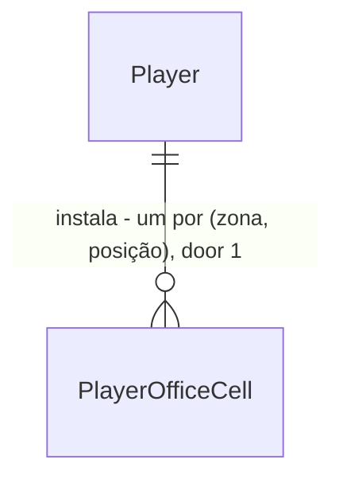

# Office

Sources:

- `docs/DevServer RPG.html` - **binding for the interface**: cena OFFICE (`isOffice`: CATÁLOGO, filtros, detalhe, sala PAREDE/PISO, rodapé, painel CONFORTO / XP DE DEPLOY / TEMPO DE DEPLOY / SP POR TURNO), `officeDefs`, `officeLevels`, `officeAgg`, `officeLevelOf`, `tapOfficeCell`, `officeBonusTxt`; efeitos em `startDeploy` (duração), `claimDeploy` (XP), turno do Bug Fight (`spregen`)
- conversa 2026-09-23 - repetidos livres como no protótipo, teto só no tempo (40%); bônus de deploy congelado ao iniciar
- `.specs/STATE.md` - AD-002 a AD-012; shop door 6 (`player.Bonus`), door 7 (`equipment` com todas as chaves)

## Problem

O dev acumula coins e gems e só pode gastá-los em poções, equipamentos e skins, que melhoram HP, SP
máximo e dano no Bug Fight. Nada melhora o deploy (tempo de espera e XP), nada regenera SP mais rápido
no turno, e a aba OFFICE do protótipo não existe. O protótipo é a única evidência; não há números de uso.

Quando isto for entregue, o dev abre OFFICE, compra e instala móveis na parede e no piso de uma sala,
vê o conforto e o nível do escritório subirem, e os bônus valem: deploys novos terminam mais cedo e
rendem mais XP, e cada turno do Bug Fight regenera mais SP. Guardar um móvel devolve metade do preço.

## Out of scope

| Excluded | Why |
| --- | --- |
| Mover, arrastar ou girar um móvel | protótipo só instala e guarda; mover = guardar + instalar |
| Estoque de móveis guardados | protótipo guarda com reembolso de metade; não existe inventário de móveis |
| Arte da sala (fundo ilustrado, sprites de móvel) | arte não existe; glifos como no protótipo |
| Visitar o escritório de outro dev | ranking-season fora (AD-008) |
| Componentes do rack (server-room) | fora do MVP (AD-008) |
| Bônus de XP na vitória do Bug Fight | protótipo aplica `xp` só ao deploy ("XP DE DEPLOY") |
| Mostrar tempo e XP ajustados nos cartões de nível do `/deploy` | protótipo mostra os valores base; o painel do OFFICE mostra o bônus e o countdown usa o `endsAt` do servidor |
| Efeito do nível do escritório além do nome | protótipo só exibe o nome do nível |

## Assumptions

| Assumption | Chosen default | Rationale | Confirmed? |
| --- | --- | --- | --- |
| Móveis repetidos | o mesmo móvel pode ocupar vários espaços; cada instalação cobra o preço; bônus somam | decisão do usuário (protótipo) | y |
| Teto dos bônus | só `deploy` tem teto: `maxDeployCut` = 40 no catálogo; `xp` e `spregen` sem teto | decisão do usuário (protótipo `Math.min(40, agg.deploy)`) | y |
| Quando o bônus vale no deploy | tempo e XP calculados e gravados no início; mexer nos móveis depois não muda deploy em andamento | decisão do usuário; `deploy_jobs` já grava a recompensa no início | y |
| Catálogo de móveis | MESA EM L `[==]` piso 60c conforto 8 +3% XP · CADEIRA GAMER `[\|]` piso 40g 10 +1 SP/turno · SETUP 2 TELAS `][` piso 90g 14 -5% tempo · RACK CASEIRO `::` piso 70g 9 -6% tempo · CAFETEIRA `{C}` piso 55c 7 +2 SP/turno · ESTANTE DE LIVROS `\|\|\|` piso 45c 6 +2% XP · PLANTA DE CANTO `^` piso 25c 5 · TAPETE PIXELADO `##` piso 30c 4 · LETREIRO NEON `~~` parede 35g 12 · PÔSTER RETRÔ `[#]` parede 20c 4 · QUADRO KANBAN `[+]` parede 50c 5 +2% XP · JANELA COM VISTA `[/]` parede 60g 15; cor e descrição do protótipo | protótipo (`officeDefs`); rebalancear é só catálogo (AD-003) | y |
| Níveis | CANTINHO 0 · HOME OFFICE 30 · ESTÚDIO 70 · LAB DEV 120 · SEDE DEVSERVE 180 de conforto | protótipo (`officeLevels`) | y |
| Grade | PAREDE 8 espaços (posições 0-7), PISO 24 (0-23), definidos no catálogo | protótipo (linha 0 parede, linhas 1-3 piso, 8 colunas) | y |
| Reembolso ao guardar | `floor(preço / 2)` na moeda do móvel | protótipo (`Math.floor(d.cost / 2)`) | y |
| Arredondamento | duração em segundos = `round(minutes × 60 × (100 − deploy%) / 100)`; XP = `round(xp × (100 + xp%) / 100)`; coins e gems sem bônus | protótipo usa `Math.round`; servidor já trunca o relógio em segundos | n |
| Ordem das validações | `invalid_body` → `unknown_cell` → `unknown_furniture` → `wrong_zone` → `cell_occupied` → saldo | validações do catálogo antes do lock, como `shop`; estado do jogador depois | n |
| Guardar espaço vazio | `200` sem mudança | mesma regra do `unequip`; clique duplo não devolve nada a mais | n |
| Confirmação ao guardar | nenhuma; um clique guarda, e o rodapé avisa | protótipo | n |
| Pré-checagem na tela | zona errada e saldo insuficiente avisam sem chamar a api | protótipo (`tapOfficeCell`); o servidor valida de novo | n |
| Rota e aba | 8ª aba `OFFICE` em `/office`, depois de AVATAR | rótulo do protótipo; `/bug-fight` já segue o rótulo | n |
| Móvel gravado que saiu do catálogo (AD-003 permite rebalancear só no catálogo) | a api trata o espaço como ocupado, guardar esvazia sem reembolso e o móvel não soma bônus; linha numa zona ou posição que o catálogo não tem mais é ignorada na leitura; a tela mostra `?` e o clique guarda | nenhum preço para devolver; não quebrar o jogador quando o catálogo encolhe (added after verification round 1) | n |

**Open questions:** none - all resolved or logged above.

## Criteria

### S1: Catálogo e forma do jogador (P1)

**Acceptance Criteria**

1. The api SHALL servir em `GET /api/catalog` a chave `office` com `zones` (`parede` PAREDE 8, `piso` PISO 24, cada uma `{id, name, cells}`), os 12 `furniture` na ordem do protótipo com `id`, `name`, `glyph`, `color`, `zone`, `price` = `{currency, amount}`, `comfort`, `bonus` = `{type: "xp" OR "deploy" OR "spregen", amount}` ou `null` e `description`, os 5 `levels` `{min, name}` e `maxDeployCut` = 40
2. The api SHALL devolver em todo `player` o campo `office`: objeto com uma chave por zona, cada uma uma lista com `cells` posições, com o id do móvel instalado ou `null`
3. WHEN um jogador é criado THEN a api SHALL devolver `office.parede` = 8 `null` e `office.piso` = 24 `null`

### S2: Instalar e guardar (P1)

**Acceptance Criteria**

4. WHEN `POST /api/me/office/{zone}/{position}` recebe `{"furniture": "<id>"}` com o espaço vazio, a zona do móvel igual a `{zone}` e saldo que paga THEN a api SHALL descontar o preço na moeda do móvel, gravar o móvel na posição e responder `200` com `{"player": {...}}`
5. IF o saldo da moeda do móvel é menor que o preço THEN a api SHALL responder `409` `not_enough_gems` ou `not_enough_coins` sem alterar nada; saldo igual ao preço paga
6. IF o espaço já tem um móvel THEN a api SHALL responder `409` `cell_occupied` sem alterar nada
7. IF a zona do móvel difere de `{zone}` THEN a api SHALL responder `422` `wrong_zone` com a mensagem `esse móvel vai na parede` ou `esse móvel vai no piso`
8. IF o móvel não existe no catálogo THEN a api SHALL responder `422` `unknown_furniture`
9. IF `{zone}` não existe no catálogo ou `{position}` não é um inteiro entre 0 e `cells − 1` THEN a api SHALL responder `422` `unknown_cell`, na instalação e no guardar
10. IF o corpo da instalação não é JSON válido THEN a api SHALL responder `422` `invalid_body`
11. WHEN o mesmo móvel é instalado em dois espaços THEN a api SHALL cobrar o preço duas vezes e gravar os dois
12. WHEN `POST /api/me/office/{zone}/{position}/remove` é chamado num espaço ocupado THEN a api SHALL esvaziar o espaço, somar `floor(preço / 2)` na moeda do móvel e responder `200` com `player`
13. WHEN `POST /api/me/office/{zone}/{position}/remove` é chamado num espaço vazio THEN a api SHALL responder `200` sem alterar nada

### S3: Bônus do escritório (P1)

**Acceptance Criteria**

14. The api SHALL somar os bônus `xp`, `deploy` e `spregen` dos móveis instalados em `player.Bonus`, com `deploy` limitado a `maxDeployCut` (40)
15. WHEN um deploy inicia THEN a api SHALL gravar `ends_at` = início + `round(minutes × 60 × (100 − deploy%) / 100)` segundos (NV.1 com um SETUP 2 TELAS: 855 s; com 8 SETUP 2 TELAS: 540 s)
16. WHEN um deploy inicia THEN a api SHALL gravar XP = `round(xp × (100 + xp%) / 100)` (NV.1 com uma MESA EM L: 82) e coins e gems do nível sem mudança
17. WHILE um deploy está em andamento a api SHALL manter `ends_at` e a XP gravados quando móveis são instalados ou guardados
18. WHEN um turno do Bug Fight termina sem vitória nem derrota THEN a api SHALL regenerar `spRegen` (5) + `spregen` do escritório de SP, limitado ao SP máximo do encontro
19. The api SHALL manter SP máximo, dano, HP máximo e a recompensa de vitória do Bug Fight iguais com ou sem móveis

### S4: Tela OFFICE (P1)

**Acceptance Criteria**

20. The web SHALL exibir a 8ª aba `OFFICE`, depois de AVATAR, levando a `/office`
21. WHEN o jogador abre `/office` THEN a web SHALL exibir `CATÁLOGO`, `escolha e clique num espaço da sala`, um cartão por móvel na ordem do catálogo com glifo e preço curto (`60C`, `40G`), os filtros `TODOS`, `PAREDE`, `PISO` com `TODOS` ativo, e o primeiro móvel selecionado
22. WHEN o filtro `PAREDE` ou `PISO` é clicado THEN a web SHALL listar só os móveis dessa zona
23. WHEN um cartão é clicado THEN a web SHALL exibir no detalhe glifo, nome, preço longo (`60 COINS`, `40 GEMS`) e `<descrição> · <ZONA> · conforto +<n>` seguido de ` · +N% XP`, ` · -N% tempo` ou ` · +N SP/turno` quando o móvel tem bônus
24. The web SHALL exibir a sala com o nome do nível, `<n> móveis instalados`, a seção `PAREDE` com 8 espaços e `PISO` com 24; espaço vazio mostra `+`, ocupado mostra glifo e nome
25. The web SHALL exibir no rodapé `faltam <n> de conforto para <próximo nível>` ou, no último nível, `escritório no nível máximo de conforto`, seguido de ` · clicar num móvel já instalado guarda ele e devolve metade do valor.`
26. The web SHALL exibir `CONFORTO <soma>`, `XP DE DEPLOY +N%`, `TEMPO DE DEPLOY -N%` (limitado a 40) e `SP POR TURNO +N`; o nível é o maior com `min` ≤ conforto (29 CANTINHO, 30 HOME OFFICE, 180 SEDE DEVSERVE)
27. IF um espaço vazio de outra zona é clicado THEN a web SHALL exibir `ESSE MÓVEL VAI NA PAREDE` ou `ESSE MÓVEL VAI NO PISO` sem chamar a api
28. IF um espaço vazio da zona certa é clicado e o saldo não paga THEN a web SHALL exibir `GEMS INSUFICIENTES` ou `COINS INSUFICIENTES` sem chamar a api
29. WHEN um espaço vazio da zona certa é clicado com saldo THEN a web SHALL chamar a instalação e, com `200`, repassar o `player` ao HUD e exibir `<NOME> INSTALADO`
30. WHEN um espaço ocupado é clicado THEN a web SHALL chamar o guardar e, com `200`, repassar o `player` ao HUD e exibir `GUARDADO · +<n> COINS` ou `GUARDADO · +<n> GEMS`
31. IF a ação responde erro THEN a web SHALL exibir a `error.message` da api; sem corpo ou falha de rede, `falha na conexão. tente de novo.`
32. WHILE uma ação está pendente a web SHALL desabilitar os espaços da sala

**Independent test:** novo dev → OFFICE → instala PLANTA DE CANTO → HUD coins 75 → reload mantém → guarda → coins 87.

### S5: Móvel fora do catálogo (P2) - added after verification round 1

**Acceptance Criteria**

33. IF um espaço gravado tem um móvel que não existe no catálogo THEN a api SHALL recusar instalar nele com `409` `cell_occupied`, guardar SHALL esvaziá-lo com `200` sem reembolso, e o móvel SHALL somar 0 em todo bônus
34. IF uma linha gravada está numa zona que o catálogo não tem ou numa posição ≥ `cells` THEN a api SHALL ignorá-la ao montar `office`, devolvendo só as zonas e posições do catálogo
35. IF um espaço do `player.office` tem um id que não existe no catálogo THEN a web SHALL exibir `?` nesse espaço, não contá-lo em `móveis instalados` nem no conforto, e o clique SHALL chamar o guardar e exibir `GUARDADO`

**Independent test:** gravar `sofa` em `piso` 0 direto no banco → `/office` mostra `?` → clicar guarda sem mudar o saldo.

## Traceability

| ID | Slice | Criteria | Status |
| --- | --- | --- | --- |
| OFFICE-01 | S1 | 1, 2, 3 | Pending |
| OFFICE-02 | S2 | 4-13 | Pending |
| OFFICE-03 | S3 | 14-19 | Pending |
| OFFICE-04 | S4 | 20-32 | Pending |
| OFFICE-05 | S5 | 33, 34, 35 | Pending |

## Observable

| Surface | Decision | Landing |
| --- | --- | --- |
| screen `/office` | empty state | AC 24 (sala vazia: 32 `+`, CANTINHO, `0 móveis instalados`), AC 25 |
| screen `/office` | loading state | existing - shell só renderiza com `player` e `catalog` (foundation) |
| screen `/office` | error state | AC 31 |
| screen `/office` | unauthorised state | existing - shell redireciona para `/login` (foundation) |
| screen `/office` | density and ordering | AC 21, AC 24 |
| API install, remove and screen `/office` | móvel gravado fora do catálogo | AC 33, 34, 35 (added after verification round 1) |
| screen `/office` | destructive action confirms | n/a - guardar é um clique como no protótipo, e o rodapé avisa a perda (AC 25) |
| API install, remove | response shape | AC 4, AC 12 - `{"player": {...}}` (AD-004) |
| API install, remove | error shape and codes | AC 5-10 - formato AD-005 |
| API install, remove | who may call it | existing - `auth.RequireSession`, `401 unauthenticated` |
| API install, remove | versioning | n/a - api e web no mesmo PR (AD-001) |
| API install, remove | rate limit | n/a - nenhuma rota do jogo tem limite; o saldo limita |
| API `GET /api/catalog` | response shape | AC 1 |

## Flow

Reusa `player.WithLocked` (AD-004), a regra de saldo do `shop`, `player.Bonus` (AD-012) como única soma
de bônus e o snapshot de recompensa que `deploy_jobs` já grava no início.

1. in: `POST /api/me/office/{zone}/{position}[/remove]` -> `api/internal/office` (new, no door - placement per conventions) - valida zona, posição e móvel no `catalog.Catalog` (exists) e aplica dentro de `player.WithLocked` (exists)
2. `player.WithLocked` (exists) - carrega `office` (door 4), persiste `PlayerOfficeCell` (door 1) e o saldo
3. `api/internal/deploy` (exists) Start - lê `player.Bonus` `deploy` e `xp` (door 3) e grava `ends_at` e `xp` ajustados (door 6)
4. `api/internal/battle` (exists) EndTurn - regen soma `player.Bonus` `spregen`
5. `GET /api/catalog` -> `catalog.Catalog` (exists) - serve `office` (door 2)
6. out: `{"player": {...}}` com `office`; web `OfficeScene` (new, no door - placement per conventions) em `/office` (door 7), `Tabs` (exists) ganha a 8ª aba

## Relations

One-way constraints: `PlayerOfficeCell` único por (jogador, zona, posição) (door 1); posição ≥ 0; zona e
móvel validados contra o catálogo, sem FK. No columns and no types here.

## Surface

| Route | In | Out | Status |
| --- | --- | --- | --- |
| `POST /api/me/office/{zone}/{position}` | `zone`, `position`, `furniture` | `player` | `200`, `401`, `409 not_enough_gems`, `409 not_enough_coins`, `409 cell_occupied`, `422 invalid_body`, `422 unknown_cell`, `422 unknown_furniture`, `422 wrong_zone`, `500` |
| `POST /api/me/office/{zone}/{position}/remove` | `zone`, `position` | `player` | `200`, `401`, `422 unknown_cell`, `500` |
| `POST /api/me/deploys` (changed) | `type`, `level` | `deploy.endsAt` com bônus · `player` · `serverTime` | `201`, `401`, `409 deploy_running`, `422 invalid_body`, `422 unknown_deploy_type`, `422 unknown_deploy_level`, `422 level_too_low`, `500` - inalterados |
| `GET /api/catalog` (changed) | - | + `office` | `200` |
| `GET /api/me` (changed; same `player` in every response) | - | + `office` | `200`, `401`, `404 player_not_found`, `500` |

## Landing

| One-way door | Literal shape | Alternative rejected |
| --- | --- | --- |
| 1. entidade `PlayerOfficeCell` | tabela `player_office` (`player_id` → `players`, `zone`, `position` `CHECK (position >= 0)`, `furniture_id`) com `PRIMARY KEY (player_id, zone, position)`, migração `00006_office.sql` | chave `"r-c"` do protótipo - mistura linha com zona e não valida o tamanho de cada zona; `jsonb` em `players` - o banco não garante um móvel por espaço |
| 2. forma do catálogo | `api/catalog/office.json` com `zones` (`id`, `name`, `cells`), `furniture` (`id`, `name`, `glyph`, `color`, `zone`, `price`, `comfort`, `bonus` ou `null`, `description`), `levels` (`min`, `name`), `maxDeployCut`; servido como `office` | móveis em `shop.json` - são da cena OFFICE, não da LOJA; números no front violam AD-003 |
| 3. regra de bônus estendida | `player.Bonus(cat, p, "xp" OR "deploy" OR "spregen")` soma os móveis instalados; `deploy` sai limitado a `maxDeployCut` | `office.Bonus` separado chamado por deploy e battle - exatamente o que AD-012 proíbe |
| 4. contrato do `player` | `office`: `{"parede": [null, "neon", null, null, null, null, null, null], "piso": ["mesa", null, …24]}` | lista de `{zone, position, furniture}` - o front montaria a grade e espaço vazio não apareceria (mesmo motivo do `equipment`) |
| 5. rotas | `POST /api/me/office/{zone}/{position}` com `{"furniture": "<id>"}` · `POST /api/me/office/{zone}/{position}/remove` | `DELETE` - nenhuma rota do jogo usa; intenção por POST como `unequip` |
| 6. snapshot no deploy | `deploy.Start` grava `ends_at` e `xp` já com bônus; `math.Round`; duração em segundos inteiros | XP na coleta (protótipo) - decisão do usuário |
| 7. aba e rota | 8ª aba `OFFICE` → `/office` | `/escritorio` - rótulo do protótipo é OFFICE |
| 8. códigos de erro novos | `unknown_cell`, `unknown_furniture`, `wrong_zone` (duas mensagens), `cell_occupied` | reusar `unknown_item` - fala de combate e não diz qual catálogo falhou |

- Door 3 reaches past this feature: vira AD-013 em `.specs/STATE.md` (estende AD-012 com os tipos de escritório e o teto)
- Nothing else in this change is hard to reverse

## Impact

| Front | What changes |
| --- | --- |
| domain | new term: `PlayerOfficeCell` / móvel - um móvel instalado numa (zona, posição); vive em `api/internal/office` e `player` |
| domain | new term: conforto e nível do escritório - derivados dos móveis, nunca gravados |
| domain | existing term: `Bonus.type` era `hp`/`sp`/`dmg`, ganha `xp`/`deploy`/`spregen` - quem ramifica hoje: `shop.hpOf` (só `hp`, inalterado), `battle` Start/turno, web `bonusShort`/`bonusLong`/`totalBonus` (só gear, skins, skills) |
| domain | existing behaviour: `deploy.Start` grava duração e XP ajustados; sem móveis o resultado é o de hoje, então `deploy_test` não muda |
| domain | existing behaviour: `battle.EndTurn` regen passa a somar `spregen`; sem móveis é 5 como hoje |
| existing check | foundation C26 (7 abas) passa a 8 com `OFFICE` → `/office`; `Tabs.test.tsx` muda no commit da aba |
| existing check | shop C46 (`ComingSoon`) ganha `/office` |
| stored data | tabela nova vazia; nada a migrar |
