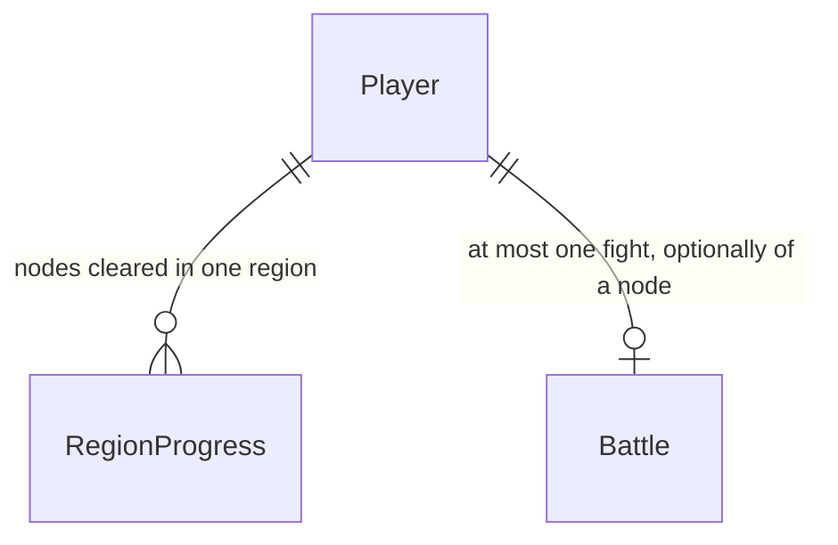

# Region path

Sources:

- conversation - ao entrar numa região, mostrar o mapa dessa região com o caminho que se percorre até o chefe; progresso real no servidor; arte nova por região; chefe exclusivo por região; 5 nós
- `.specs/STATE.md` AD-002, AD-003, AD-004, AD-005, AD-011, AD-015, AD-017 - o servidor decide a luta e o avanço; o catálogo é a lista; a mutação tranca o jogador; o sorteio sem nó continua o de AD-017

## Problem

Quem entra numa região continua no mapa-múndi. A luta da aba BUG FIGHT sorteia um inimigo qualquer da região, e não há caminho, nem um chefe que só apareça no fim, nem um registro do que já foi vencido. A pessoa não vê para onde está indo.

Quando isto existir, ENTRAR abre o mapa daquela região, com uma trilha de cinco lutas. Só a próxima está aberta. Vencer avança, e a quinta é o chefe da região. Morrer não apaga o que já foi vencido.

## Out of scope

| Excluded | Why |
| --- | --- |
| Recompensa diferente para o chefe | a vitória continua a regra única de `combat.rules.victory` |
| Apagar o progresso ao morrer | a derrota já manda para a vila; o caminho vencido fica |
| Geometria de trilha diferente por região | as seis artes pintam a mesma trilha; o que muda é o tema |
| Inimigos andando no mapa-múndi | o mapa-múndi continua só a escolha da região |
| Loja ou escritório dentro do mapa da região | continuam nas abas |

## Assumptions

| Assumption | Chosen default | Rationale | Confirmed? |
| --- | --- | --- | --- |
| A tela só habilita o próximo nó | índice igual a `cleared` é o único botão de luta; a API ainda aceita um índice menor | o plano aprovado diz que só o próximo libera, e também que rejogar é permitido no servidor | y |
| Números dos chefes | os seis do critério 3 | o plano aprovado trouxe esses HP e níveis | y |
| Id da decisão | AD-021 | AD-019 e AD-020 já estão ativos no STATE (loadout e barra de poder) | n |
| Corpo ausente | sem corpo, corpo vazio e `{}` começam a luta sorteada de hoje, sem `node` | o cliente atual faz `POST /api/me/battle` sem corpo | n |
| Batalha ativa | um nó válido de outra luta não troca uma batalha `active` da mesma região; nó desconhecido, de outra região ou JSON inválido respondem o erro e não retomam | junta as duas frases do plano: a ordem de validação e a prioridade da batalha ativa | y |
| Trilha na tela | as seis regiões usam as mesmas porcentagens de posição | a posição é apresentação; uma tabela só alinha a arte | n |

**Open questions:** none - all resolved or logged above.

## Criteria

### S1: o caminho e os chefes no catálogo (P1)

**Acceptance Criteria**

1. The catálogo SHALL dar a cada uma das regiões `vila`, `floresta`, `mercado`, `caverna`, `torre` e `nuvem` um `path` de exatamente 5 nós, o 5º com `boss` true e os quatro primeiros sem `boss`, e o `enemy` de cada nó SHALL existir com a mesma `region` do nó.
2. The nós comuns SHALL ser, nesta ordem, `slime`, `slime`, `vila`, `vila` na vila; `slime_verde`, `slime_verde`, `floresta`, `floresta` na floresta; `mercado` quatro vezes no mercado; `monstro`, `monstro`, `caverna`, `caverna` na caverna; `torre` quatro vezes na torre; `nuvem` quatro vezes na nuvem. Os ids SHALL ser `<região>-1` até `<região>-5`.
3. The catálogo SHALL incluir estes chefes, cada um com `boss` true: `boss_vila` região `vila` nome `SEGFAULT` nível 5 HP 95 SP 70 fraqueza `ponteiro nulo` drop `null_shard` glyph `SEGV`; `boss_floresta` região `floresta` nome `LOG INFINITO` nível 7 HP 110 SP 75 fraqueza `tail -f` drop `log_essence` glyph `LOG~`; `boss_mercado` região `mercado` nome `LEFT-PAD` nível 9 HP 130 SP 80 fraqueza `versão travada` drop `corrupt_dep` glyph `PAD!`; `boss_caverna` região `caverna` nome `HEISENBUG` nível 12 HP 165 SP 85 fraqueza `log de debug` drop `wild_trace` glyph `???`; `boss_torre` região `torre` nome `DEADLOCK SUPREMO` nível 17 HP 240 SP 90 fraqueza `ordem de lock` drop `race_core` glyph `X|X`; `boss_nuvem` região `nuvem` nome `KERNEL PANIC` nível 25 HP 330 SP 100 fraqueza `reboot` drop `memory_crystal` glyph `PANIC`.
4. The `EnemiesIn` SHALL devolver, sem chefes e na ordem do arquivo: vila `vila`, `slime`; floresta `floresta`, `slime_verde`; mercado `mercado`; caverna `caverna`, `monstro`; torre `torre`; nuvem `nuvem`.

**Independent test:** ler o catálogo embutido e conferir os 30 nós e os 6 chefes campo a campo.

### S2: começar a luta de um nó (P1)

**Acceptance Criteria**

5. WHEN `POST /api/me/battle` não tem corpo, tem corpo só de espaços ou tem `{}` THEN the resposta SHALL ser `200`, `battle` SHALL NOT ter a chave `node`, e `player.progress` de quem nunca venceu um nó SHALL ser `{}`.
6. WHEN `POST /api/me/battle` manda `{"node":"vila-1"}`, o jogador está em `vila` e o `cleared` da vila é 0 THEN the resposta SHALL ser `200`, `battle.enemy` SHALL ser `slime`, `battle.enemyHp` e `battle.enemyHpMax` SHALL ser `45`, `battle.node` SHALL ser `vila-1` e `battle.status` SHALL ser `active`.
7. IF o corpo não é JSON THEN the resposta SHALL ser `422` `invalid_body`.
8. IF `node` não está em nenhum `path` THEN the resposta SHALL ser `422` `unknown_node`.
9. IF o nó existe e a região dele não é `player.region` THEN the resposta SHALL ser `409` `wrong_region`, e uma batalha que já existia SHALL continuar a mesma.
10. IF o índice do nó é maior que o `cleared` da região THEN the resposta SHALL ser `409` `node_locked`.
11. WHEN o índice do nó é menor que o `cleared` THEN the resposta SHALL ser `200` e SHALL gravar esse inimigo de novo.
12. WHEN já existe batalha `active` na mesma região e o pedido traz outro nó válido dessa região THEN the resposta SHALL ser `200` com a batalha que já estava, inclusive o `node` antigo.
13. IF a sessão não tem jogador e o corpo é `{"node":"vila-1"}` THEN the resposta SHALL ser `404` `player_not_found`.
14. IF a tabela `region_progress` foi removida e o corpo é `{"node":"vila-1"}` THEN the resposta SHALL ser `500` `internal`.
15. WHEN o nó é de outra região e o índice também é maior que o `cleared` THEN the resposta SHALL ser `409` `wrong_region` e SHALL NOT ser `node_locked`.

**Independent test:** com um dev na vila, começar `vila-1`, pedir `vila-2` e ver `409`, pedir `floresta-1` e ver `409`.

### S3: vencer avança, rejogar e morrer não (P1)

**Acceptance Criteria**

16. WHEN o turno deixa o inimigo com HP 0 e o índice do `node` é igual ao `cleared` THEN `player.progress` dessa região SHALL ser esse índice mais 1, e o `GET /api/me` seguinte SHALL trazer o mesmo número.
17. WHEN o turno vence um nó cujo índice é menor que o `cleared` THEN `player.progress` SHALL ficar o mesmo número.
18. WHEN o jogador cai a HP 0 numa luta de nó THEN `player.region` SHALL ser `vila`, `player.hp` SHALL ser igual a `player.hpMax`, e `player.progress` da região da luta SHALL ficar o mesmo número.

**Independent test:** vencer `vila-1` e ler `progress.vila` = 1; vencer `vila-1` de novo e continuar 1; morrer em `vila-2` e continuar 1, de volta à vila.

### S4: o mapa da região (P1)

**Acceptance Criteria**

19. WHEN a pessoa abre `/mundo/floresta` estando em `floresta` sem `progress.floresta` THEN a tela SHALL usar o fundo `/art/background/region-floresta.png`, SHALL mostrar 5 botões de nó, só `floresta-1` habilitado, e `floresta-5` SHALL mostrar a coroa.
20. WHEN `progress.floresta` é `2` THEN `floresta-1` e `floresta-2` SHALL mostrar a bandeira e estar desabilitados, `floresta-3` SHALL ser o único habilitado, `floresta-4` e `floresta-5` SHALL estar desabilitados, e o herói SHALL estar sobre `floresta-2`.
21. WHEN a pessoa clica no próximo nó THEN o cliente SHALL fazer `POST /api/me/battle` com `{"node":"floresta-1"}` e, no `200`, SHALL ir para `/bug-fight`.
22. IF a região da URL não é `player.region` THEN a tela SHALL mostrar `você não está nesta região` e um link `VOLTAR AO MUNDO` para `/mundo`, e nenhum nó SHALL estar habilitado.
23. IF o id da URL não está no catálogo THEN a tela SHALL mostrar `região desconhecida` e o link `VOLTAR AO MUNDO` para `/mundo`.
24. WHEN `prefers-reduced-motion: reduce` THEN o clique no próximo nó SHALL disparar o `POST` sem esperar `transitionend`.
25. IF o `POST` responde `409` `node_locked` THEN a tela SHALL mostrar a `message` da api e a URL SHALL continuar `/mundo/floresta`.
26. WHILE a viewport tem 360px de largura, the documento em `/mundo/floresta` SHALL ter `scrollWidth` menor ou igual a `innerWidth`.
27. The mapa da região SHALL ter um link `VOLTAR AO MUNDO` com href `/mundo`.

**Independent test:** entrar na floresta, ver cinco nós com só o primeiro clicável, clicar e cair no bug fight contra o SLIME DE LOG.

### S5: entrar no mapa e voltar da luta (P1)

**Acceptance Criteria**

28. WHEN ENTRAR em `floresta` responde `200` THEN o cliente SHALL ir para `/mundo/floresta`.
29. WHEN o painel aberto é o da região atual THEN o botão SHALL se chamar `EXPLORAR`, o clique SHALL ir para `/mundo/vila` e SHALL NOT chamar `POST /api/me/travel`.
30. WHEN `battle.node` é `floresta-1` e `battle.status` é `won` THEN a tela de combate SHALL mostrar um link `VOLTAR AO MAPA` para `/mundo/floresta`.
31. WHEN `battle.status` é `won` e `battle` não tem `node` THEN a tela SHALL NOT mostrar `VOLTAR AO MAPA`.

**Independent test:** no mapa-múndi, ENTRAR na floresta cai em `/mundo/floresta`; no bug fight vencido de um nó, VOLTAR AO MAPA volta para essa região.

### S6: a arte da trilha e dos chefes (P1)

**Acceptance Criteria**

32. The arquivos `web/public/art/background/region-vila.png`, `region-floresta.png`, `region-mercado.png`, `region-caverna.png`, `region-torre.png`, `region-nuvem.png` e `web/public/art/sprite/enemy-boss_vila.png`, `enemy-boss_floresta.png`, `enemy-boss_mercado.png`, `enemy-boss_caverna.png`, `enemy-boss_torre.png`, `enemy-boss_nuvem.png` SHALL existir, e `make art-check` SHALL terminar com exit 0.

**Independent test:** `make art-check` e a existência dos doze PNG.

## Traceability

| ID | Slice | Criteria | Status |
| --- | --- | --- | --- |
| PATH-01 | S1 | 1, 2, 3, 4 | Pending |
| PATH-02 | S2 | 5, 6, 7, 8, 9, 10, 11, 12, 13, 14, 15 | Pending |
| PATH-03 | S3 | 16, 17, 18 | Pending |
| PATH-04 | S4 | 19, 20, 21, 22, 23, 24, 25, 26, 27 | Pending |
| PATH-05 | S5 | 28, 29, 30, 31 | Pending |
| PATH-06 | S6 | 32 | Pending |

## Observable

| Surface | Decision | Landing |
| --- | --- | --- |
| screen mapa da região | empty state | AC 23 - id fora do catálogo |
| screen mapa da região | loading state | n/a - o catálogo e o jogador já vieram no shell; a tela não busca de novo |
| screen mapa da região | error state | AC 25 - `message` do `409`; sem rede, `SERVIDOR FORA DO AR` |
| screen mapa da região | unauthorised | n/a - o shell só monta a cena com sessão |
| screen mapa da região | density and ordering | AC 19, AC 20 - cinco nós na ordem do `path` |
| screen mapa da região | destructive action confirms | n/a - começar uma luta não apaga progresso |
| screen mapa-múndi | empty state | n/a - as regiões vêm do catálogo, que sempre tem as seis |
| screen mapa-múndi | error state | existing - `error.message` do travel e `SERVIDOR FORA DO AR` |
| screen mapa-múndi | button of the current region | AC 29 |
| screen combate | won with a node | AC 30 |
| screen combate | won without a node | AC 31 |
| screen combate | loading and error | existing - a cena já busca a luta e mostra falha de carga |
| API `POST /api/me/battle` | response shape | AC 5, AC 6 - `battle` e `player`, com `node` só na luta de nó |
| API `POST /api/me/battle` | error shape and codes | AC 7 a AC 15 |
| API `POST /api/me/battle` | who may call it | existing - sessão; sem sessão, `401` `unauthenticated` |
| API `POST /api/me/battle` | versioning | n/a - um único cliente, o `web/` |
| API `POST /api/me/battle` | rate limit | n/a - a rota não tem limite e esta mudança não adiciona um |
| API `GET /api/me` | response shape | AC 5, AC 16 - `player.progress` |

## Flow

Reusa `world.Travel` para gravar a região, `battle.Start` para abrir a luta e `battle.turn` para a vitória. O sorteio sem nó continua `EnemiesIn` mais `Rand` (AD-017), agora sem os chefes.

1. ENTRAR numa região que não é a atual -> `world.Travel` (exists) grava `player.region`; o cliente abre a página da região. EXPLORAR na região atual não chama travel (exists).
2. Clique no próximo nó -> `battle.Start` (exists) lê o `path` no catálogo (exists, door 1) e o progresso (door 2) e grava a luta com o nó (door 3), ou retoma a luta `active` da mesma região.
3. Turno que zera o HP do inimigo -> `battle.turn` (exists) avança o progresso quando o índice do nó é o `cleared` (door 2). Derrota continua mandando para `vila` e não mexe no progresso.
4. out: `player.progress` na resposta; o `GET /api/me` (exists) lê as mesmas linhas.

## Relations

One-way constraints: one progress row per player and region (door 2); a fight names a node or none (door 3).

## Surface

| Route | In | Out | Status |
| --- | --- | --- | --- |
| `POST /api/me/battle` | `node` opcional | `battle`, `player` (`progress`) | `200`, `401`, `404`, `409`, `422`, `500` |
| `GET /api/me` | nenhum | `player` (`progress`) | `200`, `401`, `404` |

## Landing

| One-way door | Literal shape | Alternative rejected |
| --- | --- | --- |
| Caminho no catálogo | `regions[].path`: 5 objetos `{id, enemy, boss?}`, o último com `boss` true | lista de nós só no cliente: o servidor não recusaria um nó |
| Progresso | uma linha por jogador e região, `cleared` no mínimo 0, chave primária o par | um inteiro por região na linha do jogador: região nova exigiria migração |
| Nó da luta | `battles.node` ausente quando a luta é sorteada | guardar o nó dentro de `enemy`: o mesmo inimigo ocupa quatro nós |
| Chefe fora do sorteio | `enemies[].boss` true fica de fora de `EnemiesIn` | prefixo `boss_` no id: um inimigo comum não poderia usar esse prefixo |
| Progresso no jogador | `player.progress`: mapa de região para o inteiro `cleared`, `{}` sem linhas | um `GET` separado: as mutações que já devolvem `player` não atualizariam o HUD |

- Nothing else in this change is hard to reverse

## Impact

| Front | What changes |
| --- | --- |
| domain | new term: nó - um passo do `path`, id `<região>-<1-5>` |
| domain | new term: chefe - inimigo com `boss` true, só alcançável pelo 5º nó |
| domain | new term: progresso - quantos nós da região já foram vencidos; sem linha vale 0 |
| domain | existing term: `EnemiesIn` era todo inimigo da região; agora exclui `boss` - quem chama é `battle.Start` sem nó |
| stored data | tabela nova, vazia; lutas já gravadas ficam sem nó; nada para copiar |
| API | `POST /api/me/battle` aceita JSON opcional; sem corpo continua `200` como hoje |
| e2e | `world.spec.ts` deixa de esperar o texto da região no mesmo clique de ENTRAR, porque a tela troca |
