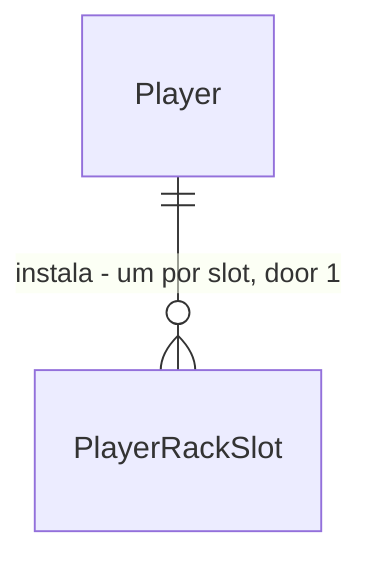

# Server room

Sources:

- `docs/DevServer RPG.html` - **binding for the interface**: cena SALA DE SERVIDORES (`isServer`: barras `stats` POWER / RAM / UPTIME, `RACK LOCALHOST-01` com 6 `slots`, `LOJA DE COMPONENTES` com `shopData`, terminal `serverMsg`), `install`, `eject`, hotspots `goServer` da tela-título (placa em 17.1%/46.7% e prédio `SALA DE SERVIDORES` em 68.5%/39.2%), aba `SERVER` na 3ª posição de `order`
- conversa 2026-09-24 - stats viram bônus: POWER → dano do Bug Fight, RAM → SP máximo do Bug Fight, UPTIME → coins do deploy; remover devolve o preço inteiro
- `.specs/STATE.md` - AD-002 a AD-013; office door 3 (`player.Bonus` estendido), door 6 (snapshot no deploy)
- `.specs/LESSONS.md` - L-013 (ordem de validação por par), L-015 (id gravado que sai do catálogo) aplicados aqui desde o início

## Problem

O dev só melhora dano e SP máximo do Bug Fight com skills, equipamentos e skins, e nada aumenta as
coins que um deploy rende. O protótipo mostra uma SALA DE SERVIDORES com rack, loja de componentes e
barras POWER / RAM / UPTIME, mas a cena não existe no jogo, e no próprio protótipo as barras não mudam
nada. Não há números de uso; o protótipo e a decisão do usuário são a única evidência.

Quando isto for entregue, o dev abre SERVER (aba ou tela-título), compra componentes com coins, cada um
entra no primeiro slot livre do rack de 6, e as barras sobem. POWER aumenta o dano no Bug Fight, RAM o SP
máximo do encontro, UPTIME as coins de cada deploy novo. Remover um componente devolve o preço inteiro.

## Out of scope

| Excluded | Why |
| --- | --- |
| UPTIME no ranking | ranking-season fora (AD-008); o protótipo usa `uptime` só na tabela de ranking |
| Escolher o slot na compra, mover ou trocar componente de slot | protótipo instala no primeiro slot livre; mover = remover + comprar |
| Estoque de componentes removidos | protótipo devolve as coins; não existe inventário de componentes |
| Mais de um rack, ou rack com mais de 6 slots | protótipo tem só `RACK LOCALHOST-01` com 6 |
| Componentes pagos em gems | todo `shopData` custa coins |
| Fórmula do protótipo (`20 + n*9 + ...`) | contradiz os rótulos que o jogador lê (GPU diz `power +40`, a fórmula dá 25); os rótulos viram a regra |
| Mostrar coins ajustadas nos cartões de nível do `/deploy` | mesmo corte do office: o cartão mostra o valor base, a coleta mostra o que foi gravado |
| Arte da sala (racks ilustrados, luzes) | arte não existe; glifos como no protótipo |

## Assumptions

| Assumption | Chosen default | Rationale | Confirmed? |
| --- | --- | --- | --- |
| Efeito dos stats | POWER → tipo `dmg` (dano % no Bug Fight), RAM → tipo `sp` (SP máximo do encontro), UPTIME → tipo novo `coins` (% nas coins do deploy) | decisão do usuário | y |
| Fórmula stat → bônus | valor = `min(max, base + Σ efeitos)`; bônus = `floor((valor − base) / step)`; POWER base 20 máx 100 step 10 (0..+8%), RAM base 15 máx 100 step 5 (0..+17), UPTIME base 60 máx 99 step 1 (0..+39%) | decisão do usuário (mapeamento "combate + coins") | y |
| `dmg` é percentual | POWER soma no `dmg` existente, que já é "% somado a cada golpe" (`battle.Rules.DamageBonus`); a prévia aprovada dizia "+4 dmg", no jogo lê-se `+4%` | não criar segundo tipo de dano ao lado de AD-012 | n |
| Reembolso | remover devolve o preço inteiro em coins | decisão do usuário (protótipo) | y |
| Efeitos por componente | CPU 8-CORE `::` 80c power +25 · RAM 32GB `[]` 60c ram +30 · SSD NVME `=` 70c power +12, uptime +8 · CACHE REDIS `~` 90c power +18 · LOAD BALANCER `>>` 120c uptime +20 · GPU EDGE `#` 150c power +40; cor do protótipo | rótulos `effect` + `extra` do protótipo; rebalancear é só catálogo (AD-003) | n |
| Repetidos | o mesmo componente pode ocupar vários slots; cada compra cobra o preço; efeitos somam até o máximo do stat | protótipo não impede | n |
| Slot da compra | primeiro slot livre, do menor índice | protótipo (`slots.indexOf(null)`) | n |
| Bônus `coins` no deploy | congelado no início com a XP: `coins` gravado = `round(coins × (100 + coins%) / 100)`; gems sem bônus | segue AD-013 e door 6 do office; `deploy_jobs.coins` já é o snapshot | n |
| Ordem das validações | compra: `invalid_body` → `unknown_component` → `rack_full` → `not_enough_coins`; remover: `unknown_slot` | catálogo antes do lock, como office; rack cheio antes do saldo como no protótipo | n |
| Remover slot vazio | api `200` sem mudança; a tela nem chama a api e mostra `> slot 0<n> vazio. compre um componente ao lado.` | regra do office e do `unequip`; mensagem do protótipo | n |
| Componente gravado que saiu do catálogo | slot conta como ocupado, soma 0 em todo stat, remover esvazia sem reembolso; slot ≥ `slots` ignorado na leitura; a tela mostra `?` e o clique remove | L-015; mesma regra do office AC 33-35 | n |
| Componente com preço em gems (catálogo rebalanceado, AD-003) | compra desconta gems via `player.Pay`; remover devolve o preço inteiro em gems | o catálogo pode mudar a moeda sem deploy do código; a regra de reembolso segue a moeda do preço como o office (added after verification round 1) | n |
| Rota e aba | 3ª aba `SERVER` em `/server`, entre MUNDO e DEPLOY; as abas seguintes são renumeradas | posição e rótulo do protótipo (`order`); rota segue o rótulo como `/office` | n |
| Preço no cartão | `80C`, como `priceShort` do office; opacidade reduzida sem saldo | protótipo mostra só `80`; o jogo já tem a forma curta | n |
| Bônus na tela | cada barra mostra abaixo `DANO +N%`, `SP MÁX +N`, `COINS DE DEPLOY +N%` | stats agora têm efeito e o protótipo não tem onde mostrá-lo | n |
| Erro da api na tela | terminal mostra `> <error.message>`; sem corpo ou falha de rede, `> falha na conexão. tente de novo.` | tom do terminal do protótipo; texto de rede já existe (`CONNECTION_FAILED`) | n |
| AVATAR soma o rack | `dano +N%` e `SP +N` do AVATAR incluem os bônus do rack | senão o AVATAR mostra um total menor que o do combate | n |
| Branch | `feat/server-room` a partir de `feat/office` | office ainda sem PR; server-room depende de AD-013 e da aba OFFICE | n |

**Open questions:** none - all resolved or logged above.

## Criteria

### S1: Catálogo e forma do jogador (P1)

**Acceptance Criteria**

1. The api SHALL servir em `GET /api/catalog` a chave `rack` com `slots` = 6, os 3 `stats` na ordem POWER, RAM, UPTIME com `id`, `name`, `color`, `base`, `max`, `step` e `bonus` (`dmg`, `sp`, `coins`), e os 6 `components` na ordem do protótipo com `id`, `name`, `glyph`, `color`, `price` = `{currency: "coins", amount}` e `effects` = lista de `{stat, amount}`, com os valores da tabela de Assumptions
2. The api SHALL devolver em todo `player` o campo `rack`: lista de `slots` posições com o id do componente instalado ou `null`
3. WHEN um jogador é criado THEN a api SHALL devolver `rack` = 6 `null`

### S2: Comprar e remover (P1)

**Acceptance Criteria**

4. WHEN `POST /api/me/rack` recebe `{"component": "<id>"}` com um slot livre e coins ≥ preço THEN a api SHALL descontar o preço, gravar o componente no primeiro slot livre e responder `200` com `{"player": {...}}`
5. WHEN o rack tem slots 0 e 1 ocupados e o 2 livre THEN a compra SHALL gravar no slot 2; com o slot 0 livre e o 1 ocupado, no slot 0
6. IF coins < preço THEN a api SHALL responder `409` `not_enough_coins` sem alterar nada; coins igual ao preço paga
7. IF os 6 slots estão ocupados THEN a api SHALL responder `409` `rack_full` com a mensagem `rack cheio. remova um componente antes` sem alterar nada, mesmo sem coins para pagar
8. IF o componente não existe no catálogo THEN a api SHALL responder `422` `unknown_component`
9. IF o corpo da compra não é JSON válido THEN a api SHALL responder `422` `invalid_body`, antes de `unknown_component`
10. WHEN o mesmo componente é comprado duas vezes THEN a api SHALL cobrar o preço duas vezes e gravar dois slots
11. WHEN `POST /api/me/rack/{slot}/remove` é chamado num slot ocupado THEN a api SHALL esvaziar o slot, somar o preço inteiro às coins e responder `200` com `player`
12. WHEN `POST /api/me/rack/{slot}/remove` é chamado num slot vazio THEN a api SHALL responder `200` sem alterar nada
13. IF `{slot}` não é um inteiro entre 0 e `slots − 1` THEN a api SHALL responder `422` `unknown_slot`
14. WHEN duas compras do mesmo jogador chegam ao mesmo tempo com 1 slot livre e coins para as duas THEN a api SHALL gravar uma e responder `409` `rack_full` na outra, cobrando uma vez

### S3: Bônus do rack (P1)

**Acceptance Criteria**

15. The api SHALL calcular cada stat como `min(max, base + Σ efeitos dos componentes instalados)` e somar `floor((stat − base) / step)` ao tipo `bonus` do stat em `player.Bonus` (rack vazio: 0; 1 GPU EDGE: POWER 60 → `dmg` +4; 1 RAM 32GB: RAM 45 → `sp` +6; 6 RAM 32GB: RAM 100 → `sp` +17; 1 LOAD BALANCER: UPTIME 80 → `coins` +20; 6 LOAD BALANCER: UPTIME 99 → `coins` +39; 1 SSD NVME: `dmg` +1 e `coins` +8)
16. WHEN um encontro do Bug Fight começa THEN a api SHALL usar SP máximo = SP do inimigo + `player.Bonus` `sp` (NULL SLIME com 1 RAM 32GB: 56)
17. WHEN um golpe do Bug Fight acerta THEN a api SHALL aplicar o `dmg` de `player.Bonus`, que inclui o POWER do rack
18. WHEN um deploy inicia THEN a api SHALL gravar coins = `round(coins × (100 + coins%) / 100)` (NV.1 com 1 LOAD BALANCER: 48; com 6: 56), e XP, gems e `ends_at` sem efeito do rack
19. WHILE um deploy está em andamento a api SHALL manter as coins gravadas quando componentes são comprados ou removidos
20. IF um slot gravado tem um componente que não existe no catálogo THEN o slot SHALL contar como ocupado na compra, somar 0 em todo stat, e remover SHALL esvaziá-lo com `200` sem reembolso
21. IF uma linha gravada está num slot ≥ `slots` THEN a api SHALL ignorá-la ao montar `rack`

### S4: Tela SERVER (P1)

**Acceptance Criteria**

22. The web SHALL exibir a 3ª aba `SERVER`, entre MUNDO e DEPLOY, levando a `/server`
23. The web SHALL levar a `/server` pelos dois hotspots da tela-título: a placa em 17.1%/46.7% (14.6% × 5.2%) e o prédio `SALA DE SERVIDORES` em 68.5%/39.2% (26.4% × 33%) com o chip `SALA DE SERVIDORES`
24. WHEN o jogador abre `/server` THEN a web SHALL exibir as barras `POWER`, `RAM`, `UPTIME` nessa ordem com valor (`20`, `15`, `60%` no rack vazio) e largura = valor %, `RACK LOCALHOST-01` com 6 slots, `LOJA DE COMPONENTES` com um cartão por componente na ordem do catálogo, e o terminal com `> selecione um componente para instalar no rack.`
25. The web SHALL exibir abaixo de cada barra `DANO +N%`, `SP MÁX +N` e `COINS DE DEPLOY +N%` calculados como a api (AC 15)
26. The web SHALL exibir slot vazio como `-`, `SLOT 0<n> VAZIO` e `livre`, e slot ocupado com glifo, nome e efeitos; slot com id fora do catálogo como `?`
27. The web SHALL exibir em cada cartão glifo, nome, efeitos (`power +25`; SSD `power +12 · uptime +8`) e preço `80C`, com opacidade reduzida quando coins < preço
28. IF o rack está cheio e um cartão é clicado THEN a web SHALL exibir `> rack cheio. remova um componente antes.` sem chamar a api
29. IF coins < preço e um cartão é clicado THEN a web SHALL exibir `> coins insuficientes para <NOME>.` e o aviso `COINS INSUFICIENTES` sem chamar a api
30. WHEN um cartão é clicado com slot livre e coins THEN a web SHALL chamar a compra e, com `200`, repassar o `player` ao HUD e exibir `> <NOME> instalado no slot 0<n> · <efeitos>`, com `<n>` = slot gravado + 1
31. WHEN um slot ocupado é clicado THEN a web SHALL chamar o remover e, com `200`, repassar o `player` ao HUD e exibir `> <NOME> removido. <preço> coins devolvidos.`; slot `?` exibe `> componente removido.`
32. WHEN um slot vazio é clicado THEN a web SHALL exibir `> slot 0<n> vazio. compre um componente ao lado.` sem chamar a api
33. IF a ação responde erro THEN a web SHALL exibir `> <error.message>`; sem corpo ou falha de rede, `> falha na conexão. tente de novo.`
34. WHILE uma ação está pendente a web SHALL desabilitar os cartões e os slots
35. The web SHALL incluir os bônus `dmg` e `sp` do rack em `dano +N%` e `SP +N` do AVATAR

**Independent test:** novo dev (100 coins) → SERVER → compra RAM 32GB → HUD 40 coins, RAM 45, `SP MÁX +6` → reload mantém → Bug Fight na VILA mostra SP máximo 56 → remove → 100 coins.

### S5: Componente pago em gems na tela (P2) - added after verification round 2

**Acceptance Criteria**

36. WHERE um componente do catálogo custa gems the web SHALL exibir no cartão o preço `<n>G`, reduzir a opacidade pelo saldo de gems, exibir `> gems insuficientes para <NOME>.` e o aviso `GEMS INSUFICIENTES` sem chamar a api quando gems < preço, e exibir `> <NOME> removido. <preço> gems devolvidos.` ao remover

**Independent test:** catálogo de teste com GPU EDGE a 150 gems → cartão `150G` → com 149 gems o clique avisa `GEMS INSUFICIENTES` → remover uma GPU instalada diz `150 gems devolvidos.`

## Traceability

| ID | Slice | Criteria | Status |
| --- | --- | --- | --- |
| RACK-01 | S1 | 1, 2, 3 | Pending |
| RACK-02 | S2 | 4-14 | Pending |
| RACK-03 | S3 | 15-21 | Pending |
| RACK-04 | S4 | 22-35 | Pending |
| RACK-05 | S5 | 36 | Pending |

## Observable

| Surface | Decision | Landing |
| --- | --- | --- |
| screen `/server` | empty state | AC 24 (rack vazio: 20 / 15 / 60%, 6 slots `livre`), AC 25 (bônus 0) |
| screen `/server` | loading state | existing - shell só renderiza com `player` e `catalog` (foundation) |
| screen `/server` | error state | AC 33 |
| screen `/server` | unauthorised state | existing - shell redireciona para `/login` (foundation) |
| screen `/server` | density and ordering | AC 24, AC 26, AC 27 |
| screen `/server` | destructive action confirms | n/a - remover devolve o preço inteiro, nada se perde; um clique como no protótipo |
| screen `/server` | componente fora do catálogo | AC 26, AC 31 |
| screen `/` (título) | entrada da cena | AC 23 |
| screen `/avatar` | totais de bônus | AC 35 |
| screen `/server` | moeda do componente | AC 36 (added after verification round 2) |
| API buy, remove | response shape | AC 4, AC 11 - `{"player": {...}}` (AD-004) |
| API buy, remove | error shape and codes | AC 6-9, AC 13 - formato AD-005 |
| API buy, remove | who may call it | existing - `auth.RequireSession`, `401 unauthenticated` |
| API buy, remove | versioning | n/a - api e web no mesmo PR (AD-001) |
| API buy, remove | rate limit | n/a - nenhuma rota do jogo tem limite; coins e 6 slots limitam |
| API `GET /api/catalog` | response shape | AC 1 |
| API `POST /api/me/deploys` | coins gravadas | AC 18, AC 19 |

## Flow

Reusa `player.WithLocked` (AD-004), `player.Pay` para o saldo, `player.Bonus` (AD-012/AD-013) como única
soma de bônus - o rack entra nela, e `battle` e `deploy` só leem - e o snapshot de recompensa de
`deploy_jobs` gravado no início.

1. in: `POST /api/me/rack` ou `POST /api/me/rack/{slot}/remove` -> `api/internal/rack` (new, no door - placement per conventions) - valida componente ou slot no `catalog.Catalog` (exists) e aplica dentro de `player.WithLocked` (exists)
2. `player.WithLocked` (exists) - carrega `rack` (door 4), persiste `PlayerRackSlot` (door 1) e as coins
3. `player.Bonus` (exists) - soma os stats do rack nos tipos `dmg`, `sp`, `coins` (door 3)
4. `api/internal/battle` (exists) Start e golpe - já leem `sp` e `dmg` de `player.Bonus`; nada muda no chamador
5. `api/internal/deploy` (exists) Start - lê `player.Bonus` `coins` e grava `coins` ajustadas em `deploy_jobs` (door 6)
6. `GET /api/catalog` -> `catalog.Catalog` (exists) - serve `rack` (door 2)
7. out: `{"player": {...}}` com `rack`; web `ServerScene` (new, no door - placement per conventions) em `/server` (door 7), `Tabs` (exists) ganha a aba na 3ª posição, `TitleScene` (exists) ganha os dois hotspots, `totalBonus` (exists) soma o rack

## Relations

One-way constraints: `PlayerRackSlot` único por (jogador, slot) (door 1); slot ≥ 0; o limite superior e o
componente validados contra o catálogo, sem FK. No columns and no types here.

## Surface

| Route | In | Out | Status |
| --- | --- | --- | --- |
| `POST /api/me/rack` | `component` | `player` | `200`, `401`, `409 rack_full`, `409 not_enough_coins`, `422 invalid_body`, `422 unknown_component`, `500` |
| `POST /api/me/rack/{slot}/remove` | `slot` | `player` | `200`, `401`, `422 unknown_slot`, `500` |
| `POST /api/me/deploys` (changed) | `type`, `level` | `deploy` · `player` · `serverTime`; coins da coleta com bônus | `201`, `401`, `409 deploy_running`, `422 invalid_body`, `422 unknown_deploy_type`, `422 unknown_deploy_level`, `422 level_too_low`, `500` - inalterados |
| `GET /api/catalog` (changed) | - | + `rack` | `200` |
| `GET /api/me` (changed; same `player` in every response) | - | + `rack` | `200`, `401`, `404 player_not_found`, `500` |

Added after verification round 1: `POST /api/me/rack` and `POST /api/me/rack/{slot}/remove` also answer `404 player_not_found` when the session has no dev, through `player.WithLocked`, as every other player route does.

## Landing

| One-way door | Literal shape | Alternative rejected |
| --- | --- | --- |
| 1. entidade `PlayerRackSlot` | tabela `player_rack` (`player_id` → `players`, `slot` `smallint CHECK (slot >= 0)`, `component_id` `text`) com `PRIMARY KEY (player_id, slot)`, migração `00007_rack.sql` | `jsonb` em `players` - o banco não garante um componente por slot; reusar `player_office` com zona `rack` - mistura dois catálogos e o `LoadOffice` ignoraria a zona |
| 2. forma do catálogo | `api/catalog/rack.json` com `slots`, `stats` (`id`, `name`, `color`, `base`, `max`, `step`, `bonus`) e `components` (`id`, `name`, `glyph`, `color`, `price`, `effects: [{stat, amount}]`); servido como `rack` | fórmula fixa no Go (protótipo) - rebalancear exigiria deploy (AD-003); `bonus` direto no componente como o móvel - perde o teto do stat, que é o que o jogador vê |
| 3. regra de bônus estendida | `player.Bonus(cat, p, "dmg" OR "sp" OR "coins")` soma `floor((min(max, base + Σ) − base) / step)` de cada stat cujo `bonus` é o tipo | `rack.Bonus` chamado por battle e deploy - exatamente o que AD-012 proíbe |
| 4. contrato do `player` | `rack`: `[null, "gpu", null, null, null, null]` | lista de `{slot, component}` - o front montaria o rack e slot vazio não apareceria (mesmo motivo de `office`) |
| 5. rotas | `POST /api/me/rack` com `{"component": "<id>"}` · `POST /api/me/rack/{slot}/remove` | `POST /api/me/rack/{slot}` com slot escolhido - protótipo instala no primeiro livre e o cliente não decide onde (AD-002) |
| 6. snapshot de coins no deploy | `deploy.Start` grava `coins` já com bônus; `math.Round` | coins na coleta - UPTIME trocado durante o deploy mudaria a recompensa, contra AD-013 |
| 7. aba e rota | 3ª aba `SERVER` → `/server` | `/sala-de-servidores` - rótulo da aba no protótipo é SERVER, e `/office` já segue o rótulo |
| 8. códigos de erro novos | `rack_full` (409, `rack cheio. remova um componente antes`), `unknown_component` (422, `componente desconhecido`), `unknown_slot` (422, `slot do rack desconhecido`) | reusar `cell_occupied` / `unknown_cell` - falam do escritório e a mensagem estaria errada |
| 9. tipo de bônus novo | `coins` - percentual sobre as coins do deploy, sem teto além do stat | somar UPTIME no `xp` - o usuário escolheu coins |

- Doors 3 and 9 reach past this feature: viram AD-014 em `.specs/STATE.md` (estende AD-013 com os stats do rack e o tipo `coins`), escrito na aprovação
- Nothing else in this change is hard to reverse

## Impact

| Front | What changes |
| --- | --- |
| domain | new term: `PlayerRackSlot` / componente - um componente num slot do rack; vive em `api/internal/rack` e `player` |
| domain | new term: stat do rack (POWER, RAM, UPTIME) - derivado dos componentes, nunca gravado |
| domain | existing term: `Bonus.type` ganha `coins` - quem ramifica hoje: `deploy.Start` (lê `deploy`, `xp`; passa a ler `coins`), web `totalBonus` (gear, skins, skills), web `furnitureBonus` (só móveis, inalterado), `shop.hpOf` (só `hp`, inalterado) |
| domain | existing behaviour: `dmg` e `sp` de `player.Bonus` ganham uma fonte; sem componentes o resultado é o de hoje, então `battle_test` não muda |
| domain | existing behaviour: `deploy.Start` grava coins ajustadas; sem componentes são as de hoje, `deploy_test` não muda |
| existing check | foundation C26 / office (8 abas) passa a 9, e DEPLOY..OFFICE são renumeradas 04..09; `Tabs.test.tsx` e `e2e/shell.spec.ts` mudam no commit da aba |
| existing check | shop C46 / office (`ComingSoon.test.tsx`, nenhuma aba em `EM BREVE`) ganha `/server` |
| existing check | tela-título ganha 2 hotspots; `TitleScene.test.tsx` muda no commit do hotspot |
| existing check | AVATAR `dano +N%` / `SP +N` passa a incluir o rack; `AvatarScene.test.tsx` sem rack não muda |
| stored data | tabela nova vazia; nada a migrar |
