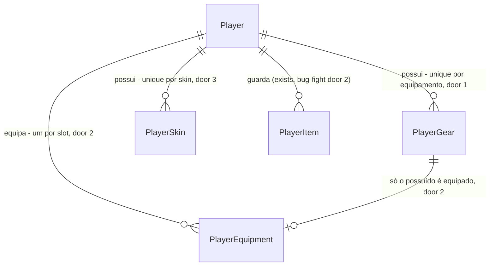

# Shop, inventory and avatar

Sources:

- `docs/DevServer RPG.html` - cena LOJA (`isShop`: seções POÇÕES, EQUIPAMENTOS DO DEV, SKINS DO AVATAR, painel de detalhe, `buyPotion`, `buyGear`, `buySkin`), cena AVATAR (`isAvatar`: mochila EQUIP / POÇÕES / LOOT / SKINS, boneco com 4 slots, faixa de skins, prévia), cena INVENTÁRIO (`isInventory`: `DESCARTAR 1`, estado vazio), `itemDefs`, `gearDefs`, `skinDefs`, `gearSum`, `boostDeploy`
- conversa 2026-09-23 - inventário vive como mochila dentro do AVATAR, sem aba nova; preços do protótipo mantidos; acelerador de deploy entra aqui (decisão registrada em deploy-pipelines)
- `.specs/STATE.md` - AD-001 a AD-011; skills door 2 (bônus `{type, amount}` somado do catálogo) e o `hpMax` gravado no unlock; bug-fight doors 2 (`PlayerItem`) e 4a (`startingItems`)

## Problem

O dev acumula coins e gems em deploys e combates e não tem onde gastá-los: as abas LOJA e AVATAR
dizem "EM BREVE", os itens que caem no Bug Fight só existem como uma lista no combate e não podem
ser vistos nem descartados, e o deploy promete um acelerador que ninguém consegue obter. O
protótipo é a única evidência; não há números de uso.

Quando isto for entregue, o dev compra poções, o acelerador, equipamentos e skins na LOJA, veste e
equipa na tela AVATAR (que também é a mochila onde vê e descarta itens), vê o bônus somado de
skills, equipamentos e skin, e esse bônus vale no Bug Fight. O acelerador corta 15 minutos de um
deploy em andamento.

## Out of scope

| Excluded | Why |
| --- | --- |
| Aba ITENS / rota `/itens` própria | decisão do usuário: a mochila fica no AVATAR; as 7 abas da foundation (AC 22) não mudam |
| Vender itens, equipamentos ou skins | o protótipo não vende na loja |
| Componentes do rack (CPU, RAM, ...) e móveis do escritório | server-room e office estão fora do MVP (AD-008) |
| Sprite próprio por skin | arte não existe; skin é um filtro sobre o mesmo sprite, como no protótipo |
| Avatar no HUD | o HUD não tem retrato hoje; a skin aparece no AVATAR e no cartão do dev no Bug Fight |
| Bônus de equipamento e skin na faixa "bônus ativo" das SKILLS | a faixa é da árvore de skills; o total de todas as fontes aparece no AVATAR |
| Usar poção fora do combate | protótipo só usa no Bug Fight |
| Craft com drops | protótipo cita "material de craft" sem regra |
| Bônus de equipamento em deploys | protótipo não aplica |

## Assumptions

| Assumption | Chosen default | Rationale | Confirmed? |
| --- | --- | --- | --- |
| Onde fica o inventário | mochila na tela AVATAR com abas EQUIP, POÇÕES, LOOT, SKINS; `DESCARTAR 1` no detalhe de um item | decisão do usuário | y |
| Preços | POÇÃO DE CACHE 15 gems · POÇÃO DE MEMÓRIA 12 gems · ACELERADOR DE DEPLOY 35 gems · MACBOOK PRO 120 gems · MONITOR ULTRAWIDE 200 gems · CAFÉ EXPRESSO 50 coins · MOLETOM CONFORTÁVEL 70 coins · CADEIRA ERGONÔMICA 150 gems · FONE COM CANCELAMENTO 90 gems · DEV NEON 60 gems · DEV SOMBRIO 80 gems · DEV DOURADO 150 gems | decisão do usuário: valores do protótipo; rebalancear é só catálogo (AD-003) | y |
| Equipamentos | macbook setup RARO dmg +8 · monitor setup LENDÁRIO sp +20 · cafe bebida COMUM sp +12 · moletom vestuario COMUM hp +15 · cadeira vestuario RARO hp +30 · fone acessorio INCOMUM dmg +6; slots CONFIGURAÇÃO, BEBIDA, VESTUÁRIO, ACESSÓRIO | protótipo (`gearDefs`) | y |
| Skins | default DEV PADRÃO PADRÃO sem bônus · neon DEV NEON INCOMUM dmg +5 · shadow DEV SOMBRIO RARO sp +10 · golden DEV DOURADO LENDÁRIO hp +20, cada uma com o filtro CSS do protótipo | protótipo (`skinDefs`) | y |
| Acelerador na loja | vendido na seção POÇÕES, depois das duas poções | protótipo tem `gemCost` 35 e o deploy manda "veja a Loja", mas nenhuma tela o vende; o usuário trouxe o acelerador para esta feature | y |
| Comprar equipamento ou skin | compra e já equipa, trocando o que estava no slot | protótipo (`COMPRAR E EQUIPAR`) | y |
| Comprar o que já possui | `409 already_owned`; equipar o que já possui é outra rota, sem custo | protótipo reequipa de graça no mesmo botão; separar mantém a compra honesta e o botão da tela chama a rota certa | y |
| HP de equipamento e skin | equipar soma o bônus em `hpMax` e `hp`; remover subtrai dos dois, com `hp` mínimo 1 | mesma regra gravada do unlock de skill; protótipo subtrai a diferença; mínimo 1 evita um dev com 0 HP fora do combate | y |
| SP e dano no combate | SP máximo do encontro soma skills + equipamentos + skin no início do encontro e fica fixo; dano soma as três fontes a cada turno | bug-fight fixa o SP máximo no encontro; protótipo recalcula no meio, sem pedido para isso | y |
| Equipar durante um combate | permitido; vale para o dano no próximo turno e para o SP no próximo encontro | não bloquear é o comportamento do protótipo | y |
| Acelerador | `ends_at` passa a `ends_at - 15min`, nunca antes de agora; deploy já pronto recusa sem gastar | protótipo reduz 15 minutos do restante | y |
| Skin padrão | `default` é de todo jogador sem linha gravada | foundation já grava `skin` = `default` | y |
| Sprite do herói | o sprite do dev do protótipo vira `web/public/hero.png`; a skin aplica o `filter` do catálogo | protótipo (T682, T819); AD-007 | y |

**Open questions:** none - all resolved or logged above.

## Criteria

### S1: Catálogo e forma do jogador (P1)

**Acceptance Criteria**

1. The api SHALL servir em `GET /api/catalog` os 6 equipamentos com `id`, `name`, `glyph`, `slot`, `rarity`, `description`, `price` = `{currency, amount}` e `bonus` = `{type, amount}`, as 4 skins com `id`, `name`, `rarity`, `description`, `filter`, `price` e `bonus` (nulo em `default`), os 4 slots com `id` e `name`, e `price` em `sp_potion` (15 gems), `hp_potion` (12 gems) e no novo item `boost_deploy` (ACELERADOR DE DEPLOY, `>>`, COMUM, 35 gems)
2. The api SHALL devolver em todo `player` os campos `gear` (ids possuídos, ordem do catálogo, `[]` sem nenhum), `equipment` (objeto com as 4 chaves de slot, cada uma com o id equipado ou `null`) e `skins` (ids possuídos em ordem do catálogo, sempre com `default`)
3. WHEN um jogador é criado THEN a api SHALL devolver `gear` = `[]`, as 4 chaves de `equipment` = `null`, `skins` = `["default"]` e `skin` = `default`

### S2: Comprar na loja (P1)

**Acceptance Criteria**

4. WHEN `POST /api/me/shop/items/{id}` é chamado para um item com preço e o jogador pode pagar THEN a api SHALL descontar o preço na moeda do item, somar 1 à quantidade e responder `200` com `{"player": {...}}`
5. WHEN `POST /api/me/shop/gear/{id}` é chamado para um equipamento não possuído e o jogador pode pagar THEN a api SHALL descontar o preço, gravar a posse, equipá-lo no seu slot substituindo o anterior e responder `200` com `player`
6. WHEN `POST /api/me/shop/skins/{id}` é chamado para uma skin não possuída e o jogador pode pagar THEN a api SHALL descontar o preço em gems, gravar a posse, definir `skin` = `{id}` e responder `200` com `player`
7. IF o saldo da moeda do preço é menor que o preço THEN a api SHALL responder `409` com `error.code` = `not_enough_gems` ou `not_enough_coins` e não alterar nada; saldo igual ao preço paga
8. IF o equipamento ou a skin já é do jogador THEN a api SHALL responder `409` com `error.code` = `already_owned` e não alterar nada
9. IF o id não existe no catálogo THEN a api SHALL responder `422` com `unknown_item`, `unknown_gear` ou `unknown_skin`
10. IF o item existe mas não tem preço (drops) THEN a api SHALL responder `422` com `error.code` = `not_for_sale`

### S3: Equipar, remover e vestir (P1)

**Acceptance Criteria**

11. WHEN `POST /api/me/gear/{id}/equip` é chamado para um equipamento possuído THEN a api SHALL equipá-lo no seu slot substituindo o anterior e responder `200` com `player`; se já está equipado, responder `200` sem mudança
12. WHEN `POST /api/me/gear/{id}/unequip` é chamado THEN a api SHALL deixar o slot desse equipamento `null` e responder `200` com `player`; se não está equipado, responder `200` sem mudança
13. WHEN `POST /api/me/skins/{id}/equip` é chamado para uma skin possuída THEN a api SHALL definir `skin` = `{id}` e responder `200` com `player`
14. IF o equipamento ou a skin não é do jogador THEN a api SHALL responder `409` com `error.code` = `not_owned`; id fora do catálogo responde `422` `unknown_gear` ou `unknown_skin`
15. WHEN um bônus `hp` passa a valer (equipar ou vestir) THEN a api SHALL somar o valor a `hpMax` e a `hp`; WHEN deixa de valer (remover, trocar) THEN SHALL subtrair de `hpMax` e de `hp`, com `hp` mínimo 1
16. The api SHALL calcular o SP máximo de um encontro novo como SP do inimigo + bônus `sp` das skills + dos equipamentos equipados + da skin vestida
17. The api SHALL calcular o bônus de dano de cada turno como a soma dos bônus `dmg` das skills, dos equipamentos equipados e da skin vestida

### S4: Descartar e acelerar (P2)

**Acceptance Criteria**

18. WHEN `POST /api/me/items/{id}/discard` é chamado com quantidade ≥ 1 THEN a api SHALL subtrair 1 e responder `200` com `player`; o item some de `inventory` ao chegar a 0
19. IF o item do descarte não existe no catálogo THEN a api SHALL responder `422` `unknown_item`; IF a quantidade é 0 THEN SHALL responder `409` `no_item`
20. WHEN `POST /api/me/deploys/{type}/boost` é chamado com um deploy em andamento e `boost_deploy` ≥ 1 THEN a api SHALL consumir 1 acelerador, definir `endsAt` = o maior entre `endsAt - 15min` e agora, e responder `200` com `deploy`, `player` e `serverTime`
21. IF não há deploy do tipo em andamento THEN a api SHALL responder `404` `deploy_not_found`; IF o deploy já está pronto THEN SHALL responder `409` `deploy_ready`; IF não há acelerador THEN SHALL responder `409` `no_item`; em todos, sem consumir nada

### S5: Tela LOJA (P1)

**Acceptance Criteria**

22. WHEN o jogador abre `/loja` THEN a web SHALL exibir `LOJA DEVSERVER`, `GEMS: <gems>` e as seções `POÇÕES` (POÇÃO DE CACHE, POÇÃO DE MEMÓRIA, ACELERADOR DE DEPLOY com `possui: <n>` e `<preço>g`), `EQUIPAMENTOS DO DEV` e `SKINS DO AVATAR` na ordem do catálogo, sem `EM BREVE`
23. The web SHALL exibir em cada cartão de equipamento e skin o bônus curto (`+N% DMG`, `+N SP`, `+N HP` ou `sem bônus`) e o estado: `EQUIPADO`/`EQUIPADA`, `NO INVENTÁRIO`/`NO GUARDA-ROUPA`, ou o preço (`<n>g` em gems, `<n>c` em coins)
24. WHEN um cartão é clicado THEN a web SHALL mostrar no painel de detalhe nome, raridade (e slot, para equipamento), `bônus: ...` e custo ou `já possui`, com o botão: poção `COMPRAR`; equipamento ou skin não possuído `COMPRAR E EQUIPAR`; possuído e fora de uso `EQUIPAR`; em uso `EQUIPADO`/`EQUIPADA` desabilitado; e `REMOVER EQUIPAMENTO` para equipamento em uso
25. WHILE o saldo não paga o preço a web SHALL trocar o botão de compra por `GEMS INSUFICIENTES` ou `COINS INSUFICIENTES`, desabilitado
26. WHEN uma compra, um equipar ou um remover responde `200` THEN a web SHALL repassar o `player` ao HUD e exibir o aviso `+1 <nome>`, `ITEM COMPRADO E EQUIPADO`, `SKIN COMPRADA E EQUIPADA`, `ITEM EQUIPADO`, `SKIN EQUIPADA` ou `ITEM REMOVIDO`
27. IF a ação responde erro THEN a web SHALL exibir a `error.message` da api e manter a tela; sem corpo ou falha de rede, `falha na conexão. tente de novo.`
28. WHILE uma ação da loja está pendente a web SHALL desabilitar os botões do painel

### S6: Tela AVATAR com mochila (P1)

**Acceptance Criteria**

29. WHEN o jogador abre `/avatar` THEN a web SHALL exibir a prévia do herói com o `filter` da skin vestida, `devName`, o nome da skin, `HP máx <hpMax>`, `dano +<N>%` e `SP +<N>` somando skills, equipamentos equipados e skin, sem `EM BREVE`
30. The web SHALL exibir os 4 slots (CONFIGURAÇÃO, VESTUÁRIO à esquerda; ACESSÓRIO, BEBIDA à direita) com o glifo e nome do equipamento equipado ou `[ ]` e o nome do slot
31. The web SHALL exibir a faixa `SKINS` com as 4 skins; skin não possuída aparece apagada e o clique mostra `SKIN BLOQUEADA — COMPRE NA LOJA` sem chamar a api; skin possuída chama `POST /api/me/skins/{id}/equip`
32. The web SHALL exibir a mochila com as abas `EQUIP`, `POÇÕES`, `LOOT`, `SKINS` e as dicas `clique para equipar`, `use no Bug Fight`, `material de craft`, `clique para vestir`: EQUIP lista os equipamentos possuídos (marca `EQUIP` no equipado), POÇÕES lista `sp_potion`, `hp_potion`, `boost_deploy` com `x<n>`, LOOT os drops com `x<n>`, SKINS as possuídas (marca `EM USO`)
33. WHEN um cartão da mochila é clicado THEN a web SHALL mostrar o detalhe: equipamento com `EQUIPAR` ou `REMOVER`; skin com `VESTIR` ou `EM USO` desabilitado; item com `quantidade: <n>` e `DESCARTAR 1`, que chama `POST /api/me/items/{id}/discard`
34. WHILE a aba da mochila não tem nada a web SHALL exibir `MOCHILA VAZIA` e `nada nesta aba ainda — derrote bugs e compre na Loja.`
35. WHEN uma ação do AVATAR responde THEN a web SHALL repassar o `player` ao HUD; erro, sem corpo e rede seguem AC 27; ação pendente segue AC 28

### S7: Acelerador no deploy e skin no combate (P2)

**Acceptance Criteria**

36. WHILE há deploy em andamento e não pronto a web SHALL exibir no cartão `ACELERAR (-15min) · <n> disponíveis`, que chama `POST /api/me/deploys/{type}/boost`; com 0 aceleradores, `SEM ACELERADORES · veja a Loja` desabilitado
37. WHEN o acelerador responde `200` THEN a web SHALL atualizar o tempo restante do deploy com o `endsAt` recebido e repassar o `player` ao HUD
38. The web SHALL exibir no cartão do dev no Bug Fight o sprite do herói com o `filter` da skin vestida

## Traceability

| ID | Slice | Criteria | Status |
| --- | --- | --- | --- |
| SHOP-01 | S1 | 1, 2, 3 | Pending |
| SHOP-02 | S2 | 4, 5, 6, 7, 8, 9, 10 | Pending |
| SHOP-03 | S3 | 11, 12, 13, 14, 15, 16, 17 | Pending |
| SHOP-04 | S4 | 18, 19, 20, 21 | Pending |
| SHOP-05 | S5 | 22, 23, 24, 25, 26, 27, 28 | Pending |
| SHOP-06 | S6 | 29, 30, 31, 32, 33, 34, 35 | Pending |
| SHOP-07 | S7 | 36, 37, 38 | Pending |

## Observable

| Surface | Decision | Landing |
| --- | --- | --- |
| screen `/loja` | empty state | n/a - o catálogo sempre tem itens; saldo 0 cai em AC 25 |
| screen `/loja` | loading state | existing - o shell só renderiza a cena com `player` e `catalog` carregados (foundation) |
| screen `/loja` | error state | AC 27 |
| screen `/loja` | unauthorised state | existing - o shell redireciona para `/login` sem sessão (foundation) |
| screen `/loja` | density and ordering | AC 22, AC 23 |
| screen `/loja` | destructive action confirms | n/a - comprar é a ação pedida e o botão mostra o custo antes; não há venda |
| screen `/avatar` | empty state | AC 34 |
| screen `/avatar` | loading state | existing - shell (foundation) |
| screen `/avatar` | error state | AC 35 |
| screen `/avatar` | unauthorised state | existing - shell (foundation) |
| screen `/avatar` | density and ordering | AC 30, AC 32 |
| screen `/avatar` | destructive action confirms | n/a - `DESCARTAR 1` tira uma unidade por clique, como no protótipo, sem diálogo |
| screen `/deploy` | acelerador sem estoque | AC 36 |
| API shop, gear, skins, items, boost | response shape | AC 4, AC 20 - `{"player": {...}}` (AD-004); boost também `deploy` e `serverTime` (AD-010) |
| API shop, gear, skins, items, boost | error shape and codes | AC 7, 8, 9, 10, 14, 19, 21 - formato AD-005 |
| API shop, gear, skins, items, boost | who may call it | existing - `auth.RequireSession`, `401 unauthenticated` |
| API shop, gear, skins, items, boost | versioning | n/a - api e web saem no mesmo PR (AD-001) |
| API shop, gear, skins, items, boost | rate limit | n/a - nenhuma rota do jogo tem limite; o saldo limita a compra |
| API `GET /api/catalog` | response shape | AC 1 |

## Flow

Reusa `player.WithLocked` (AD-004) para toda mutação, `player.AddItem` para comprar e descartar
itens, o `Bonus {type, amount}` das skills para equipamentos e skins, e o cálculo de SP e dano do
battle - só a soma das fontes muda.

1. in: `POST /api/me/shop/{items|gear|skins}/{id}`, `/api/me/gear/{id}/equip|unequip`, `/api/me/skins/{id}/equip`, `/api/me/items/{id}/discard` -> `api/internal/shop` (new, no door - placement per conventions) - valida o id no `catalog.Catalog` (exists) e aplica a regra dentro de `player.WithLocked` (exists)
2. `player.WithLocked` (exists) - carrega `gear`, `equipment`, `skins` com skills e inventário, persiste posse (door 1, door 3), slot (door 2) e `hp`/`hpMax` (door 5)
3. in: `POST /api/me/deploys/{type}/boost` -> `api/internal/deploy` (exists) - consome `boost_deploy` via `player.AddItem` (exists) e move `ends_at` (door 8)
4. `api/internal/battle` (exists) - SP máximo no início do encontro e dano por turno passam a ler a soma de todas as fontes (door 6)
5. `GET /api/catalog` -> `catalog.Catalog` (exists) - serve `gearSlots`, `gear`, `skins` e `price` (door 4)
6. out: `{"player": {...}}` com `gear`, `equipment`, `skins` (door 7); web `ShopScene` e `AvatarScene` (new, no door - placement per conventions) nas rotas `/loja` e `/avatar` (exist), `DeployScene` (exists) ganha o acelerador, `BattleScene` (exists) o sprite com filtro (door 9)

## Relations

One-way constraints: `PlayerGear` único por (jogador, equipamento) (door 1); `PlayerEquipment` único
por (jogador, slot) e referencia um `PlayerGear` do mesmo jogador (door 2); `PlayerSkin` único por
(jogador, skin), sem linha para `default` (door 3). No columns and no types here.

## Surface

| Route | In | Out | Status |
| --- | --- | --- | --- |
| `POST /api/me/shop/items/{id}` | `id` | `player` | `200`, `401`, `409 not_enough_gems`, `409 not_enough_coins`, `422 unknown_item`, `422 not_for_sale`, `500` |
| `POST /api/me/shop/gear/{id}` | `id` | `player` | `200`, `401`, `409 not_enough_gems`, `409 not_enough_coins`, `409 already_owned`, `422 unknown_gear`, `500` |
| `POST /api/me/shop/skins/{id}` | `id` | `player` | `200`, `401`, `409 not_enough_gems`, `409 already_owned`, `422 unknown_skin`, `500` |
| `POST /api/me/gear/{id}/equip` | `id` | `player` | `200`, `401`, `409 not_owned`, `422 unknown_gear`, `500` |
| `POST /api/me/gear/{id}/unequip` | `id` | `player` | `200`, `401`, `422 unknown_gear`, `500` |
| `POST /api/me/skins/{id}/equip` | `id` | `player` | `200`, `401`, `409 not_owned`, `422 unknown_skin`, `500` |
| `POST /api/me/items/{id}/discard` | `id` | `player` | `200`, `401`, `409 no_item`, `422 unknown_item`, `500` |
| `POST /api/me/deploys/{type}/boost` | `type` | `deploy` · `player` · `serverTime` | `200`, `401`, `404 deploy_not_found`, `409 deploy_ready`, `409 no_item`, `422 unknown_deploy_type`, `500` |
| `GET /api/catalog` (changed) | - | + `gearSlots` · `gear` · `skins` · `items[].price` | `200` |
| `GET /api/me` (changed; same `player` in every response) | - | + `gear` · `equipment` · `skins` | `200`, `401`, `404 player_not_found`, `500` |

## Landing

| One-way door | Literal shape | Alternative rejected |
| --- | --- | --- |
| 1. entidade `PlayerGear` | tabela `player_gear` com `PRIMARY KEY (player_id, gear_id)` | reusar `player_items` com quantidade - permite 2 MACBOOKs e mistura consumível com posse única |
| 2. entidade `PlayerEquipment` | tabela `player_equipment` com `PRIMARY KEY (player_id, slot)` e `FOREIGN KEY (player_id, gear_id) REFERENCES player_gear` | coluna `equipped` em `player_gear` com índice parcial por slot - o slot teria de ser copiado do catálogo do mesmo jeito e a posse não seria garantida pelo banco |
| 3. entidade `PlayerSkin` | tabela `player_skins` com `PRIMARY KEY (player_id, skin_id)`; `default` nunca gravada e sempre possuída; a vestida continua em `players.skin` | backfill de uma linha `default` por jogador - grava uma informação que todo jogador tem |
| 4. forma do catálogo | `api/catalog/shop.json` com `slots` (`id`, `name`), `gear` (`id`, `name`, `glyph`, `slot`, `rarity`, `description`, `price`, `bonus`) e `skins` (`id`, `name`, `rarity`, `description`, `filter`, `price`, `bonus` ou `null`); `price` = `{currency: "gems" OR "coins", amount}` também em `items` de `combat.json`; servidos como `gearSlots`, `gear`, `skins` | preços e bônus no front - viola AD-003 |
| 5. HP de equipamento e skin gravado | equipar/vestir soma em `hp_max` e `hp`; remover/trocar subtrai, `hp` mínimo 1 - mesma regra do unlock de skill | `hpMax` derivado na leitura - dois modelos de HP máximo, e o de skills já é gravado |
| 6. uma regra de bônus | `player.Bonus(cat, p, "hp" OR "sp" OR "dmg")` soma skills + equipamentos equipados + skin; battle usa só ela | somar as fontes em cada chamador - a próxima fonte (office) seria esquecida em algum lugar |
| 7. contrato do `player` | `gear`: `["macbook"]` · `equipment`: `{"setup": "macbook", "bebida": null, "vestuario": null, "acessorio": null}` · `skins`: `["default", "neon"]` | `equipment` como lista - o front teria de procurar o slot, e slot vazio não apareceria |
| 8. regra do acelerador | `ends_at = GREATEST(ends_at - interval '15 minutes', now)`; deploy pronto responde `409 deploy_ready` | contador de aceleração gravado no job - estado a mais sem leitor |
| 9. sprite do herói | `web/public/hero.png` extraído do protótipo; skin = `style={{ filter }}` com o `filter` do catálogo | um sprite por skin - a arte não existe |
| 10. códigos de erro novos | `not_enough_gems`, `not_enough_coins`, `already_owned`, `not_for_sale`, `unknown_gear`, `unknown_skin`, `not_owned`, `deploy_ready` | reusar `unknown_item` para equipamento e skin - a mensagem dele fala de combate e o front não saberia qual catálogo falhou |

- Door 6 reaches past this feature: vira AD-012 em `.specs/STATE.md`
- Nothing else in this change is hard to reverse

## Impact

| Front | What changes |
| --- | --- |
| domain | new term: `PlayerGear` / equipamento - posse única de um item de slot; vive em `api/internal/player` |
| domain | new term: `PlayerEquipment` - o equipamento em uso em cada um dos 4 slots |
| domain | new term: `PlayerSkin` - skins compradas; `default` é implícita |
| domain | existing term: bônus de combate era a soma das skills (`catalog.SkillBonus`) e passa a ser skills + equipamentos + skin via `player.Bonus` - quem ramifica hoje: `battle` Start (SP máximo) e turno (dano); o HP das skills continua gravado no unlock |
| domain | existing term: `Item` ganha `price`; `boost_deploy` entra no catálogo sem `restore`, então o Bug Fight continua listando só as duas poções |
| stored data | três tabelas novas vazias; nada a migrar; `players.skin` já é `default` para todos |
| screen | `/loja` e `/avatar` deixam de ser `EM BREVE`: o conjunto do check C28 da foundation fica vazio - o teste de `ComingSoon` passa a cobrir só o componente ou sai no commit que entrega a última cena |
| screen | `/deploy` ganha o botão de acelerar no cartão do deploy em andamento |
