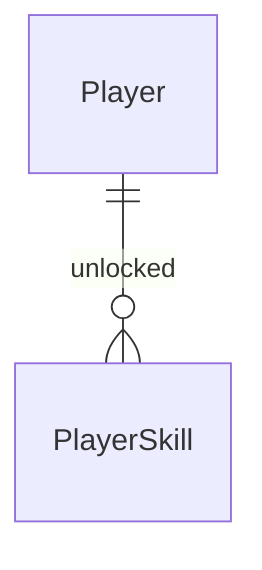

# Skills

Sources:

- `docs/DevServer RPG.html` - cena 06 ÁRVORE DE HABILIDADES: 3 trilhas × 3 nós (`treeData`), regra `unlock`, estados `ATIVA` / `1 PT` / `BLOQ.`, faixa "bônus ativo", chips "ATIVAS EM COMBATE"; HUD com as skills ativas no card SKILL PTS
- conversa 2026-09-23 - MVP fatias 1–5; skills é a fatia 3
- `.specs/STATE.md` - AD-001 a AD-010; `.specs/features/foundation/plan.md` doors 5, 7, 8, 12; `.specs/features/deploy-pipelines/plan.md` door 6 (`GainXP` dá 1 skill point por nível)

## Problem

O jogador ganha skill points ao subir de nível no deploy, mas não tem onde gastá-los: o HUD mostra
um número que só cresce e a aba SKILLS diz "EM BREVE". Não há escolha de build, então dois devs no
mesmo nível são idênticos. O protótipo não traz números - não há evidência além dele.

Quando isto for entregue, o dev gasta pontos para desbloquear habilidades em sequência nas trilhas
FRONTEND, BACKEND e INFRA, vê o HP máximo subir na hora e acumula bônus de SP e dano que o Bug Fight
vai usar; as habilidades ativas aparecem na tela de skills e no HUD.

## Out of scope

| Excluded | Why |
| --- | --- |
| Comandos de combate das skills (`</> MARKUP`, `$_ API`...) e efeito real de SP e dano | pertencem ao bug-fight; aqui a skill só é desbloqueada e o bônus é exibido |
| Redistribuir pontos (respec) | protótipo não tem; sem pedido |
| Nós com custo diferente de 1 ponto | protótipo cobra 1 ponto por nó |
| Bônus de skin e de equipamento na faixa "bônus ativo" | skins e gear entram com shop-inventory-avatar |

## Assumptions

| Assumption | Chosen default | Rationale | Confirmed? |
| --- | --- | --- | --- |
| Árvore | FRONTEND: `f1` MARKUP SEMÂNTICO +10 HP, `f2` GRID MASTER +8 SP, `f3` MOTION +10% dano · BACKEND: `b1` API REST +10 HP, `b2` CAMADA DE CACHE +10 SP, `b3` FILA DE EVENTOS +12% dano · INFRA: `i1` SHELL SCRIPT +8 SP, `i2` CONTAINERS +15 HP, `i3` AUTO-SCALING +15% dano | valores do protótipo (`treeData`) | y |
| Ordem dentro da trilha | um nó só pode ser desbloqueado depois do anterior da mesma trilha; o primeiro de cada trilha está sempre disponível | regra `unlock` do protótipo | y |
| Bônus de HP | no desbloqueio, HP máximo e HP atual sobem o valor do nó | regra `unlock` do protótipo | y |
| Bônus de SP e dano | não mudam nenhum atributo gravado; são a soma dos nós desbloqueados, calculada a partir do catálogo | só o combate os consome; somar do catálogo evita dois lugares guardando o mesmo número | y |
| Redistribuir pontos | não existe | protótipo não tem | y |
| Skills no HUD | o card SKILL PTS mostra o glifo de cada skill ativa, ou `sem habilidades ativas` | protótipo faz isso no HUD | y |

**Open questions:** none - all resolved or logged above.

## Criteria

### S1: Desbloquear uma habilidade (P1)

**Acceptance Criteria**

1. WHEN `POST /api/me/skills/{id}/unlock` é chamado com um nó disponível e o jogador tem ao menos 1 skill point THEN a api SHALL gravar o nó como desbloqueado, tirar 1 skill point e responder `200` com `player`
2. WHEN o nó desbloqueado tem bônus de HP THEN a api SHALL somar o valor ao HP máximo e ao HP atual do jogador
3. WHEN o nó desbloqueado tem bônus de SP ou de dano THEN a api SHALL manter HP, HP máximo e os demais atributos gravados do jogador sem mudança além do skill point
4. IF o nó anterior da mesma trilha não está desbloqueado THEN a api SHALL responder `409` com `error.code` = `skill_locked`
5. IF o nó já está desbloqueado THEN a api SHALL responder `409` com `error.code` = `skill_already_unlocked`
6. IF o jogador tem 0 skill points THEN a api SHALL responder `409` com `error.code` = `no_skill_points`
7. IF `{id}` não é um nó do catálogo THEN a api SHALL responder `422` com `error.code` = `unknown_skill`
8. The system SHALL desbloquear cada nó no máximo 1 vez por jogador e cobrar no máximo 1 ponto por nó, inclusive com requisições simultâneas
9. The system SHALL incluir em todo `player` a lista `skills` com os ids desbloqueados, na ordem do catálogo

**Independent test:** jogador com 2 pontos desbloqueia `f1` (HP 100→110) e `f2`; `f3` falha com `no_skill_points`; `b2` falha com `skill_locked`.

### S2: Ver a árvore (P1)

**Acceptance Criteria**

10. WHEN o jogador abre `/skills` THEN o web SHALL exibir as 3 trilhas na ordem do catálogo, cada uma com seus 3 nós na ordem, com glifo, nome e descrição
11. The web SHALL marcar cada nó como `ATIVA` (desbloqueado), `1 PT` (disponível) ou `BLOQ.` (anterior não desbloqueado)
12. The web SHALL exibir `PONTOS: <n>` com os skill points do jogador
13. The web SHALL exibir `bônus ativo: +<hp> HP · +<sp> SP · +<dmg>% dano` somando os nós desbloqueados a partir do catálogo
14. WHEN o jogador clica num nó `1 PT` THEN o web SHALL chamar o desbloqueio, repassar o `player` recebido ao HUD e exibir `> <NOME> desbloqueada · <descrição>`
15. IF o desbloqueio responde erro THEN o web SHALL exibir a mensagem da api na faixa de mensagem e não mudar os estados dos nós
16. WHILE o desbloqueio está em andamento o web SHALL desabilitar os nós
17. The web SHALL exibir em "ATIVAS EM COMBATE" um chip por skill desbloqueada, ou `nenhuma habilidade equipada`
18. The HUD SHALL exibir no card SKILL PTS o glifo de cada skill desbloqueada, ou `sem habilidades ativas`
19. The web SHALL ler trilhas, nós, glifos, nomes, descrições e bônus apenas do catálogo

**Independent test:** abrir `/skills` com 1 ponto, clicar `MARKUP SEMÂNTICO`, ver `ATIVA`, `PONTOS: 0`, `+10 HP` na faixa e o glifo `</>` no HUD.

## Traceability

| ID | Slice | Criteria | Status |
| --- | --- | --- | --- |
| SKILL-01 | S1 | 1, 2, 3, 4, 5, 6, 7, 8, 9 | Pending |
| SKILL-02 | S2 | 10, 11, 12, 13, 14, 15, 16, 17, 18, 19 | Pending |

## Observable

| Surface | Decision | Landing |
| --- | --- | --- |
| screen `skills` | empty state | AC 17 |
| screen `skills` | loading state | n/a - a cena só renderiza com `player` e catálogo já carregados pelo `GameShell` |
| screen `skills` | error state | AC 15 |
| screen `skills` | unauthorised state | existing - `GameShell` mostra login em `401` (foundation AC 1) |
| screen `skills` | ordering | AC 10 |
| screen `skills` | destructive action confirms | n/a - desbloquear gasta 1 ponto e não pode ser desfeito, mas o protótipo não confirma e o custo é visível no nó (`1 PT`) |
| screen `hud` | empty state | AC 18 |
| API `POST /api/me/skills/{id}/unlock` | response shape | AC 1 |
| API `POST /api/me/skills/{id}/unlock` | error shape and codes | AC 4 |
| API `POST /api/me/skills/{id}/unlock` | who may call it | existing - `RequireSession` da foundation |
| API `POST /api/me/skills/{id}/unlock` | versioning | n/a - único consumidor é o `web/` publicado junto |
| API `POST /api/me/skills/{id}/unlock` | rate limit behaviour | n/a - limitado pelos skill points |
| API `GET /api/me` and every `player` | response shape | AC 9 |
| API `GET /api/catalog` | response shape | AC 19 |

## Flow

Reusa `player.WithLocked` (foundation door 8) para cobrar o ponto e gravar o nó na mesma transação,
o envelope de erro e o catálogo embutido; o `player` ganha `skills`, então HUD e cena leem o mesmo
objeto que `setPlayer` já atualiza.

1. web `/skills` -> `useGame()` (exists) - desenha a árvore do catálogo e o `player.skills`
2. `POST /api/me/skills/{id}/unlock` -> `RequireSession` (exists) -> `player.WithLocked` (exists) - valida nó, anterior, já desbloqueado e pontos no catálogo (door 3), grava `PlayerSkill` (door 1), aplica bônus de HP (door 2)
3. `player` serializado com `skills` (door 4) - lido por toda resposta que devolve `player`
4. out: `{"player"}`; web chama `setPlayer` (exists), HUD mostra os glifos

## Relations

One-way constraints: no máximo 1 `PlayerSkill` por jogador e nó (door 1); o nó é um id do catálogo,
não chave estrangeira (foundation door 5). No columns and no types here.

## Surface

| Route | In | Out | Status |
| --- | --- | --- | --- |
| `POST /api/me/skills/{id}/unlock` | - | `player` · `{error}` | `200`, `401`, `404`, `409`, `422`, `500` |
| `GET /api/me` (changed; same for every route returning `player`) | cookie `ds_session` | `player` gains `skills` | `200`, `401`, `404`, `500` |
| `GET /api/catalog` (changed) | `If-None-Match` | adds `skillTrees` | `200`, `304` |

## Landing

| One-way door | Literal shape | Alternative rejected |
| --- | --- | --- |
| 1. entidade `PlayerSkill` | uma linha por nó desbloqueado, ligada ao jogador; índice único em (jogador, nó) | coluna texto/array em `players` - não tem unicidade por nó e cada leitura precisa parsear |
| 2. bônus de HP gravado, SP e dano derivados | HP máximo e HP recebem o valor no desbloqueio; SP e dano são somados do catálogo sobre `player.skills` quando preciso | gravar os três totais em `players` - mais duas colunas que podem divergir do conjunto desbloqueado |
| 3. forma do catálogo | `api/catalog/skills.json` com `trees` (`id`, `name`, `nodes`) e nós (`id`, `glyph`, `name`, `description`, `bonus` = `{type: hp OR sp OR dmg, amount}`), servido como `skillTrees` | números de bônus no front - viola AD-003 |
| 4. `player.skills` | todo `player` serializado traz `skills`: ids desbloqueados na ordem do catálogo, `[]` quando nenhum | rota separada `GET /api/me/skills` - HUD e cena precisariam de uma segunda chamada e de outro estado para ficar em dia |
| 5. códigos de erro novos | `skill_locked` `409`, `skill_already_unlocked` `409`, `no_skill_points` `409`, `unknown_skill` `422` | um `409 skill_unavailable` genérico - a mensagem não diria ao jogador o que falta |
| 6. rota | `POST /api/me/skills/{id}/unlock`, `{id}` = id do nó no catálogo | `POST /api/me/skills` com corpo - `{id}` na rota segue o padrão do claim de deploy |

- Nothing else in this change is hard to reverse

## Impact

| Front | What changes |
| --- | --- |
| domain | new term: `PlayerSkill` - um nó da árvore desbloqueado por um jogador; vive em `api/internal/skills` |
| domain | existing term: `Player` ganha `skills` em toda resposta; os clientes atuais (HUD, cenas) ignoram campos novos |
| domain | existing term: `Catalog` ganha `skillTrees`; `version` muda |
| screen | `/skills` deixa de ser `EM BREVE`: o conjunto do check C28 da foundation cai para `/bug-fight`, `/loja`, `/avatar` |
| screen | HUD: o card SKILL PTS passa a mostrar glifos; o check C23 da foundation (valores do HUD) continua valendo |
| code | `player.Get` e `player.WithLocked` carregam `skills` do banco e ordenam pelo catálogo (`catalog.Default()`); o HUD recebe o catálogo do `GameShell` |
| stored data | nothing to migrate - tabela nova, vazia; jogadores existentes têm `skills` = `[]` |
